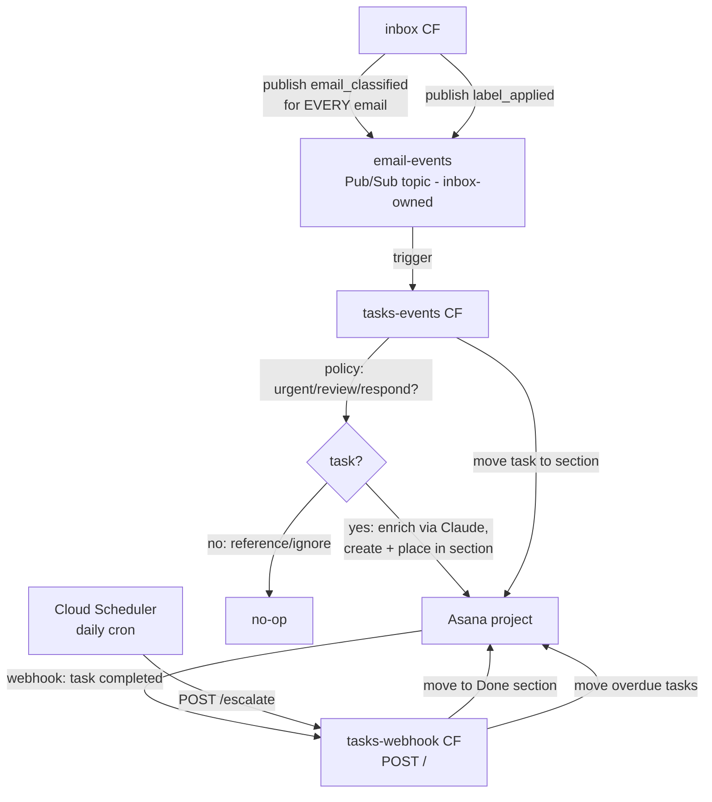

# tasks

Asana task automation service. Subscribes to inbox's email domain events,
**owns the policy for which emails become tasks**, enriches them with Claude
(summary, deadline), and handles the full task lifecycle — creation, section
placement, completion, overdue escalation — with OTel metrics to Grafana
Cloud.

## How it works

Inbox classifies every email and publishes an `email_classified` event
(category, importance, tags, full body, reply-draft link for respond) to its
`email-events` Pub/Sub topic — inbox classifies, this service decides. The
`tasks-events` Cloud Function applies `services/policy.py` (urgent, review,
and respond become tasks; reference and ignore don't), generates key points
and extracts an explicit deadline via Claude, creates the Asana task with
action links, and places it in the category's section. Human feedback on the
action links flows back through inbox, which publishes `label_applied` — the
task moves to the matching section. Completing a task in Asana fires a
webhook to the `tasks-webhook` Cloud Function, which moves it to Done. A
daily Cloud Scheduler cron hits `/escalate` to sweep incomplete past-due
tasks into Overdue.



## Project structure

```
clients/     Asana REST + Cloud SQL + OTel setup (I/O only)
repo/        DB read/write + schema.sql (tasks, asana_tag_cache tables)
services/    sections mapping, tag cache, escalation (one concern each)
handlers/    task_create, label_applied, task_complete, asana_webhook (protocol)
models/      event payload types
main.py      CF entry points — transport adapter only (decode, route, flush)
terraform/   All GCP resources (state prefix: tasks)
scripts/     fetch-env.sh, migrate_db.py, register_webhook.py, test-task-create.py
docs/        architecture, webhook runbook, metrics reference
```

## Local development

```bash
python3.13 -m venv .venv && .venv/bin/pip install -r requirements-dev.txt
scripts/fetch-env.sh                 # .env from Secret Manager + tfvars
.venv/bin/pytest tests/ -q           # unit tests
.venv/bin/python scripts/test-task-create.py   # real-Asana smoke test
```

## Deployment

Push to `main` touching `main.py`, `clients/`, `services/`, `handlers/`,
`models/`, `requirements.txt`, or `terraform/` auto-deploys via GitHub Actions
(WIF → terraform apply). Manual: `/deploy-tasks` skill.

## First-time setup

1. `cd terraform && cp terraform.tfvars.example terraform.tfvars` — fill in
   the Asana project GID, section GIDs, and a generated `tasks_db_password`.
2. `terraform init && terraform apply` — note the `webhook_url` output.
3. Apply the schema:
   ```bash
   CLOUD_SQL_CONNECTION_NAME=bens-project-462804:us-central1:inbox \
     POSTGRES_USER=tasks POSTGRES_PASSWORD=<tasks_db_password> POSTGRES_DB=tasks \
     .venv/bin/python scripts/migrate_db.py
   ```
4. Register the Asana webhook: `docs/asana-webhook-setup.md`.
5. See `docs/architecture.md` for the full design.

## tasks-api

A Cloud Run FastAPI service (`api/`) that exposes the same task data as a
small HTTP API — search across Asana projects, fetch a task with its
comments, create/update tasks, and add/edit/delete comments. It reuses the
`clients/`, `repo/`, and `services/` layers rather than duplicating Asana or
DB logic; `api/routers/` are thin transport, same role as `handlers/` for the
Cloud Functions.

| Method | Path | Purpose |
|---|---|---|
| `POST` | `/search` | search tasks (query, project, completed, due range) |
| `GET` | `/tasks/{gid}` | fetch a task with comments |
| `POST` | `/tasks` | create a task |
| `PATCH` | `/tasks/{gid}` | update a task (fields, section, tags, complete) |
| `POST` | `/tasks/{gid}/comments` | add a comment |
| `PUT` | `/comments/{story_gid}` | edit a comment |
| `DELETE` | `/comments/{story_gid}` | delete a comment |
| `GET` | `/health` | health check (no auth) |

Auth: bearer token (`Authorization: Bearer <token>`) checked against the
`tasks-api-token` secret (`terraform.tfvars` var `tasks_api_token`); unset
`TASKS_API_TOKEN` disables the check for local dev.

Search is project-enumeration based, not full-text: Asana's free tier has no
search API (returns HTTP 402 on that plan), so `/search` lists tasks across
projects (or one project, if given) and filters client-side.

```bash
(set -a; source .env; set +a; .venv/bin/uvicorn api.main:app --port 8080)  # run locally
.venv/bin/python scripts/test-api-local.py                                  # smoke it (--write creates a REAL task)
```

Deploy: push to `main` touching `api/`, `clients/`, `repo/`, `services/`,
`models/`, `Dockerfile`, or `requirements.txt` auto-deploys via
`.github/workflows/deploy-api.yml` (build + push image, `gcloud run deploy`,
read-only post-deploy smoke). First deploy after merge needs a manual
runbook (image doesn't exist yet for Terraform to reference) — see
`docs/superpowers/plans/2026-07-17-tasks-api.md`, Task 14 Step 3.
