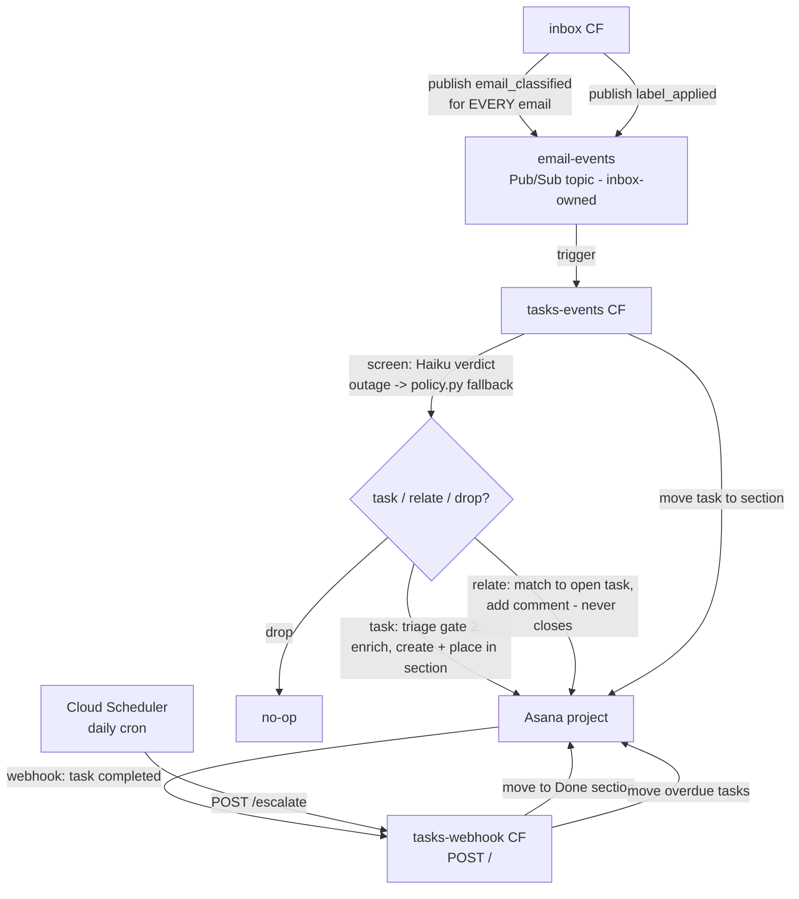

# tasks

Asana task automation service. Subscribes to inbox's email domain events,
**owns the policy for which emails become tasks**, enriches them with Claude
(summary, deadline), and handles the full task lifecycle — creation, section
placement, completion, overdue escalation — with OTel metrics to Grafana
Cloud.

## How it works

Inbox classifies every email and publishes an `email_classified` event
(category, importance, tags, full body, reply-draft link for respond) to its
`email-events` Pub/Sub topic — inbox classifies, this service decides. The
`tasks-events` Cloud Function screens **every** email with
`services/screening.py::screen` (a Haiku call, whatever category inbox filed
it under) for a three-way verdict: `task` goes to `services/triage.py::decide`
(a Sonnet tool-runner gate 2 — there's no `urgent` bypass, urgent mail is
triaged like everything else), then Claude enrichment (key points + deadline)
and creation, with priority and the `[PX]` prefix taken from the screener's
verdict, not inbox's `importance`; `relate` finds the open task the email
reports on (`services/relating.py::match`) and adds a **comment** — a match
never closes the task, and no match is a normal outcome; `drop` records a
`suppressed_emails` row and creates nothing. `services/policy.py::warrants_task`
survives only as the outage fallback, degrading gate 1 to the old category
rule (`task`/`drop` only, never `relate`) if Claude is unavailable. A created
task is placed in a section by inbox's `category` (a mailbox-routing fact,
not the screener's verdict) — only the creation path defaults a rescued email
into Review; the `label_applied` feedback path below does not. Human feedback
on the action links flows back through inbox, which publishes
`label_applied` — the task moves to the matching section. Completing a task
in Asana fires a webhook to the `tasks-webhook` Cloud Function, which moves
it to Done. A daily Cloud Scheduler cron hits `/escalate` to sweep incomplete
past-due tasks into Overdue.


```mermaid
flowchart TD
    IB[inbox CF] -->|publish email_classified\nfor EVERY email| AE[email-events\nPub/Sub topic - inbox-owned]
    AE -->|trigger| CF1[tasks-events CF]
    CF1 -->|screen: Haiku verdict\noutage -> policy.py fallback| SCR{task / relate / drop?}
    SCR -->|task: triage gate 2,\nenrich, create + place in section| AS[Asana project]
    SCR -->|relate: match to open task,\nadd comment - never closes| AS
    SCR -->|drop| SKIP[no-op]

    IB -->|publish label_applied| AE
    CF1 -->|move task to section| AS

    AS -->|webhook: task completed| CF2[tasks-webhook CF\nPOST /]
    CF2 -->|move to Done section| AS

    SCH[Cloud Scheduler\ndaily cron] -->|POST /escalate| CF2
    CF2 -->|move overdue tasks| AS
```

## Project structure

```
clients/     Asana REST + Cloud SQL + OTel setup (I/O only)
repo/        DB read/write + schema.sql (tasks, asana_tag_cache tables)
services/    sections mapping, tag cache, escalation (one concern each)
handlers/    task_create, label_applied, task_complete, asana_webhook (protocol)
models/      event payload types
main.py      CF entry points — transport adapter only (decode, route, flush)
terraform/   All GCP resources (state prefix: tasks)
scripts/     fetch-env.sh, migrate_db.py, register_webhook.py, test-task-create.py
docs/        architecture, webhook runbook, metrics reference
```

## Local development

```bash
python3.13 -m venv .venv && .venv/bin/pip install -r requirements-dev.txt
scripts/fetch-env.sh                 # .env from Secret Manager + tfvars
.venv/bin/pytest tests/ -q           # unit tests
.venv/bin/python scripts/test-task-create.py   # real-Asana smoke test
```

### Backtesting the screener

`scripts/backtest_screening.py` replays gate 1 over historical mail from the
**inbox** database and creates nothing. Use it after any change to
`services/screening.py::SYSTEM_PROMPT` or `services/relating.py::SIMILARITY_FLOOR`.

    set -a; source .env; set +a
    export STANDING_CONTEXT_PATH=~/path/to/standing-context.md
    .venv/bin/python scripts/backtest_screening.py --out backtest.tsv

`STANDING_CONTEXT_PATH` is required: without it `services/standing_context.py`
falls back to `context/standing-context.md`, which doesn't exist in a clone —
`context/` is gitignored and the real declared facts live in the private
`bdrolet/context` repo (see `context/README.md`) — so the run silently screens
with an empty `Roles` section instead of the config that ships. `task` and
`relate` are scored separately — a promotion rate that folds them together is
meaningless. A miss on the `positive` corpus (the population that already
becomes a task today) is a behaviour change to review, not necessarily an
error — inbox's category is not ground truth. Corpora and the ship gate:
`docs/superpowers/specs/2026-08-27-tasks-owned-screening-design.md` §Verification.
Full pass is ~1,200 screener calls plus the relate stage (~$3, 20-35 min);
`--no-relate` for a cheaper screener-only pass, `--corpus recall_probe --limit 20`
for a quick check. Iterating on a prompt or the similarity floor? Reach for
`--ids FILE` first — it replays only the message_ids listed there, a
seconds-long loop instead of the full run. Relate match rates are not
comparable across runs — `task_index`'s open-task pool is small and live, so
the corpus it matches against churns day to day (see spec §Verification
caveat 3).

## Deployment

Push to `main` touching `main.py`, `clients/`, `services/`, `handlers/`,
`models/`, `requirements.txt`, or `terraform/` auto-deploys via GitHub Actions
(WIF → terraform apply). Manual: `/deploy-tasks` skill.

## First-time setup

1. `cd terraform && cp terraform.tfvars.example terraform.tfvars` — fill in
   the Asana project GID, section GIDs, and a generated `tasks_db_password`.
2. `terraform init && terraform apply` — note the `webhook_url` output.
3. Apply the schema:
   ```bash
   CLOUD_SQL_CONNECTION_NAME=bens-project-462804:us-central1:inbox \
     POSTGRES_USER=tasks POSTGRES_PASSWORD=<tasks_db_password> POSTGRES_DB=tasks \
     .venv/bin/python scripts/migrate_db.py
   ```
4. Register the Asana webhook: `docs/asana-webhook-setup.md`.
5. See `docs/architecture.md` for the full design.

## tasks-api

A Cloud Run FastAPI service (`api/`) that exposes the same task data as a
small HTTP API — search across Asana projects, fetch a task with its
comments, create/update tasks, and add/edit/delete comments. It reuses the
`clients/`, `repo/`, and `services/` layers rather than duplicating Asana or
DB logic; `api/routers/` are thin transport, same role as `handlers/` for the
Cloud Functions.

| Method | Path | Purpose |
|---|---|---|
| `POST` | `/search` | search tasks (query, project, completed, due range) |
| `GET` | `/tasks/{gid}` | fetch a task with comments |
| `POST` | `/tasks` | create a task |
| `PATCH` | `/tasks/{gid}` | update a task (fields, section, tags, complete) |
| `POST` | `/tasks/{gid}/comments` | add a comment |
| `PUT` | `/comments/{story_gid}` | edit a comment |
| `DELETE` | `/comments/{story_gid}` | delete a comment |
| `GET` | `/health` | health check (no auth) |

Auth: bearer token (`Authorization: Bearer <token>`) checked against the
`tasks-api-token` secret (`terraform.tfvars` var `tasks_api_token`); unset
`TASKS_API_TOKEN` disables the check for local dev.

Search is project-enumeration based, not full-text: Asana's free tier has no
search API (returns HTTP 402 on that plan), so `/search` lists tasks across
projects (or one project, if given) and filters client-side.

```bash
(set -a; source .env; set +a; .venv/bin/uvicorn api.main:app --port 8080)  # run locally
.venv/bin/python scripts/test-api-local.py                                  # smoke it (--write creates a REAL task)
```

Deploy: push to `main` touching `api/`, `clients/`, `repo/`, `services/`,
`models/`, `Dockerfile`, or `requirements.txt` auto-deploys via
`.github/workflows/deploy-api.yml` (build + push image, `gcloud run deploy`,
read-only post-deploy smoke). First deploy after merge needs a manual
runbook (image doesn't exist yet for Terraform to reference) — see
`docs/superpowers/plans/2026-07-17-tasks-api.md`, Task 14 Step 3.
