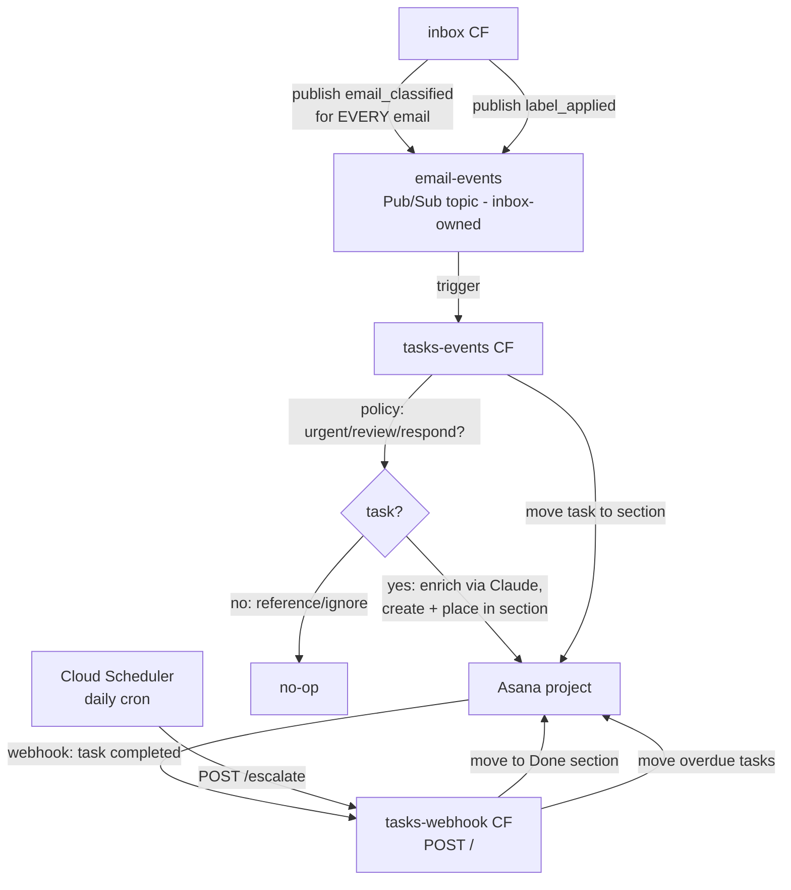

# Tasks Repo (Asana Task Automation Service) Implementation Plan

> **For agentic workers:** REQUIRED SUB-SKILL: Use superpowers:subagent-driven-development (recommended) or superpowers:executing-plans to implement this plan task-by-task. Steps use checkbox (`- [ ]`) syntax for tracking.

**Goal:** Stand up a standalone `tasks` repo with two Cloud Functions that own all Asana interactions (task policy, creation, enrichment, moves, completion, escalation + OTel metrics), subscribed to a new inbox-owned `email-events` Pub/Sub topic.

**Architecture:** Event-driven inversion — **inbox classifies, tasks decides.** Inbox publishes an `email_classified` domain event for *every* processed email (full classification, body, links, draft link for respond) plus `label_applied` feedback events, all on an inbox-owned `email-events` topic. The Pub/Sub-triggered CF (`tasks-events`, entry point `process` in root `main.py`) applies `warrants_task()` policy (urgent/review/respond → task), runs enrichment (Claude email summary + deadline extraction — migrated from inbox), creates the Asana task, and places it in its section. An HTTP-triggered public CF (`tasks-webhook`, entry point `webhook` in the **same** root `main.py`) handles Asana webhook callbacks (completion → move to Done), the webhook handshake, and a Cloud Scheduler-driven `/escalate` cron. Both deploy from the same repo-root source zip with different entry points — the same pattern inbox uses for `process`/`label`/`sweep`. State (task GID mapping, tag cache, escalation timestamps) lives in a new `tasks` database on the **existing inbox Cloud SQL instance**. Dividing rule: anything touching the mailbox (Graph) stays in inbox — classification, invite detection/RSVP, reply drafts; anything existing for the task lives here.

**Tech Stack:** Python 3.13, functions-framework, httpx, anthropic (Claude Haiku/Sonnet for enrichment), Cloud SQL Postgres 16 (shared instance, own database) via cloud-sql-python-connector/pg8000, OpenTelemetry → Grafana Cloud OTLP, Terraform (google provider ~> 5.0, GCS backend), GitHub Actions with WIF auth. GCP project `bens-project-462804`, region `us-central1`.

**Spec:** `/Users/ben/.claude/plans/task-repo-setup.md`

## Global Constraints

- GCP project: `bens-project-462804`; region: `us-central1`.
- CF names: `tasks-events` (Pub/Sub trigger), `tasks-webhook` (HTTP, public). Runtime `python313`.
- Pub/Sub topic: `email-events` — **owned by inbox terraform** (producer owns); tasks references it via `data "google_pubsub_topic"`. Deploy order at bootstrap: inbox terraform (topic) → tasks terraform (subscription via CF trigger) → inbox code (starts publishing). Events published before the subscription exists are dropped.
- Task policy (in `services/policy.py`): categories `urgent`, `review`, `respond` create tasks; `reference`, `ignore` do not. (Urgent matches today's inbox behavior — the original spec missed that `urgent.handle` creates tasks.)
- Terraform: `required_version = ">= 1.5"`, google provider `~> 5.0`, backend `gcs { bucket = "bens-project-462804-tf-state", prefix = "tasks" }`.
- Python tooling: ruff `target-version = "py313"`, `line-length = 100`, `select = ["E", "F", "I"]`, `ignore = ["E501"]`; mypy `python_version = "3.13"`, `ignore_missing_imports = true`.
- OTel metric instrument names use the `asana.` prefix (e.g. `asana.tasks.created`) → Prometheus `asana_tasks_created_total`. Histograms with `unit="ms"` land as `asana_api_duration_milliseconds_bucket`.
- Secrets consumed via Terraform `secret_environment_variables` → `os.environ`. No runtime Secret Manager SDK.
- Database: `tasks` database + `tasks` user on Cloud SQL instance `bens-project-462804:us-central1:inbox` (instance owned by inbox terraform for now — see the platform-migration prompt at `/Users/ben/.claude/plans/infra-platform-migration.md`). Connection via `CLOUD_SQL_CONNECTION_NAME` + cloud-sql-python-connector (pg8000 driver — the connector does not support psycopg); direct psycopg3 locally.
- Never commit `.env` or `terraform/terraform.tfvars` (gitignored).
- Section GID env vars: `ASANA_SECTION_REVIEW_GID`, `ASANA_SECTION_RESPOND_GID`, `ASANA_SECTION_DONE_GID`, `ASANA_SECTION_OVERDUE_GID`.
- Layer rules (same as inbox): `clients/` I/O only; `services/` business logic, one concern per file; `handlers/` orchestration; `models/` pure types, no imports from other layers.
- All git commits in this repo end with the Claude co-author trailer per session rules.

## Deviations from the spec (deliberate — from inbox-code verification and Ben's design review)

0. **Event-driven inversion (Ben's redesign, replaces the spec's command model).** The spec had inbox publish `task_create` commands; instead inbox publishes `email_classified` **facts** for every processed email on an inbox-owned `email-events` topic, and the tasks repo owns the policy "should this be a task" (`services/policy.py`). Enrichment that exists only to serve the task — Claude email summary and deadline extraction — **migrates from inbox to tasks** (with inbox's Claude client patterns); reply drafts, invite detection/RSVP, and the redirector web_link stay in inbox (they touch the mailbox). Consequences: the event carries the full body + body_html (tasks enriches from it); tasks gets its **own dedicated Anthropic API key** (`tasks-anthropic-api-key`, created in the Anthropic Console in Task 17 — separate spend tracking/rotation from inbox's key); `label_applied` rides the same topic; **policy includes `urgent`** (matching today's inbox, which the spec missed) — and since the task is now created asynchronously, the urgent ntfy push's click target becomes the email itself (stable redirector link) instead of the Asana task; the Confirm/Respond/Review action buttons are unaffected.
1. **Shared secrets are `data` sources, not resources.** `asana-api-key`, `grafana-otlp-endpoint`, `grafana-otlp-token`, `webhook-label-token`, `search-token` are created and version-managed by *inbox's* terraform state. (Anthropic is deliberately NOT shared — tasks has its own `tasks-anthropic-api-key`, and inbox's `anthropic-api-key` stays inbox-private.) Creating them again in the tasks state would fail with "already exists". Tasks terraform references them read-only via `data "google_secret_manager_secret"` and only adds IAM accessor bindings (additive, no conflict). Ownership of these shared secrets (and the Cloud SQL instance) moves to a neutral platform terraform state in `~/src/infra` **after** this repo deploys — the prompt for that work is prepared at `/Users/ben/.claude/plans/infra-platform-migration.md` (Task 22). Data-source references here survive that migration unchanged.
2. **`asana-project-id` is not a Secret Manager secret.** The spec table says it exists in SM; it doesn't — inbox injects `ASANA_PROJECT_ID` as a plain env var from `var.asana_project_id`. Tasks does the same (plain var, GH Actions *variable* `ASANA_PROJECT_ID`, same as inbox's deploy.yml).
3. **No `functions/tasks_webhook/` directory.** The webhook CF needs `clients/asana.py`, `services/sections.py`, and `services/escalation.py` — a standalone source dir (inbox's webhook pattern) can't import them. Instead the `webhook` entry point lives in root `main.py` and both CFs deploy from the same repo-root zip — exactly how inbox deploys `inbox-sweep` (HTTP) and `inbox-process` (Pub/Sub) from one zip.
4. **Tag GID cache is DB-backed on the shared Cloud SQL instance.** This repo gets its own `tasks` database + `tasks` user on the existing `inbox` instance (a database is free; the instance is the expensive unit). `services/tags.py` mirrors inbox's `asana_tag_cache` design: DB cache with Asana typeahead/create fallback.
5. **Asana webhook handshake is a POST, not GET.** Asana sends the handshake as a POST with an `X-Hook-Secret` header; the CF must echo that header. The secret never passes through `register_webhook.py` (it goes Asana → CF), so the CF logs it and the runbook retrieves it from CF logs. This is fully documented in `docs/asana-webhook-setup.md`, including a **healing runbook for when the secret is lost** (logs expire after 30 days; the Secret Manager copy is authoritative once stored; if both are gone, delete + re-register the webhook to mint a fresh secret).
6. **`asana-webhook-secret` is created by terraform in the second pass** (value in tfvars → `google_secret_manager_secret` + version guarded by `count = var.asana_webhook_secret == "" ? 0 : 1` and a `dynamic` secret-env block), not by `gcloud secrets create` — avoids a terraform import later.
7. **`label_applied.task_gid` is nullable.** Inbox never stored the task GID (it discards `create_task`'s return today, and after this change never sees it). The handler resolves it from the `tasks` DB table (written at creation time), with Asana external-ID addressing (`GET /tasks/external:{message_id}`) as fallback — tasks are created with `external.gid = message_id`.
8. **Calendar invite / RSVP details travel as generic seed fields, not an invite object.** When inbox detects an invite, it puts invite facts (when/organizer/location) in `seed_key_points` and the RSVP + calendar links (Join Zoom, Open in Google Calendar, Accept/Decline/Maybe hitting inbox's `/calendar` endpoint) in `seed_links`. Tasks appends the seeds to its own generated summary — zero calendar-specific code here, and the Asana task keeps its RSVP actions.
9. **Action links still point at inbox's webhook CF.** The "Confirmed review / Respond instead / …" links require `WEBHOOK_URL` (inbox webhook CF URL, default `https://inbox-webhook-aizbgjlava-uc.a.run.app`) and `WEBHOOK_LABEL_TOKEN` (existing shared secret) in the tasks-events CF env. The spec omitted this.
10. **No explicit `google_pubsub_subscription` resource.** The CF `event_trigger` block creates its own subscription (inbox pattern; inbox removed its explicit subscription).
11. **`complete_task` uses `PUT /tasks/{gid}`** — Asana's update-task verb is PUT, not PATCH.
12. **The user-level `/terraform-plan` + `/terraform-apply` skills are made repo-aware, not duplicated.** They currently hardcode `~/src/inbox/terraform`. Task 14 edits `~/.claude/skills/terraform-plan/SKILL.md` and `terraform-apply/SKILL.md` to resolve the terraform directory from the current repo (`$(git rev-parse --show-toplevel)/terraform`), keeping inbox-only checks (like `db_password`) conditional on that repo's variables. One skill, both repos, no logic duplication.
13. **Mailbox access goes through inbox-api, never Graph.** (Ben's addition.) `clients/inbox_api.py` is a thin bearer-authed client for the existing inbox-api Cloud Run service (`GET /emails/{id}`, `GET /emails/{id}/attachments`) using the existing `search-token` secret. No consumer in this build — it's the seam for phase-2 task actions (attachments-on-task, re-summarize, reply drafts, the last needing a new inbox-api reply-draft endpoint). Tasks deliberately has no MSAL/Graph client: a second writer to the shared MSAL token cache risks refresh-token clobbering.
14. **Task state lives in a `tasks` database on the shared Cloud SQL instance.** New `clients/db.py` (copied from inbox — including its pg8000 connector workaround), a `repo/` layer, and a `tasks` table (`task_gid`, `message_id`, `category`, `importance`, `created_at`, `completed_at`, `escalated_at`) recording every created task. The instance itself stays owned by inbox terraform until the platform migration (`/Users/ben/.claude/plans/infra-platform-migration.md`); tasks terraform creates only its database, user, and password secret against a `data` instance reference.

## File Structure

```
tasks/
├── clients/
│   ├── __init__.py
│   ├── asana.py            # All Asana REST calls, timed via otel.api_duration
│   ├── claude.py           # Anthropic client: summarize() + extract() (from inbox, trimmed)
│   ├── inbox_api.py        # mailbox gateway: get_email/get_attachments via inbox-api (no Graph here)
│   ├── db.py               # Cloud SQL connector (prod) / direct psycopg3 (local) — from inbox
│   └── otel.py             # OTel setup — asana.* instruments, flush(), no-op w/o endpoint
├── repo/
│   ├── __init__.py
│   ├── schema.sql          # tasks + asana_tag_cache tables
│   ├── tasks.py            # task row insert/lookup/mark_completed/mark_escalated
│   └── asana_tags.py       # tag_name → tag_gid cache (verbatim from inbox)
├── handlers/
│   ├── __init__.py
│   ├── task_create.py      # policy gate → enrich (summary+deadline) → create → section → store row
│   ├── label_applied.py    # resolve gid (event → DB → external) → move to label's section
│   ├── task_complete.py    # verify completed → move to Done → record completed_at
│   └── asana_webhook.py    # webhook protocol: handshake echo, HMAC validation, event dispatch
├── services/
│   ├── __init__.py
│   ├── policy.py           # warrants_task(event) — urgent/review/respond
│   ├── email_summary.py    # key_points + link extraction (migrated from inbox)
│   ├── deadline.py         # explicit-deadline extraction, P0/P1 only (migrated from inbox)
│   ├── sections.py         # env-var → section GID mapping
│   ├── tags.py             # DB-backed tag name → GID cache (API fallback)
│   └── escalation.py       # scan overdue incomplete tasks → move to Overdue (+optional tag)
├── models/
│   ├── __init__.py
│   └── events.py           # EmailClassifiedEvent / LabelAppliedEvent, EmailSummary, CreatedTask
├── main.py                 # CF entry points: process (Pub/Sub) + webhook (HTTP)
├── conftest.py             # empty — puts repo root on sys.path for pytest
├── tests/
│   ├── test_events.py
│   ├── test_otel.py
│   ├── test_asana_client.py
│   ├── test_repo.py
│   ├── test_sections.py
│   ├── test_tags.py
│   ├── test_policy.py
│   ├── test_email_summary.py
│   ├── test_deadline.py
│   ├── test_task_create.py
│   ├── test_label_applied.py
│   ├── test_task_complete.py
│   ├── test_escalation.py
│   └── test_main.py
├── scripts/
│   ├── fetch-env.sh
│   ├── migrate_db.py       # one-shot schema apply (repo/schema.sql)
│   ├── register_webhook.py
│   └── test-task-create.py
├── terraform/
│   ├── main.tf             # backend, provider (APIs already enabled by inbox tf)
│   ├── variables.tf
│   ├── pubsub.tf           # data ref to the inbox-owned email-events topic
│   ├── cloudsql.tf         # data instance ref + tasks database + tasks user
│   ├── secrets.tf          # data sources for shared secrets + webhook/db secrets
│   ├── iam.tf              # 2 CF SAs + accessor bindings + cloudsql.client
│   ├── cloud_functions.tf  # bucket, zip, both CFs, public bindings, webhook_url output
│   ├── scheduler.tf        # daily escalation cron
│   ├── project.auto.tfvars
│   └── terraform.tfvars.example
├── .claude/
│   ├── settings.json
│   └── skills/{deploy-tasks,fetch-tasks-logs,adding-tasks-secret,tasks-architecture,
│                testing-tasks-handlers,querying-grafana-metrics,adding-observability}/SKILL.md
├── .github/workflows/{ci.yml,deploy.yml}
├── docs/{architecture.md,asana-webhook-setup.md,otel-metrics.md}
├── pyproject.toml
├── .pre-commit-config.yaml
├── requirements.txt
├── requirements-dev.txt
├── .gitignore
├── README.md
└── CLAUDE.md
```

Inbox repo (separate branch/PR in `/Users/ben/src/inbox`):

```
inbox/
├── services/email_events.py      # NEW — email-events publisher + event builder + invite seeds
├── handlers/actions/dispatch.py  # MODIFY — publish email_classified for EVERY email after dispatch
├── handlers/actions/_shared.py   # MODIFY — prepare() trimmed to invite detection (summary/deadline gone)
├── handlers/actions/review.py    # MODIFY — returns extras (invite seeds); no Asana call
├── handlers/actions/respond.py   # MODIFY — returns extras + draft_link; no Asana call
├── handlers/actions/urgent.py    # MODIFY — ntfy only (no Asana task, no task_url in push)
├── handlers/pipeline.py          # MODIFY — remove tag GID resolution
├── services/labeling.py          # MODIFY — publish label_applied after applying feedback
├── clients/claude.py             # MODIFY — remove summarize() + extract() (move to tasks)
├── clients/asana.py              # DELETE
├── services/asana_tag_cache.py   # DELETE
├── services/email_summary.py     # DELETE (migrated to tasks)
├── services/deadline.py          # DELETE (migrated to tasks)
├── repo/asana_tags.py            # DELETE
├── terraform/pubsub.tf           # MODIFY — add email-events topic (inbox owns it)
├── terraform/iam.tf              # MODIFY — process_cf publisher on email-events
└── terraform/cloud_functions.tf  # MODIFY — drop ASANA_API_KEY / ASANA_PROJECT_ID from process CF
```

---

### Task 1: Scaffold repo and tooling

**Files:**
- Create: `.gitignore`, `pyproject.toml`, `requirements.txt`, `requirements-dev.txt`, `.pre-commit-config.yaml`, `conftest.py`
- Create: `clients/__init__.py`, `handlers/__init__.py`, `services/__init__.py`, `models/__init__.py`
- Test: `tests/test_scaffold.py`

**Interfaces:**
- Produces: importable packages `clients`, `handlers`, `services`, `models`; a `.venv` with dev deps; ruff/mypy/pytest configs every later task relies on.

- [ ] **Step 1: Init repo and directories**

```bash
cd /Users/ben/src/tasks
git init -b main
git commit --allow-empty -m "chore: initial commit"
git checkout -b tasks-service
mkdir -p clients repo handlers services models tests scripts terraform docs .claude/skills .github/workflows
touch clients/__init__.py repo/__init__.py handlers/__init__.py services/__init__.py models/__init__.py conftest.py
```

All implementation commits (Tasks 1–15) land on the `tasks-service` branch; `main` keeps only the empty initial commit until the PR merges (Task 20). This keeps the auto-deploy workflow off `main` until the infra is applied and verified.

(The plan file itself lives in `docs/superpowers/plans/` — it gets committed with this task.)

- [ ] **Step 2: Write `.gitignore`**

```gitignore
# Python
__pycache__/
*.pyc
*.pyo
.pytest_cache/
.venv/
venv/
*.egg-info/
dist/
build/

# Terraform
.terraform/
*.tfstate
*.tfstate.*
terraform.tfvars
*.tfvars.backup
crash.log
override.tf
override.tf.json
*_override.tf
*_override.tf.json

# Secrets / tokens
.env
.env.*
!.env.example
*token*.json

# macOS
.DS_Store
```

- [ ] **Step 3: Write `pyproject.toml`**

```toml
[tool.ruff]
target-version = "py313"
line-length = 100
exclude = [".claude", ".venv"]

[tool.ruff.lint]
select = ["E", "F", "I"]
ignore = ["E501"]

[tool.ruff.lint.per-file-ignores]
"main.py" = ["E402"]
"scripts/*.py" = ["E402", "I001"]

[tool.mypy]
python_version = "3.13"
ignore_missing_imports = true

[tool.pytest.ini_options]
testpaths = ["tests"]
```

- [ ] **Step 4: Write `requirements.txt`**

```
# Asana REST
httpx>=0.27

# Enrichment LLM calls (summary, deadline extraction)
anthropic>=0.25

# Cloud Functions
functions-framework>=3.0

# Database — connector uses pg8000 (does NOT support psycopg); psycopg3 for local direct
psycopg>=3.1
pg8000>=1.31
cloud-sql-python-connector>=1.7.0

# Observability
opentelemetry-sdk>=1.24
opentelemetry-exporter-otlp-proto-http>=1.24

# Environment (local dev / scripts)
python-dotenv>=1.0.0
```

- [ ] **Step 5: Write `requirements-dev.txt`**

```
ruff>=0.4
mypy>=1.10
pytest>=8.0
pre-commit>=3.7
# Runtime deps the test suite imports (CI installs only this file):
httpx>=0.27
anthropic>=0.25
functions-framework>=3.0
psycopg>=3.1
pg8000>=1.31
cloud-sql-python-connector>=1.7.0
opentelemetry-sdk>=1.24
opentelemetry-exporter-otlp-proto-http>=1.24
python-dotenv>=1.0.0
```

- [ ] **Step 6: Write `.pre-commit-config.yaml`** (verbatim from inbox)

```yaml
repos:
  - repo: https://github.com/astral-sh/ruff-pre-commit
    rev: v0.4.10
    hooks:
      - id: ruff
        args: [--fix]
      - id: ruff-format

  - repo: https://github.com/pre-commit/mirrors-mypy
    rev: v1.10.0
    hooks:
      - id: mypy
        args: [--ignore-missing-imports]
        additional_dependencies: []
```

- [ ] **Step 7: Write the failing test** — `tests/test_scaffold.py`

```python
import importlib


def test_packages_importable():
    for pkg in ("clients", "handlers", "services", "models"):
        importlib.import_module(pkg)
```

- [ ] **Step 8: Create venv, install, run test**

```bash
python3.13 -m venv .venv
.venv/bin/pip install -r requirements-dev.txt
.venv/bin/pytest tests/test_scaffold.py -v
```

Expected: PASS (packages exist from Step 1 — this test guards the scaffold, no implementation step needed).

- [ ] **Step 9: Lint + commit**

```bash
.venv/bin/ruff check . && .venv/bin/ruff format .
git add -A
git commit -m "chore: scaffold tasks repo — packages, tooling config, dev deps"
```

---

### Task 2: Event models

**Files:**
- Create: `models/events.py`
- Test: `tests/test_events.py`

**Interfaces:**
- Produces: `EmailClassifiedEvent` (TypedDict; required keys `event, message_id, category, importance, confidence, subject, sender, sender_display, received_at, tags, reasoning, body, body_html, web_link`; `NotRequired` keys `draft_link, seed_key_points, seed_links`), `LabelAppliedEvent` (keys `event, message_id, task_gid, label, source`; `task_gid: str | None`), `EmailSummary` dataclass (`key_points: list[str]`, `relevant_links: list[list[str]]`), `CreatedTask` dataclass (`gid: str`, `permalink_url: str`). Consumed by every handler, the enrichment services, and `clients/asana.py`. The test helper `make_email_event(**overrides)` is reused by later test files.

- [ ] **Step 1: Write the failing test** — `tests/test_events.py`

```python
from models.events import CreatedTask, EmailClassifiedEvent, EmailSummary, LabelAppliedEvent


def make_email_event(**overrides) -> EmailClassifiedEvent:
    event: EmailClassifiedEvent = {
        "event": "email_classified",
        "message_id": "msg-123",
        "category": "review",
        "importance": "P1",
        "confidence": 0.92,
        "subject": "Quarterly report",
        "sender": "alice@example.com",
        "sender_display": "Alice",
        "to": ["ben@drolet.cloud"],
        "cc": ["team@example.com"],
        "received_at": "2026-07-15T12:00:00Z",
        "tags": ["finance"],
        "reasoning": "Needs review",
        "body": "Please review the attached report before Friday. " * 5,
        "body_html": '<p>Please review <a href="https://docs.example/q2">the Q2 report</a></p>',
        "web_link": "https://outlook.example/msg-123",
    }
    event.update(overrides)  # type: ignore[typeddict-item]
    return event


def test_email_event_optional_fields_absent():
    event = make_email_event()
    assert event.get("draft_link") is None
    assert event.get("seed_key_points") is None
    assert event.get("seed_links") is None


def test_email_event_carries_all_categories():
    for category in ("urgent", "respond", "review", "reference", "ignore"):
        assert make_email_event(category=category)["category"] == category


def test_label_applied_event_allows_null_task_gid():
    event: LabelAppliedEvent = {
        "event": "label_applied",
        "message_id": "msg-123",
        "task_gid": None,
        "label": "respond",
        "source": "human_correction",
    }
    assert event["task_gid"] is None


def test_summary_and_created_task():
    summary = EmailSummary()
    assert summary.key_points == [] and summary.relevant_links == []
    task = CreatedTask(gid="42", permalink_url="https://app.asana.com/0/1/42")
    assert task.gid == "42"
```

- [ ] **Step 2: Run test to verify it fails**

Run: `.venv/bin/pytest tests/test_events.py -v`
Expected: FAIL with `ModuleNotFoundError: No module named 'models.events'`

- [ ] **Step 3: Write `models/events.py`**

```python
"""Typed payloads for events arriving on the email-events Pub/Sub topic.

Mirrors what inbox publishes (see inbox services/email_events.py). This is a
domain event — "an email was classified" — not a command; services/policy.py
decides whether it becomes a task. JSON has no tuples, so link pairs arrive as
[url, label] lists.
"""

from dataclasses import dataclass, field
from typing import Literal, NotRequired, TypedDict


class EmailClassifiedEvent(TypedDict):
    event: Literal["email_classified"]
    message_id: str
    category: str  # "urgent" | "respond" | "review" | "reference" | "ignore"
    importance: str  # "P0" | "P1" | "P2" | "P3"
    confidence: float
    subject: str
    sender: str
    sender_display: str
    to: list[str]  # recipient addresses
    cc: list[str]
    received_at: str
    tags: list[str]
    reasoning: str
    body: str  # plain text; inbox truncates to 10k chars
    body_html: str | None  # for link extraction; inbox truncates to 200k chars
    web_link: str | None
    draft_link: NotRequired[str | None]  # respond only
    seed_key_points: NotRequired[list[str] | None]  # invite facts from inbox
    seed_links: NotRequired[list[list[str]] | None]  # invite/RSVP [url, label] pairs


class LabelAppliedEvent(TypedDict):
    event: Literal["label_applied"]
    message_id: str
    task_gid: str | None  # None → resolve via DB, then external:{message_id}
    label: str
    source: str


@dataclass
class EmailSummary:
    key_points: list[str] = field(default_factory=list)
    relevant_links: list[list[str]] = field(default_factory=list)  # [url, label]


@dataclass
class CreatedTask:
    gid: str
    permalink_url: str
```

- [ ] **Step 4: Run test to verify it passes**

Run: `.venv/bin/pytest tests/test_events.py -v`
Expected: PASS (4 tests)

- [ ] **Step 5: Commit**

```bash
git add models/events.py tests/test_events.py
git commit -m "feat: typed event payloads for the email-events topic"
```

---

### Task 3: OTel client

**Files:**
- Create: `clients/otel.py` (adapted from `/Users/ben/src/inbox/clients/otel.py`)
- Test: `tests/test_otel.py`

**Interfaces:**
- Produces: `setup_telemetry(service_name: str) -> None`, `flush() -> None`, `get_tracer()`, and module-level instruments `tasks_created`, `tasks_moved`, `tasks_completed`, `escalations`, `errors`, `claude_tokens` (Counters) and `api_duration` (Histogram, ms). All are safe no-ops until `setup_telemetry()` runs with `GRAFANA_OTLP_ENDPOINT` set. Consumed by all handlers, `clients/asana.py`, `clients/claude.py`, `services/escalation.py`, `main.py`.

- [ ] **Step 1: Write the failing test** — `tests/test_otel.py`

```python
import clients.otel as otel


def test_instruments_are_noop_safe_without_setup():
    otel.tasks_created.add(1, {"category": "review", "importance": "P1"})
    otel.tasks_moved.add(1, {"from_section": "Review", "to_section": "Done"})
    otel.tasks_completed.add(1)
    otel.escalations.add(1)
    otel.errors.add(1, {"handler": "task_create"})
    otel.claude_tokens.add(10, {"token_type": "input"})
    otel.api_duration.record(12.5, {"operation": "create_task"})


def test_setup_is_noop_without_endpoint(monkeypatch):
    monkeypatch.delenv("GRAFANA_OTLP_ENDPOINT", raising=False)
    otel.setup_telemetry("tasks-test")
    otel.flush()  # must not raise
```

- [ ] **Step 2: Run test to verify it fails**

Run: `.venv/bin/pytest tests/test_otel.py -v`
Expected: FAIL with `ModuleNotFoundError: No module named 'clients.otel'`

- [ ] **Step 3: Write `clients/otel.py`**

Same structure as inbox's (`/Users/ben/src/inbox/clients/otel.py`) — global no-ops, `setup_telemetry()`, traces + metrics + logs providers, `flush()`. Full content:

```python
import logging
import os

from opentelemetry import metrics, trace
from opentelemetry._logs import set_logger_provider
from opentelemetry.exporter.otlp.proto.http._log_exporter import OTLPLogExporter
from opentelemetry.exporter.otlp.proto.http.metric_exporter import OTLPMetricExporter
from opentelemetry.exporter.otlp.proto.http.trace_exporter import OTLPSpanExporter
from opentelemetry.sdk._logs import LoggerProvider, LoggingHandler
from opentelemetry.sdk._logs.export import BatchLogRecordProcessor
from opentelemetry.sdk.metrics import MeterProvider
from opentelemetry.sdk.metrics.export import PeriodicExportingMetricReader
from opentelemetry.sdk.resources import Resource
from opentelemetry.sdk.trace import TracerProvider
from opentelemetry.sdk.trace.export import BatchSpanProcessor

logger = logging.getLogger(__name__)

_meter_provider: MeterProvider | None = None
_tracer_provider: TracerProvider | None = None
_metric_reader: PeriodicExportingMetricReader | None = None

# Metric instruments — no-ops until setup_telemetry() runs
tasks_created: metrics.Counter = metrics.NoOpMeter("noop").create_counter("noop")
tasks_moved: metrics.Counter = metrics.NoOpMeter("noop").create_counter("noop")
tasks_completed: metrics.Counter = metrics.NoOpMeter("noop").create_counter("noop")
escalations: metrics.Counter = metrics.NoOpMeter("noop").create_counter("noop")
errors: metrics.Counter = metrics.NoOpMeter("noop").create_counter("noop")
claude_tokens: metrics.Counter = metrics.NoOpMeter("noop").create_counter("noop")
api_duration: metrics.Histogram = metrics.NoOpMeter("noop").create_histogram("noop")


def setup_telemetry(service_name: str) -> None:
    """
    Initialize OTel MeterProvider, TracerProvider, and LoggerProvider targeting
    Grafana Cloud OTLP. No-ops when GRAFANA_OTLP_ENDPOINT is unset (local dev).
    """
    global _meter_provider, _tracer_provider, _metric_reader
    global tasks_created, tasks_moved, tasks_completed, escalations, errors
    global claude_tokens, api_duration

    endpoint = os.environ.get("GRAFANA_OTLP_ENDPOINT")
    if not endpoint:
        return

    token = os.environ.get("GRAFANA_OTLP_TOKEN", "")
    headers = {"Authorization": f"Basic {token}"}
    resource = Resource({"service.name": service_name})

    # --- Traces ---
    _tracer_provider = TracerProvider(resource=resource)
    _tracer_provider.add_span_processor(
        BatchSpanProcessor(OTLPSpanExporter(endpoint=f"{endpoint}/v1/traces", headers=headers))
    )
    trace.set_tracer_provider(_tracer_provider)

    # --- Metrics ---
    _metric_reader = PeriodicExportingMetricReader(
        OTLPMetricExporter(endpoint=f"{endpoint}/v1/metrics", headers=headers),
        export_interval_millis=60_000,
    )
    _meter_provider = MeterProvider(resource=resource, metric_readers=[_metric_reader])
    metrics.set_meter_provider(_meter_provider)

    meter = _meter_provider.get_meter(service_name)
    tasks_created = meter.create_counter(
        "asana.tasks.created", description="Asana tasks created from inbox events"
    )
    tasks_moved = meter.create_counter(
        "asana.tasks.moved", description="Asana tasks moved between sections"
    )
    tasks_completed = meter.create_counter(
        "asana.tasks.completed", description="Asana tasks completed (via webhook)"
    )
    escalations = meter.create_counter(
        "asana.escalations", description="Overdue tasks escalated"
    )
    errors = meter.create_counter(
        "asana.errors", description="Handler errors by handler name"
    )
    claude_tokens = meter.create_counter(
        "asana.claude.tokens", description="Claude tokens spent on task enrichment"
    )
    api_duration = meter.create_histogram(
        "asana.api.duration", unit="ms", description="Asana REST call duration by operation"
    )

    # --- Logs ---
    log_provider = LoggerProvider(resource=resource)
    log_provider.add_log_record_processor(
        BatchLogRecordProcessor(OTLPLogExporter(endpoint=f"{endpoint}/v1/logs", headers=headers))
    )
    set_logger_provider(log_provider)
    logging.getLogger().addHandler(LoggingHandler(logger_provider=log_provider))

    logger.debug("OTel telemetry configured for service=%s endpoint=%s", service_name, endpoint)


def get_tracer() -> trace.Tracer:
    return trace.get_tracer("tasks")


def flush() -> None:
    """Force-flush all providers. Call before and after every Cloud Function invocation."""
    if _tracer_provider is not None:
        _tracer_provider.force_flush(timeout_millis=5_000)
    if _metric_reader is not None:
        _metric_reader.force_flush(timeout_millis=5_000)
```

- [ ] **Step 4: Run test to verify it passes**

Run: `.venv/bin/pytest tests/test_otel.py -v`
Expected: PASS (2 tests)

- [ ] **Step 5: Commit**

```bash
git add clients/otel.py tests/test_otel.py
git commit -m "feat: OTel client with asana.* metric instruments"
```

---

### Task 4: Asana client

**Files:**
- Create: `clients/asana.py` (migrated from `/Users/ben/src/inbox/clients/asana.py`, refactored to take event payloads + enrichment results, plus 8 new functions)
- Test: `tests/test_asana_client.py`

**Interfaces:**
- Consumes: `EmailClassifiedEvent`, `CreatedTask` from `models/events.py`; `otel.api_duration` from Task 3.
- Produces (all read `ASANA_API_KEY` / `ASANA_PROJECT_ID` module-level env):
  - `create_task(event: EmailClassifiedEvent, *, tag_gids: list[str] | None = None, key_points: list[str] | None = None, relevant_links: list[list[str]] | None = None, due_date: str | None = None) -> CreatedTask | None` — None when unconfigured or duplicate `external.gid`. Enrichment (key_points/links/due_date) is computed by the handler (Task 6) and passed in; when key_points is empty the notes fall back to a 500-char preview of `event["body"]`.
  - `add_task_to_section(task_gid: str, section_gid: str) -> None`
  - `get_sections(project_gid: str | None = None) -> list[dict]` — `[{"gid", "name"}]`
  - `get_task(task_gid: str) -> dict` — opt_fields `completed,name,memberships.section.gid,memberships.section.name,memberships.project.gid`
  - `current_section(task: dict) -> dict | None` — this project's `{"gid", "name"}` membership
  - `complete_task(task_gid: str) -> None`
  - `add_tag(task_gid: str, tag_gid: str) -> None`
  - `find_task_by_external(external_gid: str) -> str | None`
  - `get_incomplete_tasks_past_due(project_gid: str | None = None) -> list[dict]`
  - `get_workspace_gid() -> str`, `find_tag(name, workspace_gid) -> str | None`, `create_tag(name, workspace_gid) -> str` (used by `services/tags.py`)

- [ ] **Step 1: Write the failing test** — `tests/test_asana_client.py`

```python
import httpx
import pytest

import clients.asana as asana
from tests.test_events import make_email_event


def _resp(status: int, payload: dict) -> httpx.Response:
    return httpx.Response(
        status, json=payload, request=httpx.Request("GET", "https://app.asana.com")
    )


@pytest.fixture(autouse=True)
def configure(monkeypatch):
    monkeypatch.setattr(asana, "ASANA_API_KEY", "test-key")
    monkeypatch.setattr(asana, "ASANA_PROJECT_ID", "proj-1")
    monkeypatch.setenv("WEBHOOK_URL", "https://inbox-webhook.example")
    monkeypatch.setenv("WEBHOOK_LABEL_TOKEN", "tok")


def _capture(monkeypatch, response):
    calls = []

    def fake_request(method, url, **kwargs):
        calls.append({"method": method, "url": url, **kwargs})
        return response

    monkeypatch.setattr(asana.httpx, "request", fake_request)
    return calls


def test_create_task_builds_payload(monkeypatch):
    calls = _capture(
        monkeypatch, _resp(201, {"data": {"gid": "42", "permalink_url": "https://a/42"}})
    )
    task = asana.create_task(make_email_event(), tag_gids=["tg1"], due_date="2026-07-20")
    assert task is not None and task.gid == "42"
    payload = calls[0]["json"]["data"]
    assert payload["name"] == "[P1] Quarterly report"
    assert payload["external"] == {"gid": "msg-123", "data": "inbox"}
    assert payload["due_on"] == "2026-07-20"
    assert payload["tags"] == ["tg1"]
    assert payload["projects"] == ["proj-1"]
    assert "Confirmed review" in payload["html_notes"]
    assert "Respond instead" in payload["html_notes"]
    assert "<li><strong>To:</strong> ben@drolet.cloud</li>" in payload["html_notes"]
    assert "<li><strong>Cc:</strong> team@example.com</li>" in payload["html_notes"]


def test_create_task_key_points_render(monkeypatch):
    calls = _capture(
        monkeypatch, _resp(201, {"data": {"gid": "42", "permalink_url": "https://a/42"}})
    )
    asana.create_task(
        make_email_event(),
        key_points=["Point one"],
        relevant_links=[["https://x", "Doc"]],
    )
    notes = calls[0]["json"]["data"]["html_notes"]
    assert "<li>Point one</li>" in notes
    assert '<a href="https://x">Doc</a>' in notes


def test_create_task_preview_fallback_without_key_points(monkeypatch):
    calls = _capture(
        monkeypatch, _resp(201, {"data": {"gid": "42", "permalink_url": "https://a/42"}})
    )
    asana.create_task(make_email_event(body="x" * 900))
    notes = calls[0]["json"]["data"]["html_notes"]
    assert "Preview:" in notes
    assert "x" * 500 + "..." in notes


def test_create_task_duplicate_returns_none(monkeypatch):
    _capture(
        monkeypatch,
        _resp(400, {"errors": [{"message": "external: Already assigned to another object"}]}),
    )
    assert asana.create_task(make_email_event()) is None


def test_create_task_unconfigured_returns_none(monkeypatch):
    monkeypatch.setattr(asana, "ASANA_API_KEY", "")
    assert asana.create_task(make_email_event()) is None


def test_add_task_to_section(monkeypatch):
    calls = _capture(monkeypatch, _resp(200, {"data": {}}))
    asana.add_task_to_section("42", "sec-1")
    assert calls[0]["method"] == "POST"
    assert calls[0]["url"].endswith("/sections/sec-1/addTask")
    assert calls[0]["json"] == {"data": {"task": "42"}}


def test_complete_task_uses_put(monkeypatch):
    calls = _capture(monkeypatch, _resp(200, {"data": {}}))
    asana.complete_task("42")
    assert calls[0]["method"] == "PUT"
    assert calls[0]["json"] == {"data": {"completed": True}}


def test_find_task_by_external_returns_none_on_404(monkeypatch):
    _capture(monkeypatch, _resp(404, {"errors": [{"message": "Not found"}]}))
    assert asana.find_task_by_external("msg-999") is None


def test_get_incomplete_tasks_past_due_filters_by_due_date(monkeypatch):
    _capture(
        monkeypatch,
        _resp(
            200,
            {
                "data": [
                    {"gid": "1", "due_on": "2020-01-01", "memberships": []},
                    {"gid": "2", "due_on": "2999-01-01", "memberships": []},
                    {"gid": "3", "due_on": None, "memberships": []},
                ]
            },
        ),
    )
    overdue = asana.get_incomplete_tasks_past_due()
    assert [t["gid"] for t in overdue] == ["1"]


def test_current_section_picks_this_project(monkeypatch):
    task = {
        "memberships": [
            {"project": {"gid": "other"}, "section": {"gid": "sX", "name": "Nope"}},
            {"project": {"gid": "proj-1"}, "section": {"gid": "s1", "name": "Review"}},
        ]
    }
    assert asana.current_section(task) == {"gid": "s1", "name": "Review"}
```

- [ ] **Step 2: Run test to verify it fails**

Run: `.venv/bin/pytest tests/test_asana_client.py -v`
Expected: FAIL with `ModuleNotFoundError: No module named 'clients.asana'`

- [ ] **Step 3: Write `clients/asana.py`**

```python
"""All Asana REST calls. Migrated from inbox clients/asana.py; create_task now
takes the email_classified event payload plus enrichment results (key points,
links, due date) computed by handlers/task_create.py."""

import logging
import os
import time
import urllib.parse
from datetime import date

import httpx

import clients.otel as otel
from models.events import CreatedTask, EmailClassifiedEvent

logger = logging.getLogger(__name__)

ASANA_API_KEY = os.environ.get("ASANA_API_KEY", "")
ASANA_PROJECT_ID = os.environ.get("ASANA_PROJECT_ID", "")
_BASE = "https://app.asana.com/api/1.0"

_workspace_gid: str | None = None


def _request(method: str, path: str, *, operation: str, **kwargs) -> httpx.Response:
    """Single choke point for Asana calls — records asana.api.duration per operation."""
    t0 = time.monotonic()
    try:
        return httpx.request(
            method,
            f"{_BASE}{path}",
            headers={"Authorization": f"Bearer {ASANA_API_KEY}"},
            timeout=10,
            **kwargs,
        )
    finally:
        otel.api_duration.record((time.monotonic() - t0) * 1000, {"operation": operation})


def get_workspace_gid() -> str:
    global _workspace_gid
    if not _workspace_gid:
        resp = _request(
            "GET",
            f"/projects/{ASANA_PROJECT_ID}",
            operation="get_workspace",
            params={"opt_fields": "workspace"},
        )
        resp.raise_for_status()
        _workspace_gid = resp.json()["data"]["workspace"]["gid"]
    return _workspace_gid


def find_tag(name: str, workspace_gid: str) -> str | None:
    """Search workspace tags by name via typeahead; return GID or None."""
    resp = _request(
        "GET",
        f"/workspaces/{workspace_gid}/typeahead",
        operation="find_tag",
        params={"resource_type": "tag", "query": name},
    )
    resp.raise_for_status()
    for item in resp.json().get("data", []):
        if item.get("name", "").casefold() == name.casefold():
            return item["gid"]
    return None


def create_tag(name: str, workspace_gid: str) -> str:
    """Create a new tag in the workspace; return its GID."""
    resp = _request(
        "POST",
        "/tags",
        operation="create_tag",
        json={"data": {"name": name, "workspace": workspace_gid}},
    )
    resp.raise_for_status()
    return resp.json()["data"]["gid"]


def _esc(text: str) -> str:
    return text.replace("&", "&amp;").replace("<", "&lt;").replace(">", "&gt;")


def _html_notes(
    event: EmailClassifiedEvent,
    key_points: list[str] | None,
    relevant_links: list[list[str]] | None,
) -> str:
    message_id = event["message_id"]
    webhook_url = os.environ.get("WEBHOOK_URL", "")
    label_token = os.environ.get("WEBHOOK_LABEL_TOKEN", "")

    def action_url(label: str, source: str) -> str:
        params = f"id={message_id}&label={label}&source={source}"
        if label_token:
            params += f"&token={urllib.parse.quote(label_token, safe='')}"
        return f"{webhook_url}/label?{params}"

    web_link = event.get("web_link")
    outlook_link = f'<a href="{_esc(web_link)}">Open in Outlook</a>\n' if web_link else ""

    if event["category"] == "respond":
        confirm_label, confirm_text = "respond", "Confirmed respond"
        alt_label, alt_text = "review", "Review instead"
    else:
        confirm_label, confirm_text = "review", "Confirmed review"
        alt_label, alt_text = "respond", "Respond instead"

    action_items = (
        f'<li><a href="{_esc(action_url(confirm_label, "human_confirmation"))}">{confirm_text}</a></li>'
        f'<li><a href="{_esc(action_url(alt_label, "human_correction"))}">{alt_text}</a></li>'
        f'<li><a href="{_esc(action_url("reference", "human_correction"))}">Reference</a></li>'
        f'<li><a href="{_esc(action_url("ignore", "human_correction"))}">Ignore</a></li>'
    )

    draft_link = event.get("draft_link")
    draft_item = (
        f'<li><a href="{_esc(draft_link)}">Open draft reply in Outlook</a></li>'
        if draft_link
        else ""
    )

    if key_points:
        key_points_html = (
            "<strong>Key points:</strong><ul>"
            + "".join(f"<li>{_esc(p)}</li>" for p in key_points)
            + "</ul>"
        )
    else:
        body = event["body"] or ""
        preview = _esc(body[:500]) + ("..." if len(body) > 500 else "")
        key_points_html = f"<strong>Preview:</strong>\n{preview}\n"

    if relevant_links:
        links_html = (
            "<strong>Links:</strong><ul>"
            + "".join(
                f'<li><a href="{_esc(url)}">{_esc(label)}</a></li>'
                for url, label in relevant_links
            )
            + "</ul>"
        )
    else:
        links_html = ""

    to_item = (
        f"<li><strong>To:</strong> {_esc(', '.join(event['to']))}</li>" if event.get("to") else ""
    )
    cc_item = (
        f"<li><strong>Cc:</strong> {_esc(', '.join(event['cc']))}</li>" if event.get("cc") else ""
    )

    return (
        "<body>"
        "<ul>"
        f"<li><strong>From:</strong> {_esc(event['sender_display'])} ({_esc(event['sender'])})</li>"
        f"{to_item}"
        f"{cc_item}"
        f"<li><strong>Received:</strong> {_esc(event['received_at'])}</li>"
        f"<li><strong>Importance:</strong> {_esc(event['importance'])}</li>"
        f"<li><strong>Tags:</strong> {_esc(', '.join(event['tags']) or 'none')}</li>"
        f"{draft_item}"
        "</ul>"
        f"<strong>AI reasoning:</strong> {_esc(event['reasoning'])}\n"
        f"\n{key_points_html}"
        f"\n{links_html}"
        f"\n{outlook_link}"
        "\n<strong>Actions</strong>"
        f"<ul>{action_items}</ul>"
        "</body>"
    )


def create_task(
    event: EmailClassifiedEvent,
    *,
    tag_gids: list[str] | None = None,
    key_points: list[str] | None = None,
    relevant_links: list[list[str]] | None = None,
    due_date: str | None = None,
) -> CreatedTask | None:
    """Create an Asana task from an email_classified event plus enrichment
    results. Returns None if Asana is not configured or a task for this
    message_id already exists."""
    if not ASANA_API_KEY or not ASANA_PROJECT_ID:
        return None

    payload: dict = {
        "name": f"[{event['importance']}] {event['subject'] or '(no subject)'}",
        "html_notes": _html_notes(event, key_points, relevant_links),
        "projects": [ASANA_PROJECT_ID],
        "external": {"gid": event["message_id"], "data": "inbox"},
    }
    if due_date:
        payload["due_on"] = due_date
    if tag_gids:
        payload["tags"] = tag_gids

    resp = _request(
        "POST",
        "/tasks",
        operation="create_task",
        params={"opt_fields": "gid,permalink_url"},
        json={"data": payload},
    )
    if resp.status_code == 400:
        errs = resp.json().get("errors", [])
        if any("already assigned" in e.get("message", "").lower() for e in errs):
            logger.warning(
                "Asana task for message_id=%s already exists (duplicate external.gid) — skipping",
                event["message_id"],
            )
            return None
    resp.raise_for_status()
    data = resp.json()["data"]
    return CreatedTask(gid=data["gid"], permalink_url=data["permalink_url"])


def add_task_to_section(task_gid: str, section_gid: str) -> None:
    resp = _request(
        "POST",
        f"/sections/{section_gid}/addTask",
        operation="add_task_to_section",
        json={"data": {"task": task_gid}},
    )
    resp.raise_for_status()


def get_sections(project_gid: str | None = None) -> list[dict]:
    resp = _request(
        "GET",
        f"/projects/{project_gid or ASANA_PROJECT_ID}/sections",
        operation="get_sections",
        params={"opt_fields": "name"},
    )
    resp.raise_for_status()
    return [{"gid": s["gid"], "name": s["name"]} for s in resp.json()["data"]]


def get_task(task_gid: str) -> dict:
    resp = _request(
        "GET",
        f"/tasks/{task_gid}",
        operation="get_task",
        params={
            "opt_fields": "completed,name,memberships.section.gid,"
            "memberships.section.name,memberships.project.gid"
        },
    )
    resp.raise_for_status()
    return resp.json()["data"]


def current_section(task: dict) -> dict | None:
    """Return this project's {'gid', 'name'} section membership, or None."""
    for m in task.get("memberships", []):
        if (m.get("project") or {}).get("gid") == ASANA_PROJECT_ID:
            section = m.get("section") or {}
            if section.get("gid"):
                return {"gid": section["gid"], "name": section.get("name", "")}
    return None


def complete_task(task_gid: str) -> None:
    resp = _request(
        "PUT", f"/tasks/{task_gid}", operation="complete_task", json={"data": {"completed": True}}
    )
    resp.raise_for_status()


def add_tag(task_gid: str, tag_gid: str) -> None:
    resp = _request(
        "POST", f"/tasks/{task_gid}/addTag", operation="add_tag", json={"data": {"tag": tag_gid}}
    )
    resp.raise_for_status()


def find_task_by_external(external_gid: str) -> str | None:
    """Look up a task by the external.gid it was created with (message_id)."""
    resp = _request(
        "GET",
        f"/tasks/external:{external_gid}",
        operation="find_task_by_external",
        params={"opt_fields": "gid"},
    )
    if resp.status_code == 404:
        return None
    resp.raise_for_status()
    return resp.json()["data"]["gid"]


def get_incomplete_tasks_past_due(project_gid: str | None = None) -> list[dict]:
    """Incomplete tasks in the project whose due_on is before today."""
    resp = _request(
        "GET",
        "/tasks",
        operation="get_incomplete_tasks_past_due",
        params={
            "project": project_gid or ASANA_PROJECT_ID,
            "completed_since": "now",
            "opt_fields": "name,due_on,memberships.section.gid,"
            "memberships.section.name,memberships.project.gid",
        },
    )
    resp.raise_for_status()
    today = date.today().isoformat()
    return [t for t in resp.json()["data"] if t.get("due_on") and t["due_on"] < today]
```

- [ ] **Step 4: Run test to verify it passes**

Run: `.venv/bin/pytest tests/test_asana_client.py -v`
Expected: PASS (10 tests)

- [ ] **Step 5: Commit**

```bash
git add clients/asana.py tests/test_asana_client.py
git commit -m "feat: Asana client — create/move/complete/escalate + timed requests"
```

---

### Task 4b: Database client, repo layer, migration script

**Files:**
- Create: `clients/db.py` (copied from `/Users/ben/src/inbox/clients/db.py`), `repo/schema.sql`, `repo/tasks.py`, `repo/asana_tags.py` (verbatim from `/Users/ben/src/inbox/repo/asana_tags.py`), `scripts/migrate_db.py`
- Test: `tests/test_repo.py`

**Interfaces:**
- Consumes: env `CLOUD_SQL_CONNECTION_NAME` (prod) or `POSTGRES_HOST` (local), `POSTGRES_USER`/`POSTGRES_PASSWORD`/`POSTGRES_DB`.
- Produces: `db.get_conn()` (context manager; commit on clean exit, rollback on exception — inbox's `_Pg8000Conn` semantics); `repo.tasks.insert(conn, *, task_gid, message_id, category, importance)`, `repo.tasks.get_gid_by_message(conn, message_id) -> str | None`, `repo.tasks.mark_completed(conn, task_gid)`, `repo.tasks.mark_escalated(conn, task_gid)`, `repo.tasks.was_escalated(conn, task_gid) -> bool`; `repo.asana_tags.get_gid(conn, tag_name)`, `repo.asana_tags.store_gid(conn, tag_name, tag_gid)`.

- [ ] **Step 1: Copy the DB client and tag repo from inbox**

```bash
cp /Users/ben/src/inbox/clients/db.py clients/db.py
cp /Users/ben/src/inbox/repo/asana_tags.py repo/asana_tags.py
```

Then edit `clients/db.py` — exactly two changes:
- both `os.environ.get("POSTGRES_DB", "app")` defaults → `"tasks"`
- `_direct_conn` host default `"postgres.apps.svc.cluster.local"` → `"localhost"` (no k8s here)

Keep the `_Pg8000Conn` wrapper and `_adapt_params` untouched (the connector-doesn't-support-psycopg workaround; the Jsonb/vector branches are dead weight here but harmless and keep the file diffable against inbox's).

- [ ] **Step 2: Write `repo/schema.sql`**

```sql
CREATE TABLE IF NOT EXISTS tasks (
    task_gid     TEXT PRIMARY KEY,
    message_id   TEXT UNIQUE NOT NULL,
    category     TEXT NOT NULL,
    importance   TEXT NOT NULL,
    created_at   TIMESTAMPTZ NOT NULL DEFAULT now(),
    completed_at TIMESTAMPTZ,
    escalated_at TIMESTAMPTZ
);

CREATE TABLE IF NOT EXISTS asana_tag_cache (
    tag_name TEXT PRIMARY KEY,
    tag_gid  TEXT NOT NULL
);
```

- [ ] **Step 3: Write the failing test** — `tests/test_repo.py`

Repo functions take an open connection (inbox layer rule) — test against a stub:

```python
from repo import tasks as repo_tasks


class FakeCursor:
    def __init__(self, row=None):
        self._row = row

    def fetchone(self):
        return self._row


class FakeConn:
    """Stands in for clients.db connections — also a context manager, since
    callers use `with get_conn() as conn`."""

    def __init__(self, row=None):
        self.executed = []
        self._row = row

    def execute(self, query, params=None):
        self.executed.append((" ".join(query.split()), params))
        return FakeCursor(self._row)

    def __enter__(self):
        return self

    def __exit__(self, exc_type, exc_val, exc_tb):
        return None


def test_insert_is_idempotent_on_message_id():
    conn = FakeConn()
    repo_tasks.insert(
        conn, task_gid="42", message_id="m1", category="review", importance="P1"
    )
    query, params = conn.executed[0]
    assert "INSERT INTO tasks" in query
    assert "ON CONFLICT (message_id) DO NOTHING" in query
    assert params == ("42", "m1", "review", "P1")


def test_get_gid_by_message():
    conn = FakeConn(row={"task_gid": "42"})
    assert repo_tasks.get_gid_by_message(conn, "m1") == "42"
    assert repo_tasks.get_gid_by_message(FakeConn(row=None), "m1") is None


def test_mark_completed_and_escalated():
    conn = FakeConn()
    repo_tasks.mark_completed(conn, "42")
    repo_tasks.mark_escalated(conn, "42")
    assert "completed_at" in conn.executed[0][0]
    assert "escalated_at" in conn.executed[1][0]


def test_was_escalated():
    assert repo_tasks.was_escalated(FakeConn(row={"escalated_at": "2026-07-15"}), "42")
    assert not repo_tasks.was_escalated(FakeConn(row=None), "42")
```

Run: `.venv/bin/pytest tests/test_repo.py -v` — expected FAIL (`repo.tasks` doesn't exist).

- [ ] **Step 4: Write `repo/tasks.py`**

```python
from typing import Any


def insert(conn: Any, *, task_gid: str, message_id: str, category: str, importance: str) -> None:
    """Record a created task. Idempotent on message_id (Pub/Sub redelivery)."""
    conn.execute(
        """
        INSERT INTO tasks (task_gid, message_id, category, importance)
        VALUES (%s, %s, %s, %s)
        ON CONFLICT (message_id) DO NOTHING
        """,
        (task_gid, message_id, category, importance),
    )


def get_gid_by_message(conn: Any, message_id: str) -> str | None:
    row = conn.execute(
        "SELECT task_gid FROM tasks WHERE message_id = %s", (message_id,)
    ).fetchone()
    return row["task_gid"] if row else None


def mark_completed(conn: Any, task_gid: str) -> None:
    conn.execute(
        "UPDATE tasks SET completed_at = now() WHERE task_gid = %s AND completed_at IS NULL",
        (task_gid,),
    )


def mark_escalated(conn: Any, task_gid: str) -> None:
    conn.execute(
        "UPDATE tasks SET escalated_at = now() WHERE task_gid = %s", (task_gid,)
    )


def was_escalated(conn: Any, task_gid: str) -> bool:
    row = conn.execute(
        "SELECT escalated_at FROM tasks WHERE task_gid = %s AND escalated_at IS NOT NULL",
        (task_gid,),
    ).fetchone()
    return row is not None
```

- [ ] **Step 5: Write `scripts/migrate_db.py`** (inbox pattern)

```python
#!/usr/bin/env python3
"""One-shot schema migration. Run after the first terraform apply:

  CLOUD_SQL_CONNECTION_NAME=bens-project-462804:us-central1:inbox \
    POSTGRES_USER=tasks POSTGRES_PASSWORD=<tasks_db_password> POSTGRES_DB=tasks \
    .venv/bin/python scripts/migrate_db.py
"""

import sys
from pathlib import Path

from dotenv import load_dotenv

load_dotenv()

from clients.db import get_conn

SCHEMA = Path(__file__).parent.parent / "repo" / "schema.sql"


def main() -> None:
    sql = SCHEMA.read_text()
    with get_conn() as conn:
        conn.execute(sql)
        conn.commit()
    print("Migration complete")


if __name__ == "__main__":
    try:
        main()
    except Exception as e:
        print(f"Migration failed: {e}", file=sys.stderr)
        sys.exit(1)
```

- [ ] **Step 6: Run tests, lint, commit**

```bash
.venv/bin/pytest tests/test_repo.py -v     # expected: PASS (4 tests)
.venv/bin/ruff check .
git add clients/db.py repo/ scripts/migrate_db.py tests/test_repo.py
git commit -m "feat: Cloud SQL client, tasks/tag repo layer, schema migration"
```

---

### Task 4c: Inbox-API client (mailbox gateway seam)

**Files:**
- Create: `clients/inbox_api.py`
- Test: `tests/test_inbox_api.py`

**Interfaces:**
- Consumes: env `INBOX_API_URL` (inbox-api Cloud Run URL) + `INBOX_API_TOKEN` (the existing `search-token` secret value).
- Produces: `get_email(message_id: str) -> dict`, `get_attachments(message_id: str) -> dict`. **No consumer in this build** — this is the deliberate seam for phase-2 task actions. Anything mailbox-shaped in this repo MUST go through this client, never Graph/MSAL directly.

- [ ] **Step 1: Write the failing test** — `tests/test_inbox_api.py`

```python
import httpx
import pytest

import clients.inbox_api as inbox_api


def _capture(monkeypatch, status=200, payload=None):
    calls = []

    def fake_get(url, **kwargs):
        calls.append({"url": url, **kwargs})
        return httpx.Response(
            status, json=payload or {}, request=httpx.Request("GET", url)
        )

    monkeypatch.setattr(inbox_api.httpx, "get", fake_get)
    return calls


@pytest.fixture(autouse=True)
def configure(monkeypatch):
    monkeypatch.setattr(inbox_api, "INBOX_API_URL", "https://inbox-api.example")
    monkeypatch.setattr(inbox_api, "INBOX_API_TOKEN", "tok")


def test_get_email_hits_endpoint_with_bearer(monkeypatch):
    calls = _capture(monkeypatch, payload={"subject": "hi"})
    assert inbox_api.get_email("m1") == {"subject": "hi"}
    assert calls[0]["url"] == "https://inbox-api.example/emails/m1"
    assert calls[0]["headers"]["Authorization"] == "Bearer tok"


def test_get_attachments_endpoint(monkeypatch):
    calls = _capture(monkeypatch, payload={"attachments": []})
    inbox_api.get_attachments("m1")
    assert calls[0]["url"] == "https://inbox-api.example/emails/m1/attachments"


def test_http_error_raises(monkeypatch):
    _capture(monkeypatch, status=404)
    with pytest.raises(httpx.HTTPStatusError):
        inbox_api.get_email("missing")
```

- [ ] **Step 2: Run test to verify it fails**

Run: `.venv/bin/pytest tests/test_inbox_api.py -v`
Expected: FAIL with `ModuleNotFoundError: No module named 'clients.inbox_api'`

- [ ] **Step 3: Write `clients/inbox_api.py`**

```python
"""Client for the inbox-api Cloud Run service — the mailbox gateway.

This repo never talks to Microsoft Graph directly (no MSAL here, by design:
a second writer to the shared MSAL token cache risks refresh-token
clobbering). Anything mailbox-shaped goes through inbox-api's bearer-authed
HTTP interface. No pipeline consumer yet — this is the seam for post-creation
task actions (attachments-on-task, re-summarize, reply drafts)."""

import os

import httpx

INBOX_API_URL = os.environ.get("INBOX_API_URL", "")
INBOX_API_TOKEN = os.environ.get("INBOX_API_TOKEN", "")


def _get(path: str) -> dict:
    resp = httpx.get(
        f"{INBOX_API_URL}{path}",
        headers={"Authorization": f"Bearer {INBOX_API_TOKEN}"},
        timeout=30,
    )
    resp.raise_for_status()
    return resp.json()


def get_email(message_id: str) -> dict:
    """Full email detail (body, recipients) — GET /emails/{message_id}."""
    return _get(f"/emails/{message_id}")


def get_attachments(message_id: str) -> dict:
    """Attachment list with content — GET /emails/{message_id}/attachments."""
    return _get(f"/emails/{message_id}/attachments")
```

- [ ] **Step 4: Run tests, lint, commit**

```bash
.venv/bin/pytest tests/test_inbox_api.py -v   # expected: PASS (3 tests)
.venv/bin/ruff check .
git add clients/inbox_api.py tests/test_inbox_api.py
git commit -m "feat: inbox-api client — mailbox gateway seam (no consumer yet)"
```

---

### Task 5: Section mapping and tag cache

**Files:**
- Create: `services/sections.py`, `services/tags.py`
- Test: `tests/test_sections.py`, `tests/test_tags.py`

**Interfaces:**
- Consumes: `asana.get_workspace_gid`, `asana.find_tag`, `asana.create_tag`, `asana.ASANA_API_KEY` from Task 4; `db.get_conn` and `repo.asana_tags` from Task 4b.
- Produces:
  - `sections.for_category(category: str) -> str | None` (also used for labels — "review"/"respond" map to sections, anything else → None)
  - `sections.done() -> str | None`, `sections.overdue() -> str | None`
  - `tags.resolve_gids(tag_names: list[str]) -> list[str]` — DB cache first, Asana typeahead/create fallback, result stored back

- [ ] **Step 1: Write the failing tests**

`tests/test_sections.py`:

```python
from services import sections


def test_for_category(monkeypatch):
    monkeypatch.setenv("ASANA_SECTION_REVIEW_GID", "sec-review")
    monkeypatch.setenv("ASANA_SECTION_RESPOND_GID", "sec-respond")
    assert sections.for_category("review") == "sec-review"
    assert sections.for_category("respond") == "sec-respond"


def test_unknown_category_returns_none(monkeypatch):
    assert sections.for_category("ignore") is None


def test_unset_env_returns_none(monkeypatch):
    monkeypatch.delenv("ASANA_SECTION_REVIEW_GID", raising=False)
    assert sections.for_category("review") is None


def test_done_and_overdue(monkeypatch):
    monkeypatch.setenv("ASANA_SECTION_DONE_GID", "sec-done")
    monkeypatch.setenv("ASANA_SECTION_OVERDUE_GID", "sec-overdue")
    assert sections.done() == "sec-done"
    assert sections.overdue() == "sec-overdue"
```

`tests/test_tags.py`:

```python
import clients.asana as asana
from repo import asana_tags
from services import tags
from tests.test_repo import FakeConn


def test_resolve_gids_uses_db_cache(monkeypatch):
    monkeypatch.setattr(asana, "ASANA_API_KEY", "test-key")
    monkeypatch.setattr(tags, "get_conn", lambda: FakeConn())
    monkeypatch.setattr(asana_tags, "get_gid", lambda conn, name: "cached-gid")
    api_calls = []
    monkeypatch.setattr(asana, "find_tag", lambda name, wgid: api_calls.append(name))

    assert tags.resolve_gids(["finance"]) == ["cached-gid"]
    assert api_calls == []  # cache hit — no API lookup


def test_resolve_gids_falls_back_to_api_and_stores(monkeypatch):
    monkeypatch.setattr(asana, "ASANA_API_KEY", "test-key")
    monkeypatch.setattr(tags, "get_conn", lambda: FakeConn())
    monkeypatch.setattr(asana, "get_workspace_gid", lambda: "ws-1")
    monkeypatch.setattr(asana_tags, "get_gid", lambda conn, name: None)
    monkeypatch.setattr(asana, "find_tag", lambda name, wgid: None)
    monkeypatch.setattr(asana, "create_tag", lambda name, wgid: f"gid-{name}")
    stored = []
    monkeypatch.setattr(asana_tags, "store_gid", lambda conn, name, gid: stored.append((name, gid)))

    assert tags.resolve_gids(["finance"]) == ["gid-finance"]
    assert stored == [("finance", "gid-finance")]


def test_resolve_gids_empty_without_key(monkeypatch):
    monkeypatch.setattr(asana, "ASANA_API_KEY", "")
    assert tags.resolve_gids(["finance"]) == []
```

- [ ] **Step 2: Run tests to verify they fail**

Run: `.venv/bin/pytest tests/test_sections.py tests/test_tags.py -v`
Expected: FAIL with `ImportError` (modules don't exist)

- [ ] **Step 3: Write `services/sections.py`**

```python
"""Map inbox categories / labels and lifecycle states to Asana section GIDs.

GIDs are configured via env vars (Terraform variables → CF env). To find a
section GID: open the section in Asana — the numeric ID at the end of the URL.
"""

import os

_BY_CATEGORY = {
    "review": "ASANA_SECTION_REVIEW_GID",
    "respond": "ASANA_SECTION_RESPOND_GID",
    "urgent": "ASANA_SECTION_URGENT_GID",  # optional — unset leaves urgent tasks unsectioned
}


def for_category(category: str) -> str | None:
    var = _BY_CATEGORY.get(category)
    return os.environ.get(var) or None if var else None


def done() -> str | None:
    return os.environ.get("ASANA_SECTION_DONE_GID") or None


def overdue() -> str | None:
    return os.environ.get("ASANA_SECTION_OVERDUE_GID") or None
```

- [ ] **Step 4: Write `services/tags.py`**

Same design as inbox's `services/asana_tag_cache.py`, against this repo's DB and public client functions:

```python
"""Resolve tag names to Asana GIDs using the DB cache, falling back to
Asana typeahead lookup / tag creation (migrated from inbox asana_tag_cache)."""

import clients.asana as asana
from clients.db import get_conn
from repo import asana_tags


def resolve_gids(tag_names: list[str]) -> list[str]:
    if not tag_names or not asana.ASANA_API_KEY:
        return []
    gids = []
    with get_conn() as conn:
        for name in tag_names:
            gid = asana_tags.get_gid(conn, name)
            if not gid:
                workspace_gid = asana.get_workspace_gid()
                gid = asana.find_tag(name, workspace_gid) or asana.create_tag(name, workspace_gid)
                asana_tags.store_gid(conn, name, gid)
            gids.append(gid)
    return gids
```

- [ ] **Step 5: Run tests to verify they pass**

Run: `.venv/bin/pytest tests/test_sections.py tests/test_tags.py -v`
Expected: PASS (7 tests)

- [ ] **Step 6: Commit**

```bash
git add services/sections.py services/tags.py tests/test_sections.py tests/test_tags.py
git commit -m "feat: section mapping and DB-backed tag GID cache"
```

---

### Task 5b: Claude client, enrichment services, task policy

**Files:**
- Create: `clients/claude.py` (trimmed migration from `/Users/ben/src/inbox/clients/claude.py`), `services/email_summary.py` and `services/deadline.py` (migrated from inbox, adapted to take the event dict), `services/policy.py`
- Test: `tests/test_policy.py`, `tests/test_email_summary.py`, `tests/test_deadline.py`

**Interfaces:**
- Consumes: `ANTHROPIC_API_KEY` env; `otel.claude_tokens`; `EmailClassifiedEvent`, `EmailSummary` from Task 2.
- Produces:
  - `policy.warrants_task(event: EmailClassifiedEvent) -> bool` — urgent/review/respond
  - `email_summary.generate(event: EmailClassifiedEvent) -> EmailSummary` — Claude key points (never raises; empty on failure) + deterministic link extraction from `body_html`
  - `deadline.extract_deadline(event: EmailClassifiedEvent) -> str | None` — ISO date or None (raises on API failure; caller guards)
  - `claude.summarize(prompt) -> str`, `claude.extract(prompt) -> str`

- [ ] **Step 1: Write the failing tests**

`tests/test_policy.py`:

```python
import pytest

from services import policy
from tests.test_events import make_email_event


@pytest.mark.parametrize(
    ("category", "expected"),
    [
        ("urgent", True),
        ("review", True),
        ("respond", True),
        ("reference", False),
        ("ignore", False),
    ],
)
def test_warrants_task(category, expected):
    assert policy.warrants_task(make_email_event(category=category)) is expected
```

`tests/test_email_summary.py`:

```python
import clients.claude as claude
from services import email_summary
from tests.test_events import make_email_event


def test_generate_parses_key_points_and_extracts_links(monkeypatch):
    monkeypatch.setattr(claude, "summarize", lambda prompt: '{"key_points": ["Do the thing"]}')
    summary = email_summary.generate(make_email_event())
    assert summary.key_points == ["Do the thing"]
    assert summary.relevant_links == [["https://docs.example/q2", "the Q2 report"]]


def test_generate_strips_markdown_fences(monkeypatch):
    monkeypatch.setattr(
        claude, "summarize", lambda prompt: '```json\n{"key_points": ["A"]}\n```'
    )
    assert email_summary.generate(make_email_event()).key_points == ["A"]


def test_generate_survives_claude_failure(monkeypatch):
    def boom(prompt):
        raise RuntimeError("api down")

    monkeypatch.setattr(claude, "summarize", boom)
    summary = email_summary.generate(make_email_event())
    assert summary.key_points == []
    assert summary.relevant_links == [["https://docs.example/q2", "the Q2 report"]]
```

`tests/test_deadline.py`:

```python
import clients.claude as claude
from services import deadline
from tests.test_events import make_email_event


def test_extract_deadline_returns_date(monkeypatch):
    monkeypatch.setattr(claude, "extract", lambda prompt: "2026-07-31")
    assert deadline.extract_deadline(make_email_event()) == "2026-07-31"


def test_extract_deadline_null(monkeypatch):
    monkeypatch.setattr(claude, "extract", lambda prompt: "null")
    assert deadline.extract_deadline(make_email_event()) is None
```

- [ ] **Step 2: Run tests to verify they fail**

Run: `.venv/bin/pytest tests/test_policy.py tests/test_email_summary.py tests/test_deadline.py -v`
Expected: FAIL with `ImportError` (modules don't exist)

- [ ] **Step 3: Write `clients/claude.py`**

Inbox's client minus `classify()` and `draft()` (those stay in inbox — classification and reply drafts are email-domain):

```python
"""Anthropic client for task enrichment. Trimmed migration of inbox
clients/claude.py — summarize() and extract() only."""

import logging
import os

import anthropic

import clients.otel as otel

logger = logging.getLogger(__name__)

_client: anthropic.Anthropic | None = None


def _get_client() -> anthropic.Anthropic:
    global _client
    if _client is None:
        _client = anthropic.Anthropic(api_key=os.environ["ANTHROPIC_API_KEY"])
    return _client


def _record_usage(response) -> None:
    usage = response.usage
    otel.claude_tokens.add(usage.input_tokens, {"token_type": "input"})
    otel.claude_tokens.add(usage.output_tokens, {"token_type": "output"})


def extract(prompt: str) -> str:
    """Single-turn extraction call. Temperature 0, max_tokens 20. Returns raw stripped text."""
    response = _get_client().messages.create(
        model="claude-sonnet-4-6",
        max_tokens=20,
        temperature=0,
        messages=[{"role": "user", "content": prompt}],
    )
    _record_usage(response)
    return response.content[0].text.strip()  # type: ignore[union-attr]


def summarize(prompt: str) -> str:
    """Extract structured summary. Haiku, temperature 0, max_tokens 400. Returns raw text."""
    response = _get_client().messages.create(
        model="claude-haiku-4-5-20251001",
        max_tokens=400,
        temperature=0,
        messages=[{"role": "user", "content": prompt}],
    )
    _record_usage(response)
    return response.content[0].text.strip()  # type: ignore[union-attr]
```

- [ ] **Step 4: Write `services/email_summary.py`**

Copy `/Users/ben/src/inbox/services/email_summary.py`, then adapt: the `_NOISE` regex, `_GENERIC_LABELS`, `_LinkExtractor`, and `_extract_links` migrate **verbatim**; `generate()` changes signature from `(msg: Message, html_body)` to `(event)` and links become `[url, label]` lists:

```python
def generate(event: EmailClassifiedEvent) -> EmailSummary:
    """Return key points and relevant links for the email."""
    links = [[url, label] for url, label in _extract_links(event.get("body_html") or "")]

    body_text = (event["body"] or "")[:3000]
    prompt = (
        "Summarize this email in 2-3 concise bullet points. Be specific about what action "
        "is requested or what information is conveyed. No preamble.\n"
        'Return JSON only: {"key_points": ["point 1", "point 2"]}\n\n'
        f"Subject: {event['subject']}\n"
        f"From: {event['sender_display'] or event['sender']}\n\n"
        f"{body_text}"
    )
    key_points: list[str] = []
    try:
        raw = claude.summarize(prompt)
        raw = re.sub(r"^```(?:json)?\s*|\s*```$", "", raw.strip())
        data = json.loads(raw)
        key_points = data.get("key_points", [])
    except Exception:
        logger.warning("Email summary generation failed for message_id=%s", event["message_id"])

    return EmailSummary(key_points=key_points, relevant_links=links)
```

(Imports: `json`, `logging`, `re`, `html.parser.HTMLParser` as in inbox, plus `import clients.claude as claude` and `from models.events import EmailClassifiedEvent, EmailSummary`.)

- [ ] **Step 5: Write `services/deadline.py`**

```python
"""Explicit-deadline extraction (migrated from inbox services/deadline.py).
Called only for P0/P1 events — see handlers/task_create.py."""

import logging
from datetime import date

import clients.claude as claude
from models.events import EmailClassifiedEvent

logger = logging.getLogger(__name__)


def extract_deadline(event: EmailClassifiedEvent) -> str | None:
    """Return ISO 8601 due date if the email states an explicit deadline, else None."""
    today = date.today().isoformat()
    prompt = (
        f"Today is {today}.\n"
        "Does the following email contain an explicit deadline or due date?\n"
        "If yes, reply with ONLY the date in ISO 8601 format (YYYY-MM-DD).\n"
        "If no explicit deadline is stated, reply with ONLY the word null.\n\n"
        f"Subject: {event['subject']}\n\n"
        f"{(event['body'] or '')[:1000]}"
    )
    raw = claude.extract(prompt)
    result = None if raw.lower() == "null" else raw
    logger.debug("deadline extraction for message_id=%s → %s", event["message_id"], result)
    return result
```

- [ ] **Step 6: Write `services/policy.py`**

```python
"""Task policy: which classified emails become Asana tasks.

Inbox classifies; this module decides. Changing what becomes a task happens
here — no inbox deploy needed. Urgent is included to match pre-extraction
inbox behavior (urgent.handle created tasks too)."""

from models.events import EmailClassifiedEvent

_TASK_CATEGORIES = {"urgent", "review", "respond"}


def warrants_task(event: EmailClassifiedEvent) -> bool:
    return event.get("category") in _TASK_CATEGORIES
```

- [ ] **Step 7: Run tests, lint, commit**

```bash
.venv/bin/pytest tests/test_policy.py tests/test_email_summary.py tests/test_deadline.py -v
# expected: PASS (10 tests)
.venv/bin/ruff check .
git add clients/claude.py services/email_summary.py services/deadline.py services/policy.py \
  tests/test_policy.py tests/test_email_summary.py tests/test_deadline.py
git commit -m "feat: task policy + enrichment (summary, deadline) migrated from inbox"
```

---

### Task 6: task_create handler

**Files:**
- Create: `handlers/task_create.py`
- Test: `tests/test_task_create.py`

**Interfaces:**
- Consumes: `policy.warrants_task`, `email_summary.generate`, `deadline.extract_deadline` (Task 5b); `asana.create_task`, `asana.add_task_to_section`, `sections.for_category`, `tags.resolve_gids`, `otel.tasks_created`, `db.get_conn`, `repo.tasks.insert`.
- Produces: `handle(event: EmailClassifiedEvent) -> None` — dispatched from `main.process` for every classified email; the policy gate is the first line. Enrichment order: generated summary first, then invite seeds appended; deadline extraction only for P0/P1 (inbox's gate, moved here). Stores the `message_id → task_gid` row that `label_applied` (Task 7) reads.

- [ ] **Step 1: Write the failing test** — `tests/test_task_create.py`

```python
import clients.asana as asana
import clients.otel  # noqa: F401 — imported by handler
from handlers import task_create
from models.events import CreatedTask, EmailSummary
from repo import tasks as repo_tasks
from services import deadline, email_summary, tags
from tests.test_events import make_email_event
from tests.test_repo import FakeConn


def _stub_db(monkeypatch):
    monkeypatch.setattr(task_create, "get_conn", lambda: FakeConn())
    inserts = []
    monkeypatch.setattr(
        repo_tasks, "insert", lambda conn, **kw: inserts.append(kw)
    )
    return inserts


def _stub_enrichment(monkeypatch, key_points=None, links=None, due=None):
    summary_calls = []

    def fake_generate(event):
        summary_calls.append(event)
        return EmailSummary(key_points=key_points or [], relevant_links=links or [])

    monkeypatch.setattr(email_summary, "generate", fake_generate)
    deadline_calls = []

    def fake_deadline(event):
        deadline_calls.append(event)
        return due

    monkeypatch.setattr(deadline, "extract_deadline", fake_deadline)
    return summary_calls, deadline_calls


def _capture_create(monkeypatch, result="42"):
    created = {}

    def fake_create(event, *, tag_gids=None, key_points=None, relevant_links=None, due_date=None):
        created.update(
            tag_gids=tag_gids, key_points=key_points,
            relevant_links=relevant_links, due_date=due_date,
        )
        if result is None:
            return None
        return CreatedTask(gid=result, permalink_url=f"https://a/{result}")

    monkeypatch.setattr(asana, "create_task", fake_create)
    return created


def test_handle_enriches_creates_places_and_stores(monkeypatch):
    monkeypatch.setenv("ASANA_SECTION_REVIEW_GID", "sec-review")
    monkeypatch.setattr(tags, "resolve_gids", lambda names: ["tg1"])
    inserts = _stub_db(monkeypatch)
    _stub_enrichment(
        monkeypatch, key_points=["Summarized point"], links=[["https://x", "Doc"]], due="2026-07-31"
    )
    created = _capture_create(monkeypatch)
    moves = []
    monkeypatch.setattr(asana, "add_task_to_section", lambda t, s: moves.append((t, s)))

    event = make_email_event(
        seed_key_points=["Calendar invite: Standup"], seed_links=[["https://z", "RSVP: Accept"]]
    )
    task_create.handle(event)

    assert created["tag_gids"] == ["tg1"]
    assert created["key_points"] == ["Summarized point", "Calendar invite: Standup"]
    assert created["relevant_links"] == [["https://x", "Doc"], ["https://z", "RSVP: Accept"]]
    assert created["due_date"] == "2026-07-31"  # P1 → deadline extraction ran
    assert moves == [("42", "sec-review")]
    assert inserts == [
        {"task_gid": "42", "message_id": "msg-123", "category": "review", "importance": "P1"}
    ]


def test_handle_skips_non_task_categories_without_enrichment(monkeypatch):
    summary_calls, _ = _stub_enrichment(monkeypatch)
    created = _capture_create(monkeypatch)

    task_create.handle(make_email_event(category="ignore"))
    task_create.handle(make_email_event(category="reference"))

    assert summary_calls == []  # policy gate runs BEFORE enrichment — no Claude spend
    assert created == {}


def test_deadline_extraction_only_for_p0_p1(monkeypatch):
    monkeypatch.setattr(tags, "resolve_gids", lambda names: [])
    _stub_db(monkeypatch)
    _, deadline_calls = _stub_enrichment(monkeypatch)
    _capture_create(monkeypatch)
    monkeypatch.setattr(asana, "add_task_to_section", lambda t, s: None)

    task_create.handle(make_email_event(importance="P2"))
    assert deadline_calls == []

    task_create.handle(make_email_event(importance="P0"))
    assert len(deadline_calls) == 1


def test_handle_duplicate_skips_move_and_store(monkeypatch):
    monkeypatch.setenv("ASANA_SECTION_REVIEW_GID", "sec-review")
    monkeypatch.setattr(tags, "resolve_gids", lambda names: [])
    inserts = _stub_db(monkeypatch)
    _stub_enrichment(monkeypatch)
    _capture_create(monkeypatch, result=None)
    moves = []
    monkeypatch.setattr(asana, "add_task_to_section", lambda t, s: moves.append((t, s)))

    task_create.handle(make_email_event())
    assert moves == []
    assert inserts == []


def test_handle_db_failure_does_not_block_section_move(monkeypatch):
    monkeypatch.setenv("ASANA_SECTION_REVIEW_GID", "sec-review")
    monkeypatch.setattr(tags, "resolve_gids", lambda names: [])
    _stub_enrichment(monkeypatch)
    _capture_create(monkeypatch)
    monkeypatch.setattr(
        task_create, "get_conn", lambda: (_ for _ in ()).throw(RuntimeError("db down"))
    )
    moves = []
    monkeypatch.setattr(asana, "add_task_to_section", lambda t, s: moves.append((t, s)))

    task_create.handle(make_email_event())  # must not raise
    assert moves == [("42", "sec-review")]
```

- [ ] **Step 2: Run test to verify it fails**

Run: `.venv/bin/pytest tests/test_task_create.py -v`
Expected: FAIL with `ImportError: cannot import name 'task_create'`

- [ ] **Step 3: Write `handlers/task_create.py`**

```python
import logging

import clients.asana as asana
import clients.otel as otel
from clients.db import get_conn
from models.events import EmailClassifiedEvent
from repo import tasks as repo_tasks
from services import deadline, email_summary, policy, sections, tags

logger = logging.getLogger(__name__)


def handle(event: EmailClassifiedEvent) -> None:
    if not policy.warrants_task(event):
        logger.info(
            "No task for category=%r — message_id=%s", event["category"], event["message_id"]
        )
        return

    # Enrichment: generated summary first, invite seeds from inbox appended.
    summary = email_summary.generate(event)
    key_points = summary.key_points + (event.get("seed_key_points") or [])
    relevant_links = summary.relevant_links + (event.get("seed_links") or [])

    due_date = None
    if event["importance"] in ("P0", "P1"):
        try:
            due_date = deadline.extract_deadline(event)
        except Exception:
            logger.exception("Deadline extraction failed for message_id=%s", event["message_id"])

    tag_gids = tags.resolve_gids(event.get("tags") or [])
    task = asana.create_task(
        event,
        tag_gids=tag_gids,
        key_points=key_points,
        relevant_links=relevant_links,
        due_date=due_date,
    )
    if task is None:
        logger.info(
            "Task not created (unconfigured or duplicate) — message_id=%s", event["message_id"]
        )
        return

    otel.tasks_created.add(
        1, {"category": event["category"], "importance": event["importance"]}
    )

    try:
        with get_conn() as conn:
            repo_tasks.insert(
                conn,
                task_gid=task.gid,
                message_id=event["message_id"],
                category=event["category"],
                importance=event["importance"],
            )
    except Exception:
        # The Asana task already exists — a DB hiccup must not crash the event
        # (a Pub/Sub retry would duplicate-skip in Asana and still miss the row;
        # label_applied's external-GID fallback covers the gap).
        logger.exception("tasks row insert failed for gid=%s", task.gid)

    section_gid = sections.for_category(event["category"])
    if section_gid:
        asana.add_task_to_section(task.gid, section_gid)

    logger.info(
        "Task created gid=%s category=%s section=%s message_id=%s",
        task.gid,
        event["category"],
        section_gid,
        event["message_id"],
    )
```

- [ ] **Step 4: Run test to verify it passes**

Run: `.venv/bin/pytest tests/test_task_create.py -v`
Expected: PASS (5 tests)

- [ ] **Step 5: Commit**

```bash
git add handlers/task_create.py tests/test_task_create.py
git commit -m "feat: task_create handler — policy gate, enrichment, section placement"
```

---

### Task 7: label_applied handler

**Files:**
- Create: `handlers/label_applied.py`
- Test: `tests/test_label_applied.py`

**Interfaces:**
- Consumes: `asana.find_task_by_external`, `asana.get_task`, `asana.current_section`, `asana.add_task_to_section`, `sections.for_category`, `otel.tasks_moved`, `db.get_conn`, `repo.tasks.get_gid_by_message`.
- Produces: `handle(event: LabelAppliedEvent) -> None` — dispatched from `main.process`. GID resolution order: event `task_gid` → `tasks` DB row → Asana `external:{message_id}` lookup.

- [ ] **Step 1: Write the failing test** — `tests/test_label_applied.py`

```python
import clients.asana as asana
from handlers import label_applied
from models.events import LabelAppliedEvent
from repo import tasks as repo_tasks
from tests.test_repo import FakeConn


def make_event(**overrides) -> LabelAppliedEvent:
    event: LabelAppliedEvent = {
        "event": "label_applied",
        "message_id": "msg-123",
        "task_gid": "42",
        "label": "respond",
        "source": "human_correction",
    }
    event.update(overrides)  # type: ignore[typeddict-item]
    return event


def _stub_task(monkeypatch, section_name="Review"):
    monkeypatch.setattr(asana, "get_task", lambda gid: {"gid": gid})
    monkeypatch.setattr(
        asana, "current_section", lambda task: {"gid": "s-old", "name": section_name}
    )


def _stub_db(monkeypatch, gid=None):
    monkeypatch.setattr(label_applied, "get_conn", lambda: FakeConn())
    monkeypatch.setattr(repo_tasks, "get_gid_by_message", lambda conn, mid: gid)


def test_moves_task_to_label_section(monkeypatch):
    monkeypatch.setenv("ASANA_SECTION_RESPOND_GID", "sec-respond")
    _stub_task(monkeypatch)
    moves = []
    monkeypatch.setattr(asana, "add_task_to_section", lambda t, s: moves.append((t, s)))

    label_applied.handle(make_event())
    assert moves == [("42", "sec-respond")]


def test_missing_task_gid_resolves_from_db(monkeypatch):
    monkeypatch.setenv("ASANA_SECTION_RESPOND_GID", "sec-respond")
    _stub_task(monkeypatch)
    _stub_db(monkeypatch, gid="55")
    moves = []
    monkeypatch.setattr(asana, "add_task_to_section", lambda t, s: moves.append((t, s)))

    label_applied.handle(make_event(task_gid=None))
    assert moves == [("55", "sec-respond")]


def test_db_miss_falls_back_to_external_lookup(monkeypatch):
    monkeypatch.setenv("ASANA_SECTION_RESPOND_GID", "sec-respond")
    _stub_task(monkeypatch)
    _stub_db(monkeypatch, gid=None)
    monkeypatch.setattr(asana, "find_task_by_external", lambda mid: "77")
    moves = []
    monkeypatch.setattr(asana, "add_task_to_section", lambda t, s: moves.append((t, s)))

    label_applied.handle(make_event(task_gid=None))
    assert moves == [("77", "sec-respond")]


def test_no_task_found_is_a_noop(monkeypatch):
    monkeypatch.setenv("ASANA_SECTION_RESPOND_GID", "sec-respond")
    _stub_db(monkeypatch, gid=None)
    monkeypatch.setattr(asana, "find_task_by_external", lambda mid: None)
    moves = []
    monkeypatch.setattr(asana, "add_task_to_section", lambda t, s: moves.append((t, s)))

    label_applied.handle(make_event(task_gid=None))
    assert moves == []


def test_unmapped_label_is_a_noop(monkeypatch):
    moves = []
    monkeypatch.setattr(asana, "add_task_to_section", lambda t, s: moves.append((t, s)))

    label_applied.handle(make_event(label="ignore"))
    assert moves == []
```

- [ ] **Step 2: Run test to verify it fails**

Run: `.venv/bin/pytest tests/test_label_applied.py -v`
Expected: FAIL with `ImportError: cannot import name 'label_applied'`

- [ ] **Step 3: Write `handlers/label_applied.py`**

```python
import logging

import clients.asana as asana
import clients.otel as otel
from clients.db import get_conn
from models.events import LabelAppliedEvent
from repo import tasks as repo_tasks
from services import sections

logger = logging.getLogger(__name__)


def _resolve_task_gid(event: LabelAppliedEvent) -> str | None:
    """Event task_gid → tasks DB row → Asana external-ID addressing."""
    if event.get("task_gid"):
        return event["task_gid"]
    try:
        with get_conn() as conn:
            gid = repo_tasks.get_gid_by_message(conn, event["message_id"])
        if gid:
            return gid
    except Exception:
        logger.exception("DB lookup failed for message_id=%s", event["message_id"])
    return asana.find_task_by_external(event["message_id"])


def handle(event: LabelAppliedEvent) -> None:
    section_gid = sections.for_category(event["label"])
    if not section_gid:
        logger.info("Label %r has no section mapping — nothing to do", event["label"])
        return

    task_gid = _resolve_task_gid(event)
    if not task_gid:
        logger.warning("No Asana task found for message_id=%s — skipping", event["message_id"])
        return

    task = asana.get_task(task_gid)
    current = asana.current_section(task)
    if current and current["gid"] == section_gid:
        logger.info("Task %s already in %s — no move needed", task_gid, current["name"])
        return

    asana.add_task_to_section(task_gid, section_gid)
    otel.tasks_moved.add(
        1,
        {
            "from_section": current["name"] if current else "unknown",
            "to_section": event["label"],
        },
    )
    logger.info("Task %s moved to %s section (label from %s)", task_gid, event["label"], event["source"])
```

- [ ] **Step 4: Run test to verify it passes**

Run: `.venv/bin/pytest tests/test_label_applied.py -v`
Expected: PASS (5 tests)

- [ ] **Step 5: Commit**

```bash
git add handlers/label_applied.py tests/test_label_applied.py
git commit -m "feat: label_applied handler — move task to matching section"
```

---

### Task 8: task_complete handler

**Files:**
- Create: `handlers/task_complete.py`
- Test: `tests/test_task_complete.py`

**Interfaces:**
- Consumes: `asana.get_task`, `asana.current_section`, `asana.add_task_to_section`, `sections.done`, `otel.tasks_completed`, `otel.tasks_moved`, `db.get_conn`, `repo.tasks.mark_completed`.
- Produces: `handle(task_gid: str) -> None` — called from `main.webhook` for each completion event. Records `completed_at` (best-effort).

- [ ] **Step 1: Write the failing test** — `tests/test_task_complete.py`

```python
import clients.asana as asana
from handlers import task_complete
from tests.test_repo import FakeConn


def test_completed_task_moves_to_done(monkeypatch):
    monkeypatch.setenv("ASANA_SECTION_DONE_GID", "sec-done")
    db = FakeConn()
    monkeypatch.setattr(task_complete, "get_conn", lambda: db)
    monkeypatch.setattr(asana, "get_task", lambda gid: {"gid": gid, "completed": True})
    monkeypatch.setattr(
        asana, "current_section", lambda task: {"gid": "s-review", "name": "Review"}
    )
    moves = []
    monkeypatch.setattr(asana, "add_task_to_section", lambda t, s: moves.append((t, s)))

    task_complete.handle("42")
    assert moves == [("42", "sec-done")]
    assert any("completed_at" in q for q, _ in db.executed)


def test_incomplete_task_is_ignored(monkeypatch):
    monkeypatch.setenv("ASANA_SECTION_DONE_GID", "sec-done")
    monkeypatch.setattr(asana, "get_task", lambda gid: {"gid": gid, "completed": False})
    moves = []
    monkeypatch.setattr(asana, "add_task_to_section", lambda t, s: moves.append((t, s)))

    task_complete.handle("42")
    assert moves == []


def test_already_in_done_is_a_noop(monkeypatch):
    monkeypatch.setenv("ASANA_SECTION_DONE_GID", "sec-done")
    monkeypatch.setattr(task_complete, "get_conn", lambda: FakeConn())
    monkeypatch.setattr(asana, "get_task", lambda gid: {"gid": gid, "completed": True})
    monkeypatch.setattr(
        asana, "current_section", lambda task: {"gid": "sec-done", "name": "Done"}
    )
    moves = []
    monkeypatch.setattr(asana, "add_task_to_section", lambda t, s: moves.append((t, s)))

    task_complete.handle("42")
    assert moves == []
```

- [ ] **Step 2: Run test to verify it fails**

Run: `.venv/bin/pytest tests/test_task_complete.py -v`
Expected: FAIL with `ImportError: cannot import name 'task_complete'`

- [ ] **Step 3: Write `handlers/task_complete.py`**

```python
import logging

import clients.asana as asana
import clients.otel as otel
from clients.db import get_conn
from repo import tasks as repo_tasks
from services import sections

logger = logging.getLogger(__name__)


def handle(task_gid: str) -> None:
    # Asana fires "changed/completed" on both complete AND un-complete — verify.
    task = asana.get_task(task_gid)
    if not task.get("completed"):
        logger.info("Task %s not completed (uncomplete event?) — ignoring", task_gid)
        return

    otel.tasks_completed.add(1)

    try:
        with get_conn() as conn:
            repo_tasks.mark_completed(conn, task_gid)
    except Exception:
        logger.exception("completed_at update failed for gid=%s", task_gid)

    done_gid = sections.done()
    if not done_gid:
        logger.warning("ASANA_SECTION_DONE_GID not set — task %s left in place", task_gid)
        return

    current = asana.current_section(task)
    if current and current["gid"] == done_gid:
        logger.info("Task %s already in Done — no move needed", task_gid)
        return

    asana.add_task_to_section(task_gid, done_gid)
    otel.tasks_moved.add(
        1,
        {"from_section": current["name"] if current else "unknown", "to_section": "Done"},
    )
    logger.info("Task %s completed — moved to Done", task_gid)
```

- [ ] **Step 4: Run test to verify it passes**

Run: `.venv/bin/pytest tests/test_task_complete.py -v`
Expected: PASS (3 tests)

- [ ] **Step 5: Commit**

```bash
git add handlers/task_complete.py tests/test_task_complete.py
git commit -m "feat: task_complete handler — move completed tasks to Done"
```

---

### Task 9: Escalation service

**Files:**
- Create: `services/escalation.py`
- Test: `tests/test_escalation.py`

**Interfaces:**
- Consumes: `asana.get_incomplete_tasks_past_due`, `asana.current_section`, `asana.add_task_to_section`, `asana.add_tag`, `sections.overdue`, `otel.escalations`, `otel.tasks_moved`, `db.get_conn`, `repo.tasks.was_escalated` / `mark_escalated`. Optional env `ASANA_OVERDUE_TAG_GID` additionally tags escalated tasks.
- Produces: `run() -> dict[str, int]` with keys `scanned`, `escalated` — called from `main.webhook` on `POST /escalate`. Idempotent two ways: skips tasks already in the Overdue section AND tasks with `escalated_at` set (DB check is best-effort — a DB outage degrades to section-only dedupe, never blocks the scan).

- [ ] **Step 1: Write the failing test** — `tests/test_escalation.py`

```python
import clients.asana as asana
from repo import tasks as repo_tasks
from services import escalation
from tests.test_repo import FakeConn


def _tasks(monkeypatch, tasks):
    monkeypatch.setattr(asana, "get_incomplete_tasks_past_due", lambda project_gid=None: tasks)


def _stub_db(monkeypatch, escalated_gids=()):
    monkeypatch.setattr(escalation, "get_conn", lambda: FakeConn())
    monkeypatch.setattr(
        repo_tasks, "was_escalated", lambda conn, gid: gid in escalated_gids
    )
    marked = []
    monkeypatch.setattr(repo_tasks, "mark_escalated", lambda conn, gid: marked.append(gid))
    return marked


def test_moves_overdue_tasks(monkeypatch):
    monkeypatch.setenv("ASANA_SECTION_OVERDUE_GID", "sec-overdue")
    monkeypatch.delenv("ASANA_OVERDUE_TAG_GID", raising=False)
    _tasks(monkeypatch, [{"gid": "1", "memberships": []}, {"gid": "2", "memberships": []}])
    marked = _stub_db(monkeypatch)
    monkeypatch.setattr(asana, "current_section", lambda task: None)
    moves = []
    monkeypatch.setattr(asana, "add_task_to_section", lambda t, s: moves.append((t, s)))

    result = escalation.run()
    assert moves == [("1", "sec-overdue"), ("2", "sec-overdue")]
    assert marked == ["1", "2"]
    assert result == {"scanned": 2, "escalated": 2}


def test_skips_previously_escalated_per_db(monkeypatch):
    monkeypatch.setenv("ASANA_SECTION_OVERDUE_GID", "sec-overdue")
    monkeypatch.delenv("ASANA_OVERDUE_TAG_GID", raising=False)
    _tasks(monkeypatch, [{"gid": "1", "memberships": []}])
    _stub_db(monkeypatch, escalated_gids=("1",))
    monkeypatch.setattr(asana, "current_section", lambda task: None)
    moves = []
    monkeypatch.setattr(asana, "add_task_to_section", lambda t, s: moves.append((t, s)))

    result = escalation.run()
    assert moves == []
    assert result == {"scanned": 1, "escalated": 0}


def test_skips_tasks_already_in_overdue(monkeypatch):
    monkeypatch.setenv("ASANA_SECTION_OVERDUE_GID", "sec-overdue")
    monkeypatch.delenv("ASANA_OVERDUE_TAG_GID", raising=False)
    _tasks(monkeypatch, [{"gid": "1", "memberships": []}])
    _stub_db(monkeypatch)
    monkeypatch.setattr(
        asana, "current_section", lambda task: {"gid": "sec-overdue", "name": "Overdue"}
    )
    moves = []
    monkeypatch.setattr(asana, "add_task_to_section", lambda t, s: moves.append((t, s)))

    result = escalation.run()
    assert moves == []
    assert result == {"scanned": 1, "escalated": 0}


def test_tags_when_tag_gid_configured(monkeypatch):
    monkeypatch.setenv("ASANA_SECTION_OVERDUE_GID", "sec-overdue")
    monkeypatch.setenv("ASANA_OVERDUE_TAG_GID", "tag-overdue")
    _tasks(monkeypatch, [{"gid": "1", "memberships": []}])
    _stub_db(monkeypatch)
    monkeypatch.setattr(asana, "current_section", lambda task: None)
    monkeypatch.setattr(asana, "add_task_to_section", lambda t, s: None)
    tagged = []
    monkeypatch.setattr(asana, "add_tag", lambda t, tag: tagged.append((t, tag)))

    escalation.run()
    assert tagged == [("1", "tag-overdue")]


def test_unconfigured_returns_zero(monkeypatch):
    monkeypatch.delenv("ASANA_SECTION_OVERDUE_GID", raising=False)
    monkeypatch.delenv("ASANA_OVERDUE_TAG_GID", raising=False)
    assert escalation.run() == {"scanned": 0, "escalated": 0}
```

- [ ] **Step 2: Run test to verify it fails**

Run: `.venv/bin/pytest tests/test_escalation.py -v`
Expected: FAIL with `ImportError: cannot import name 'escalation'`

- [ ] **Step 3: Write `services/escalation.py`**

```python
"""Overdue-task escalation: incomplete tasks past their due date move to the
Overdue section (and optionally get a tag). Triggered by Cloud Scheduler via
POST /escalate on the tasks-webhook CF."""

import logging
import os

import clients.asana as asana
import clients.otel as otel
from clients.db import get_conn
from repo import tasks as repo_tasks
from services import sections

logger = logging.getLogger(__name__)


def _was_escalated(task_gid: str) -> bool:
    try:
        with get_conn() as conn:
            return repo_tasks.was_escalated(conn, task_gid)
    except Exception:
        logger.exception("escalated_at lookup failed for gid=%s", task_gid)
        return False  # degrade to section-only dedupe


def _mark_escalated(task_gid: str) -> None:
    try:
        with get_conn() as conn:
            repo_tasks.mark_escalated(conn, task_gid)
    except Exception:
        logger.exception("escalated_at update failed for gid=%s", task_gid)


def run() -> dict[str, int]:
    overdue_gid = sections.overdue()
    tag_gid = os.environ.get("ASANA_OVERDUE_TAG_GID", "")
    if not overdue_gid and not tag_gid:
        logger.warning(
            "Neither ASANA_SECTION_OVERDUE_GID nor ASANA_OVERDUE_TAG_GID set — nothing to do"
        )
        return {"scanned": 0, "escalated": 0}

    tasks = asana.get_incomplete_tasks_past_due()
    escalated = 0
    for task in tasks:
        current = asana.current_section(task)
        if overdue_gid and current and current["gid"] == overdue_gid:
            continue  # already in Overdue
        if _was_escalated(task["gid"]):
            continue  # already escalated on a previous run
        if overdue_gid:
            asana.add_task_to_section(task["gid"], overdue_gid)
            otel.tasks_moved.add(
                1,
                {
                    "from_section": current["name"] if current else "unknown",
                    "to_section": "Overdue",
                },
            )
        if tag_gid:
            asana.add_tag(task["gid"], tag_gid)
        _mark_escalated(task["gid"])
        otel.escalations.add(1)
        escalated += 1

    logger.info("Escalation scan: %d overdue, %d escalated", len(tasks), escalated)
    return {"scanned": len(tasks), "escalated": escalated}
```

- [ ] **Step 4: Run test to verify it passes**

Run: `.venv/bin/pytest tests/test_escalation.py -v`
Expected: PASS (5 tests)

- [ ] **Step 5: Commit**

```bash
git add services/escalation.py tests/test_escalation.py
git commit -m "feat: overdue escalation scan"
```

---

### Task 10: Cloud Function entry points

**Files:**
- Create: `main.py`, `handlers/asana_webhook.py`
- Test: `tests/test_main.py`

**Interfaces:**
- Consumes: all handlers, `escalation.run`, `otel.setup_telemetry`/`flush`/`errors`.
- Produces:
  - `main.process(cloud_event)` — entry point for the `tasks-events` CF (inbox-owned `email-events` topic); dispatches `email_classified` → task_create, `label_applied` → label_applied.
  - `main.webhook(request)` — entry point for the `tasks-webhook` CF (flask-style request). **Pure routing** — the Asana webhook protocol lives in `handlers/asana_webhook.py`: `handshake(hook_secret) -> response tuple` (echo + log the secret — retrieved from CF logs during registration, Task 19), `signature_valid(body: bytes, signature: str) -> bool` (HMAC-SHA256 keyed by `ASANA_WEBHOOK_SECRET`), `receive(body, signature) -> response tuple` (validate → dispatch completion events, `action == "changed"` + `change.field == "completed"`, to `task_complete.handle`).
  - Layer rule this task locks in (also in CLAUDE.md): `main.py` is a fixed-size transport adapter — decode envelope, route, flush, count errors. It grows only if a new *trigger* is added; features land in `handlers/`/`services/`.
- Service name comes from `K_SERVICE` (set by Cloud Run) so each CF reports its own name. `POST /escalate` runs the escalation scan; non-POST without a handshake header → 405.

- [ ] **Step 1: Write the failing test** — `tests/test_main.py`

```python
import base64
import hashlib
import hmac
import json

import main
from handlers import label_applied, task_complete, task_create


class Req:
    def __init__(self, *, path="/", method="POST", headers=None, body=b""):
        self.path = path
        self.method = method
        self.headers = headers or {}
        self._body = body

    def get_data(self):
        return self._body


def _cloud_event(payload: dict):
    class CE:
        data = {"message": {"data": base64.b64encode(json.dumps(payload).encode())}}

    return CE()


def test_process_dispatches_email_classified(monkeypatch):
    seen = []
    monkeypatch.setattr(task_create, "handle", lambda e: seen.append(e))
    main.process(_cloud_event({"event": "email_classified", "message_id": "m1"}))
    assert seen[0]["message_id"] == "m1"


def test_process_dispatches_label_applied(monkeypatch):
    seen = []
    monkeypatch.setattr(label_applied, "handle", lambda e: seen.append(e))
    main.process(_cloud_event({"event": "label_applied", "message_id": "m1"}))
    assert len(seen) == 1


def test_process_ignores_unknown_event(monkeypatch):
    main.process(_cloud_event({"event": "mystery"}))  # must not raise


def test_webhook_handshake_echoes_secret():
    body, status, headers = main.webhook(Req(headers={"X-Hook-Secret": "s3cret"}))
    assert status == 200
    assert headers["X-Hook-Secret"] == "s3cret"


def test_webhook_rejects_bad_signature(monkeypatch):
    monkeypatch.setenv("ASANA_WEBHOOK_SECRET", "key")
    _, status = main.webhook(
        Req(headers={"X-Hook-Signature": "bogus"}, body=b'{"events": []}')
    )
    assert status == 401


def test_webhook_dispatches_completion_events(monkeypatch):
    monkeypatch.setenv("ASANA_WEBHOOK_SECRET", "key")
    payload = json.dumps(
        {
            "events": [
                {
                    "action": "changed",
                    "change": {"field": "completed"},
                    "resource": {"gid": "42"},
                },
                {"action": "added", "resource": {"gid": "99"}},
            ]
        }
    ).encode()
    sig = hmac.new(b"key", payload, hashlib.sha256).hexdigest()
    handled = []
    monkeypatch.setattr(task_complete, "handle", lambda gid: handled.append(gid))

    _, status = main.webhook(Req(headers={"X-Hook-Signature": sig}, body=payload))
    assert status == 200
    assert handled == ["42"]


def test_webhook_escalate_route(monkeypatch):
    from services import escalation

    monkeypatch.setattr(escalation, "run", lambda: {"scanned": 0, "escalated": 0})
    result, status = main.webhook(Req(path="/escalate"))
    assert status == 200
    assert result == {"scanned": 0, "escalated": 0}
```

- [ ] **Step 2: Run test to verify it fails**

Run: `.venv/bin/pytest tests/test_main.py -v`
Expected: FAIL with `ModuleNotFoundError: No module named 'main'`

- [ ] **Step 3: Write `handlers/asana_webhook.py` and `main.py`**

`handlers/asana_webhook.py` — owns the Asana webhook *protocol* so main.py stays a pure transport adapter:

```python
"""Asana webhook protocol: handshake echo, HMAC signature validation, and
event dispatch. main.py owns transport (routing, flush); this module owns
everything about the webhook payload — new Asana event types get handled
here, never in main.py."""

import hashlib
import hmac
import json
import logging
import os

from handlers import task_complete

logger = logging.getLogger(__name__)


def handshake(hook_secret: str) -> tuple:
    """Echo X-Hook-Secret. Logged so the runbook can store it in Secret
    Manager (docs/asana-webhook-setup.md)."""
    logger.info("Asana webhook handshake — X-Hook-Secret: %s", hook_secret)
    return "", 200, {"X-Hook-Secret": hook_secret}


def signature_valid(body: bytes, signature: str) -> bool:
    secret = os.environ.get("ASANA_WEBHOOK_SECRET", "")
    if not secret:
        logger.warning("ASANA_WEBHOOK_SECRET not set — rejecting webhook event")
        return False
    expected = hmac.new(secret.encode(), body, hashlib.sha256).hexdigest()
    return hmac.compare_digest(expected, signature)


def receive(body: bytes, signature: str) -> tuple:
    """Validate and dispatch one webhook delivery."""
    if not signature_valid(body, signature):
        logger.warning("Invalid webhook signature — rejecting")
        return "", 401

    payload = json.loads(body or b"{}")
    handled = 0
    for event in payload.get("events", []):
        if (
            event.get("action") == "changed"
            and event.get("change", {}).get("field") == "completed"
        ):
            task_complete.handle(event["resource"]["gid"])
            handled += 1
    logger.info(
        "Webhook: %d event(s) received, %d completion(s) handled — signature_valid: true",
        len(payload.get("events", [])),
        handled,
    )
    return "", 200
```

`main.py`:

```python
"""
Cloud Function entry points for the tasks service.

process — Pub/Sub trigger on the inbox-owned email-events topic; handles
          email_classified (policy → enrich → create task) and label_applied.
webhook — HTTP trigger (public); Asana webhook handshake + completion events,
          and POST /escalate for the Cloud Scheduler overdue scan.

LAYER RULE: this file is a transport adapter — decode the envelope, route,
flush telemetry, count errors. All behavior lives in handlers/ and services/;
main.py grows only when a new trigger is added.

Both deploy from this repo root with different entry points (same pattern as
inbox's process/sweep). Required env vars:
  ASANA_API_KEY / ASANA_PROJECT_ID           — Asana REST auth + target project
  ANTHROPIC_API_KEY                          — enrichment (summary, deadline)
  ASANA_SECTION_{REVIEW,RESPOND,URGENT,DONE,OVERDUE}_GID — section mapping
  ASANA_WEBHOOK_SECRET                       — HMAC key for X-Hook-Signature (webhook CF)
  WEBHOOK_URL / WEBHOOK_LABEL_TOKEN          — inbox webhook CF, for task action links
  CLOUD_SQL_CONNECTION_NAME / POSTGRES_*     — tasks database
  GRAFANA_OTLP_ENDPOINT / GRAFANA_OTLP_TOKEN — OTel export (optional)
"""

import base64
import json
import logging
import os

logging.basicConfig(level=logging.INFO, format="%(levelname)s %(name)s %(message)s")

import functions_framework
from cloudevents.http import CloudEvent

import clients.otel as otel
from handlers import asana_webhook, label_applied, task_create
from services import escalation

logger = logging.getLogger(__name__)

otel.setup_telemetry(os.environ.get("K_SERVICE", "tasks-local"))


@functions_framework.cloud_event
def process(cloud_event: CloudEvent) -> None:
    data = json.loads(base64.b64decode(cloud_event.data["message"]["data"]))
    # Flush before processing to export a cumulative baseline (see inbox main.py:
    # Prometheus increase() needs ≥2 samples to show a non-zero result).
    otel.flush()
    try:
        match data.get("event"):
            case "email_classified":
                task_create.handle(data)
            case "label_applied":
                label_applied.handle(data)
            case other:
                logger.warning("Unknown event type %r — ignoring", other)
    except Exception:
        otel.errors.add(1, {"handler": str(data.get("event", "unknown"))})
        raise
    finally:
        otel.flush()


@functions_framework.http
def webhook(request):
    otel.flush()
    try:
        # Asana handshake — any request carrying X-Hook-Secret
        hook_secret = request.headers.get("X-Hook-Secret")
        if hook_secret:
            return asana_webhook.handshake(hook_secret)

        if request.path == "/escalate" and request.method == "POST":
            return escalation.run(), 200

        if request.method != "POST":
            return "", 405

        return asana_webhook.receive(
            request.get_data(), request.headers.get("X-Hook-Signature", "")
        )
    except Exception:
        otel.errors.add(1, {"handler": "webhook"})
        raise
    finally:
        otel.flush()
```

(The Task 1 `tests/test_main.py` from Step 1 passes unchanged against this split — its signature/dispatch tests exercise the `main → asana_webhook` path, and the `task_complete.handle` monkeypatch still intercepts because `asana_webhook` calls it through the module attribute.)

- [ ] **Step 4: Run test to verify it passes**

Run: `.venv/bin/pytest tests/test_main.py -v`
Expected: PASS (7 tests)

- [ ] **Step 5: Run the full suite + lint + type check**

```bash
.venv/bin/pytest tests/ -q
.venv/bin/ruff check . && .venv/bin/ruff format --check .
.venv/bin/mypy clients/ services/ handlers/ models/ repo/ main.py
```

Expected: all pass, no errors.

- [ ] **Step 6: Commit**

```bash
git add main.py handlers/asana_webhook.py tests/test_main.py
git commit -m "feat: CF entry points (transport only) + Asana webhook protocol handler"
```

---

### Task 11: Local dev scripts

**Files:**
- Create: `scripts/fetch-env.sh`, `scripts/register_webhook.py`, `scripts/test-task-create.py`

**Interfaces:**
- Consumes: `handlers.task_create.handle` (test script); Secret Manager + `terraform/terraform.tfvars` (fetch-env); Asana `POST /webhooks` API (register).
- Produces: a populated `.env`; a registered Asana webhook (GID printed; X-Hook-Secret lands in CF logs).

- [ ] **Step 1: Write `scripts/fetch-env.sh`**

Adapted from the spec: `asana-project-id` and section GIDs are **not** secrets — they're read from `terraform/terraform.tfvars`. `asana-webhook-secret` may not exist yet (first run before registration) — tolerated with `|| echo ""`.

```bash
#!/bin/bash
# Populate .env from Secret Manager + terraform.tfvars. Run from the repo root.
set -e
PROJECT=bens-project-462804
secret() { gcloud secrets versions access latest --secret="$1" --project="$PROJECT"; }
tfvar() { grep "^$1" terraform/terraform.tfvars | sed 's/.*= *"\(.*\)"/\1/'; }

cat > .env <<EOF
ASANA_API_KEY=$(secret asana-api-key)
ANTHROPIC_API_KEY=$(secret tasks-anthropic-api-key)
ASANA_PROJECT_ID=$(tfvar asana_project_id)
ASANA_SECTION_REVIEW_GID=$(tfvar asana_section_review_gid)
ASANA_SECTION_RESPOND_GID=$(tfvar asana_section_respond_gid)
ASANA_SECTION_URGENT_GID=$(tfvar asana_section_urgent_gid)
ASANA_SECTION_DONE_GID=$(tfvar asana_section_done_gid)
ASANA_SECTION_OVERDUE_GID=$(tfvar asana_section_overdue_gid)
ASANA_WEBHOOK_SECRET=$(secret asana-webhook-secret 2>/dev/null || echo "")
WEBHOOK_URL=https://inbox-webhook-aizbgjlava-uc.a.run.app
WEBHOOK_LABEL_TOKEN=$(secret webhook-label-token)
GRAFANA_OTLP_ENDPOINT=$(secret grafana-otlp-endpoint)
GRAFANA_OTLP_TOKEN=$(secret grafana-otlp-token)
INBOX_API_URL=$(tfvar inbox_api_url)
INBOX_API_TOKEN=$(secret search-token)
CLOUD_SQL_CONNECTION_NAME=bens-project-462804:us-central1:inbox
POSTGRES_USER=tasks
POSTGRES_DB=tasks
POSTGRES_PASSWORD=$(secret tasks-db-password 2>/dev/null || echo "")
EOF
echo ".env written"
```

```bash
chmod +x scripts/fetch-env.sh
```

- [ ] **Step 2: Write `scripts/register_webhook.py`**

The X-Hook-Secret goes Asana → CF during the handshake — this script never sees it; it prints where to find it.

```python
"""One-time Asana webhook registration for the tasks-webhook CF.

Usage:
    .venv/bin/python scripts/register_webhook.py <tasks-webhook-cf-url>

Reads ASANA_API_KEY + ASANA_PROJECT_ID from .env / environment. Registers a
webhook filtered to task "completed" changes. Asana sends the X-Hook-Secret to
the CF (not here) during the handshake — the CF logs it; see the printed
instructions for storing it.
"""

import os
import sys

import httpx
from dotenv import load_dotenv

load_dotenv()


def main() -> None:
    if len(sys.argv) != 2:
        sys.exit("usage: register_webhook.py <tasks-webhook-cf-url>")
    target = sys.argv[1]
    api_key = os.environ["ASANA_API_KEY"]
    project = os.environ["ASANA_PROJECT_ID"]

    resp = httpx.post(
        "https://app.asana.com/api/1.0/webhooks",
        headers={"Authorization": f"Bearer {api_key}"},
        json={
            "data": {
                "resource": project,
                "target": target,
                "filters": [
                    {"resource_type": "task", "action": "changed", "fields": ["completed"]}
                ],
            }
        },
        timeout=30,
    )
    resp.raise_for_status()
    data = resp.json()["data"]
    print(f"Webhook registered: gid={data['gid']} active={data['active']}")
    print()
    print("X-Hook-Secret was delivered to the CF during the handshake. Fetch it with:")
    print(
        "  gcloud functions logs read tasks-webhook --project=bens-project-462804 "
        "--region=us-central1 --limit=20 | grep 'X-Hook-Secret'"
    )
    print("Then follow docs/asana-webhook-setup.md to store it (tfvars + GH secret + apply).")


if __name__ == "__main__":
    main()
```

- [ ] **Step 3: Write `scripts/test-task-create.py`**

```python
"""Local smoke test: build an email_classified event and run the handler
directly — exercises the full path: policy → Claude enrichment → Asana create
→ section placement → DB row.

Usage (from repo root, after scripts/fetch-env.sh):
    .venv/bin/python scripts/test-task-create.py [--category respond|urgent|ignore]

Creates a REAL Asana task (except --category ignore, which must no-op) and
spends real Claude tokens. Uses a fresh UUID for message_id so Asana's
duplicate external.gid check never trips on re-runs.
"""

import argparse
import uuid
from datetime import UTC, datetime

from dotenv import load_dotenv

load_dotenv()

from handlers import task_create
from models.events import EmailClassifiedEvent


def main() -> None:
    parser = argparse.ArgumentParser()
    parser.add_argument(
        "--category", choices=["review", "respond", "urgent", "ignore"], default="review"
    )
    args = parser.parse_args()

    event: EmailClassifiedEvent = {
        "event": "email_classified",
        "message_id": str(uuid.uuid4()),
        "category": args.category,
        "importance": "P1",
        "confidence": 0.99,
        "subject": f"[test] tasks smoke test {datetime.now(UTC):%H:%M:%S}",
        "sender": "test@drolet.cloud",
        "sender_display": "Smoke Test",
        "received_at": datetime.now(UTC).isoformat(),
        "tags": [],
        "reasoning": "Local smoke test via scripts/test-task-create.py",
        "body": (
            "This task was created by the local smoke test — safe to delete. "
            "Please review the tasks repo setup and confirm the deployment checklist "
            "is complete by 2026-08-01."
        ),
        "body_html": '<p>See <a href="https://github.com/bdrolet/tasks">the tasks repo</a></p>',
        "web_link": None,
    }
    task_create.handle(event)
    print(
        f"Handler ran for category={args.category} (message_id={event['message_id']}). "
        "Expect: a task in the matching section with Claude key points, a repo link, and a "
        "due date around 2026-08-01 — or no task at all for --category ignore."
    )


if __name__ == "__main__":
    main()
```

- [ ] **Step 4: Verify lint passes and commit**

```bash
.venv/bin/ruff check scripts/
git add scripts/
git commit -m "feat: local dev scripts — fetch-env, webhook registration, smoke test"
```

(Runtime verification of these scripts happens in the deployment tasks — they need real credentials and a deployed CF.)

---

### Task 12: Terraform

**Files:**
- Create: `terraform/main.tf`, `terraform/variables.tf`, `terraform/pubsub.tf`, `terraform/secrets.tf`, `terraform/iam.tf`, `terraform/cloud_functions.tf`, `terraform/scheduler.tf`, `terraform/project.auto.tfvars`, `terraform/terraform.tfvars.example`

**Interfaces:**
- Consumes: existing Secret Manager secrets (inbox-owned): `asana-api-key`, `grafana-otlp-endpoint`, `grafana-otlp-token`, `webhook-label-token`, `search-token`; the inbox-owned `email-events` Pub/Sub topic (created in Task 16 Step 2, applied before this repo's apply); existing Cloud SQL instance `inbox` via `data "google_sql_database_instance"`; existing GCS state bucket `bens-project-462804-tf-state`; APIs already enabled by inbox terraform.
- Produces: CFs `tasks-events` + `tasks-webhook` (both from repo-root zip, entry points `process`/`webhook`; `tasks-events` event-triggers on the `email-events` topic); SAs `tasks-events-cf` + `tasks-webhook-cf`; `tasks` database + `tasks` user on the shared instance; secrets `tasks-db-password` + `tasks-anthropic-api-key` (dedicated enrichment key, events CF only); scheduler job `tasks-escalation`; output `webhook_url`. Second pass (`var.asana_webhook_secret != ""`) additionally creates the `asana-webhook-secret` secret + version and injects `ASANA_WEBHOOK_SECRET`.

- [ ] **Step 1: Write `terraform/main.tf`**

```hcl
terraform {
  required_version = ">= 1.5"

  required_providers {
    google = {
      source  = "hashicorp/google"
      version = "~> 5.0"
    }
    archive = {
      source = "hashicorp/archive"
    }
  }

  backend "gcs" {
    bucket = "bens-project-462804-tf-state"
    prefix = "tasks"
  }
}

provider "google" {
  project = var.project_id
  region  = var.region
}

# Project APIs (cloudfunctions, run, pubsub, secretmanager, cloudscheduler,
# cloudbuild, storage, artifactregistry) are enabled and managed by the inbox
# repo's terraform — not duplicated here.
```

- [ ] **Step 2: Write `terraform/variables.tf`**

```hcl
variable "project_id" {
  description = "GCP project ID"
  type        = string
}

variable "region" {
  description = "GCP region for all resources"
  type        = string
  default     = "us-central1"
}

variable "asana_project_id" {
  description = "Asana project GID for inbox tasks (from https://app.asana.com/0/{gid}/list)"
  type        = string
}

variable "asana_section_review_gid" {
  description = "Asana section GID for Review tasks (open the section in Asana — numeric ID at URL end)"
  type        = string
  default     = ""
}

variable "asana_section_respond_gid" {
  description = "Asana section GID for Respond tasks"
  type        = string
  default     = ""
}

variable "asana_section_urgent_gid" {
  description = "Asana section GID for Urgent tasks (optional — unset leaves urgent tasks unsectioned)"
  type        = string
  default     = ""
}

variable "asana_section_done_gid" {
  description = "Asana section GID for Done tasks"
  type        = string
  default     = ""
}

variable "asana_section_overdue_gid" {
  description = "Asana section GID for Overdue (escalated) tasks"
  type        = string
  default     = ""
}

variable "asana_webhook_secret" {
  description = "X-Hook-Secret captured from the tasks-webhook CF logs after webhook registration. Empty until the second-pass apply (docs/asana-webhook-setup.md)."
  type        = string
  sensitive   = true
  default     = ""
}

variable "tasks_db_password" {
  description = "Password for the tasks Cloud SQL user. Generate with: openssl rand -base64 24 | tr -d '/+=' | head -c 32"
  type        = string
  sensitive   = true
}

variable "tasks_anthropic_api_key" {
  description = "Dedicated Anthropic API key for task enrichment — create at console.anthropic.com (key name: tasks-cf). Do NOT reuse inbox's key."
  type        = string
  sensitive   = true
}

variable "inbox_webhook_url" {
  description = "Inbox webhook CF URL — target of the task action links (Confirmed review / Respond instead / ...)"
  type        = string
  default     = "https://inbox-webhook-aizbgjlava-uc.a.run.app"
}

variable "inbox_api_url" {
  description = "inbox-api Cloud Run URL (mailbox gateway) — gcloud run services describe inbox-api --region us-central1 --format='value(status.url)'"
  type        = string
  default     = ""
}
```

- [ ] **Step 3: Write `terraform/pubsub.tf`**

```hcl
# The email-events topic is owned by the INBOX repo's terraform (producer owns
# the event stream) — referenced read-only here. The tasks-events CF creates
# its own push subscription on it via its event_trigger block.
data "google_pubsub_topic" "email_events" {
  name    = "email-events"
  project = var.project_id
}
```

- [ ] **Step 3b: Write `terraform/cloudsql.tf`**

```hcl
# The instance is created and owned by the INBOX repo's terraform (moving to a
# platform state in ~/src/infra later — see
# /Users/ben/.claude/plans/infra-platform-migration.md). This repo only adds
# its own database and user on it. A database on an existing instance costs
# nothing; the instance is the billable unit.
data "google_sql_database_instance" "inbox" {
  name = "inbox"
}

resource "google_sql_database" "tasks" {
  instance = data.google_sql_database_instance.inbox.name
  name     = "tasks"
}

resource "google_sql_user" "tasks" {
  instance = data.google_sql_database_instance.inbox.name
  name     = "tasks"
  password = var.tasks_db_password
}
```

- [ ] **Step 4: Write `terraform/secrets.tf`**

```hcl
# Shared secrets created and version-managed by the inbox repo's terraform —
# referenced read-only here. Do NOT convert to resources: two states owning
# the same secret_id fails with "already exists".
data "google_secret_manager_secret" "shared" {
  for_each = toset([
    "asana-api-key",
    "grafana-otlp-endpoint",
    "grafana-otlp-token",
    "webhook-label-token",
    "search-token", # inbox-api bearer auth (clients/inbox_api.py)
  ])
  secret_id = each.key
  project   = var.project_id
}

# Owned by this repo, created in the second-pass apply once the value exists
# (captured from CF logs after webhook registration).
resource "google_secret_manager_secret" "asana_webhook_secret" {
  count     = var.asana_webhook_secret == "" ? 0 : 1
  secret_id = "asana-webhook-secret"

  replication {
    auto {}
  }
}

resource "google_secret_manager_secret_version" "asana_webhook_secret" {
  count       = var.asana_webhook_secret == "" ? 0 : 1
  secret      = google_secret_manager_secret.asana_webhook_secret[0].id
  secret_data = var.asana_webhook_secret
}

# Owned by this repo — password for the tasks Cloud SQL user.
resource "google_secret_manager_secret" "tasks_db_password" {
  secret_id = "tasks-db-password"

  replication {
    auto {}
  }
}

resource "google_secret_manager_secret_version" "tasks_db_password" {
  secret      = google_secret_manager_secret.tasks_db_password.id
  secret_data = var.tasks_db_password
}

# Owned by this repo — dedicated Anthropic key for task enrichment (separate
# spend tracking and rotation from inbox's anthropic-api-key). Created in the
# Anthropic Console, key name "tasks-cf" — see Task 17 / terraform.tfvars.example.
resource "google_secret_manager_secret" "tasks_anthropic_api_key" {
  secret_id = "tasks-anthropic-api-key"

  replication {
    auto {}
  }
}

resource "google_secret_manager_secret_version" "tasks_anthropic_api_key" {
  secret      = google_secret_manager_secret.tasks_anthropic_api_key.id
  secret_data = var.tasks_anthropic_api_key
}
```

- [ ] **Step 5: Write `terraform/iam.tf`**

```hcl
# ---------------------------------------------------------------------------
# tasks-events Cloud Function service account
# ---------------------------------------------------------------------------
resource "google_service_account" "tasks_events_cf" {
  account_id   = "tasks-events-cf"
  display_name = "Tasks Events Cloud Function"
}

resource "google_secret_manager_secret_iam_member" "events_cf_shared" {
  for_each  = data.google_secret_manager_secret.shared
  secret_id = each.value.secret_id
  role      = "roles/secretmanager.secretAccessor"
  member    = "serviceAccount:${google_service_account.tasks_events_cf.email}"
}

resource "google_secret_manager_secret_iam_member" "events_cf_db_password" {
  secret_id = google_secret_manager_secret.tasks_db_password.secret_id
  role      = "roles/secretmanager.secretAccessor"
  member    = "serviceAccount:${google_service_account.tasks_events_cf.email}"
}

# Enrichment runs only in the events CF — the webhook CF gets no Anthropic access.
resource "google_secret_manager_secret_iam_member" "events_cf_anthropic" {
  secret_id = google_secret_manager_secret.tasks_anthropic_api_key.secret_id
  role      = "roles/secretmanager.secretAccessor"
  member    = "serviceAccount:${google_service_account.tasks_events_cf.email}"
}

resource "google_project_iam_member" "events_cf_cloudsql" {
  project = var.project_id
  role    = "roles/cloudsql.client"
  member  = "serviceAccount:${google_service_account.tasks_events_cf.email}"
}

# ---------------------------------------------------------------------------
# tasks-webhook Cloud Function service account
# ---------------------------------------------------------------------------
resource "google_service_account" "tasks_webhook_cf" {
  account_id   = "tasks-webhook-cf"
  display_name = "Tasks Webhook Cloud Function"
}

resource "google_secret_manager_secret_iam_member" "webhook_cf_shared" {
  for_each  = data.google_secret_manager_secret.shared
  secret_id = each.value.secret_id
  role      = "roles/secretmanager.secretAccessor"
  member    = "serviceAccount:${google_service_account.tasks_webhook_cf.email}"
}

resource "google_secret_manager_secret_iam_member" "webhook_cf_db_password" {
  secret_id = google_secret_manager_secret.tasks_db_password.secret_id
  role      = "roles/secretmanager.secretAccessor"
  member    = "serviceAccount:${google_service_account.tasks_webhook_cf.email}"
}

resource "google_project_iam_member" "webhook_cf_cloudsql" {
  project = var.project_id
  role    = "roles/cloudsql.client"
  member  = "serviceAccount:${google_service_account.tasks_webhook_cf.email}"
}

resource "google_secret_manager_secret_iam_member" "webhook_cf_webhook_secret" {
  count     = var.asana_webhook_secret == "" ? 0 : 1
  secret_id = google_secret_manager_secret.asana_webhook_secret[0].secret_id
  role      = "roles/secretmanager.secretAccessor"
  member    = "serviceAccount:${google_service_account.tasks_webhook_cf.email}"
}

# The email-events topic and inbox-process-cf's publisher binding live in the
# INBOX repo's terraform (producer owns the stream) — see plan Task 16 Step 2.
```

- [ ] **Step 6: Write `terraform/cloud_functions.tf`**

```hcl
locals {
  cf_source_bucket = "${var.project_id}-tasks-cf-source"

  # Env vars shared by both CFs
  common_env = {
    GCP_PROJECT_ID            = var.project_id
    ASANA_PROJECT_ID          = var.asana_project_id
    ASANA_SECTION_REVIEW_GID  = var.asana_section_review_gid
    ASANA_SECTION_RESPOND_GID = var.asana_section_respond_gid
    ASANA_SECTION_URGENT_GID  = var.asana_section_urgent_gid
    ASANA_SECTION_DONE_GID    = var.asana_section_done_gid
    ASANA_SECTION_OVERDUE_GID = var.asana_section_overdue_gid
    WEBHOOK_URL               = var.inbox_webhook_url
    INBOX_API_URL             = var.inbox_api_url
    CLOUD_SQL_CONNECTION_NAME = data.google_sql_database_instance.inbox.connection_name
    POSTGRES_USER             = google_sql_user.tasks.name
    POSTGRES_DB               = google_sql_database.tasks.name
  }
}

resource "google_storage_bucket" "cf_source" {
  name                        = local.cf_source_bucket
  location                    = var.region
  uniform_bucket_level_access = true
  force_destroy               = true
}

data "archive_file" "source" {
  type        = "zip"
  source_dir  = "${path.module}/.."
  output_path = "${path.module}/.terraform/tasks.zip"
  excludes = [
    "terraform",
    ".venv",
    ".git",
    ".github",
    ".claude",
    "docs",
    "tests",
    "scripts",
    ".env",
    ".pre-commit-config.yaml",
    "requirements-dev.txt",
    "conftest.py",
  ]
}

resource "google_storage_bucket_object" "source" {
  name   = "tasks-${data.archive_file.source.output_md5}.zip"
  bucket = google_storage_bucket.cf_source.name
  source = data.archive_file.source.output_path
}

# ---------------------------------------------------------------------------
# tasks-events — Pub/Sub-triggered event processor
# ---------------------------------------------------------------------------
resource "google_cloudfunctions2_function" "tasks_events" {
  name     = "tasks-events"
  location = var.region

  build_config {
    runtime     = "python313"
    entry_point = "process"
    source {
      storage_source {
        bucket = google_storage_bucket.cf_source.name
        object = google_storage_bucket_object.source.name
      }
    }
  }

  service_config {
    service_account_email = google_service_account.tasks_events_cf.email
    min_instance_count    = 0
    max_instance_count    = 3
    timeout_seconds       = 120
    available_memory      = "512Mi"
    environment_variables = local.common_env

    secret_environment_variables {
      key        = "ASANA_API_KEY"
      project_id = var.project_id
      secret     = data.google_secret_manager_secret.shared["asana-api-key"].secret_id
      version    = "latest"
    }
    secret_environment_variables {
      key        = "WEBHOOK_LABEL_TOKEN"
      project_id = var.project_id
      secret     = data.google_secret_manager_secret.shared["webhook-label-token"].secret_id
      version    = "latest"
    }
    secret_environment_variables {
      key        = "GRAFANA_OTLP_ENDPOINT"
      project_id = var.project_id
      secret     = data.google_secret_manager_secret.shared["grafana-otlp-endpoint"].secret_id
      version    = "latest"
    }
    secret_environment_variables {
      key        = "GRAFANA_OTLP_TOKEN"
      project_id = var.project_id
      secret     = data.google_secret_manager_secret.shared["grafana-otlp-token"].secret_id
      version    = "latest"
    }
    secret_environment_variables {
      key        = "POSTGRES_PASSWORD"
      project_id = var.project_id
      secret     = google_secret_manager_secret.tasks_db_password.secret_id
      version    = "latest"
    }
    secret_environment_variables {
      key        = "ANTHROPIC_API_KEY"
      project_id = var.project_id
      secret     = google_secret_manager_secret.tasks_anthropic_api_key.secret_id
      version    = "latest"
    }
    secret_environment_variables {
      key        = "INBOX_API_TOKEN"
      project_id = var.project_id
      secret     = data.google_secret_manager_secret.shared["search-token"].secret_id
      version    = "latest"
    }
  }

  event_trigger {
    trigger_region = var.region
    event_type     = "google.cloud.pubsub.topic.v1.messagePublished"
    pubsub_topic   = data.google_pubsub_topic.email_events.id
    retry_policy   = "RETRY_POLICY_RETRY"
  }
}

# ---------------------------------------------------------------------------
# tasks-webhook — HTTP-triggered (public): Asana webhooks + /escalate cron
# ---------------------------------------------------------------------------
resource "google_cloudfunctions2_function" "tasks_webhook" {
  name     = "tasks-webhook"
  location = var.region

  build_config {
    runtime     = "python313"
    entry_point = "webhook"
    source {
      storage_source {
        bucket = google_storage_bucket.cf_source.name
        object = google_storage_bucket_object.source.name
      }
    }
  }

  service_config {
    service_account_email = google_service_account.tasks_webhook_cf.email
    min_instance_count    = 0
    max_instance_count    = 3
    timeout_seconds       = 120
    available_memory      = "512Mi"
    environment_variables = local.common_env

    secret_environment_variables {
      key        = "ASANA_API_KEY"
      project_id = var.project_id
      secret     = data.google_secret_manager_secret.shared["asana-api-key"].secret_id
      version    = "latest"
    }
    secret_environment_variables {
      key        = "WEBHOOK_LABEL_TOKEN"
      project_id = var.project_id
      secret     = data.google_secret_manager_secret.shared["webhook-label-token"].secret_id
      version    = "latest"
    }
    secret_environment_variables {
      key        = "GRAFANA_OTLP_ENDPOINT"
      project_id = var.project_id
      secret     = data.google_secret_manager_secret.shared["grafana-otlp-endpoint"].secret_id
      version    = "latest"
    }
    secret_environment_variables {
      key        = "GRAFANA_OTLP_TOKEN"
      project_id = var.project_id
      secret     = data.google_secret_manager_secret.shared["grafana-otlp-token"].secret_id
      version    = "latest"
    }
    secret_environment_variables {
      key        = "POSTGRES_PASSWORD"
      project_id = var.project_id
      secret     = google_secret_manager_secret.tasks_db_password.secret_id
      version    = "latest"
    }

    # Injected only after the second-pass apply (webhook registration done,
    # var.asana_webhook_secret set in tfvars / GH secret).
    dynamic "secret_environment_variables" {
      for_each = var.asana_webhook_secret == "" ? [] : [1]
      content {
        key        = "ASANA_WEBHOOK_SECRET"
        project_id = var.project_id
        secret     = google_secret_manager_secret.asana_webhook_secret[0].secret_id
        version    = "latest"
      }
    }
  }
}

# Asana posts webhook events without auth — must be publicly invokable
resource "google_cloudfunctions2_function_iam_member" "webhook_public" {
  project        = var.project_id
  location       = var.region
  cloud_function = google_cloudfunctions2_function.tasks_webhook.name
  role           = "roles/cloudfunctions.invoker"
  member         = "allUsers"
}

# Gen2 CFs run on Cloud Run — also need the Cloud Run invoker for unauthenticated access
resource "google_cloud_run_v2_service_iam_member" "webhook_public" {
  project  = var.project_id
  location = var.region
  name     = google_cloudfunctions2_function.tasks_webhook.name
  role     = "roles/run.invoker"
  member   = "allUsers"
}

output "webhook_url" {
  description = "tasks-webhook CF URL — use when registering the Asana webhook"
  value       = google_cloudfunctions2_function.tasks_webhook.service_config[0].uri
}
```

- [ ] **Step 7: Write `terraform/scheduler.tf`**

The webhook CF is public (`allUsers` invoker), so the scheduler job needs no OIDC token.

```hcl
# ---------------------------------------------------------------------------
# Overdue escalation — daily at 6 AM ET
# ---------------------------------------------------------------------------
resource "google_cloud_scheduler_job" "escalation" {
  name      = "tasks-escalation"
  schedule  = "0 6 * * *"
  time_zone = "America/New_York"

  http_target {
    http_method = "POST"
    uri         = "${google_cloudfunctions2_function.tasks_webhook.service_config[0].uri}/escalate"
    body        = base64encode("{}")
    headers     = { "Content-Type" = "application/json" }
  }
}
```

- [ ] **Step 8: Write `terraform/project.auto.tfvars`**

```hcl
project_id = "bens-project-462804"
```

- [ ] **Step 9: Write `terraform/terraform.tfvars.example`**

```hcl
# Copy to terraform.tfvars (gitignored) and fill in real values.

# Asana project GID — same value as inbox's asana_project_id tfvar
# (grep asana_project_id /Users/ben/src/inbox/terraform/terraform.tfvars)
asana_project_id = "..."

# Section GIDs: open each section in Asana — the GID is the numeric ID at the
# end of the URL. urgent is optional (unset → urgent tasks stay unsectioned).
asana_section_review_gid  = "..."
asana_section_respond_gid = "..."
asana_section_urgent_gid  = ""
asana_section_done_gid    = "..."
asana_section_overdue_gid = "..."

# Cloud SQL password for the tasks user — generate:
#   openssl rand -base64 24 | tr -d '/+=' | head -c 32
tasks_db_password = "..."

# Dedicated Anthropic API key for enrichment — console.anthropic.com → API keys
# → Create key, name it "tasks-cf". Do NOT reuse inbox's key (separate spend
# tracking + rotation).
tasks_anthropic_api_key = "sk-ant-..."

# inbox-api Cloud Run URL (mailbox gateway for clients/inbox_api.py):
#   gcloud run services describe inbox-api --region us-central1 --project bens-project-462804 --format='value(status.url)'
inbox_api_url = "https://inbox-api-....run.app"

# Leave empty until webhook registration (docs/asana-webhook-setup.md), then
# paste the X-Hook-Secret captured from the tasks-webhook CF logs.
asana_webhook_secret = ""
```

- [ ] **Step 10: Validate**

```bash
cd terraform
terraform fmt
terraform init -backend=false
terraform validate
cd ..
```

Expected: `Success! The configuration is valid.`

- [ ] **Step 11: Commit**

```bash
git add terraform/
git commit -m "feat: terraform — topic, two CFs, SAs, tasks DB on shared instance, scheduler"
```

---

### Task 13: GitHub Actions workflows

**Files:**
- Create: `.github/workflows/ci.yml`, `.github/workflows/deploy.yml`

**Interfaces:**
- Consumes: repo secrets `GCP_WIF_PROVIDER`, `GCP_DEPLOYER_SA`, `TF_VAR_TASKS_DB_PASSWORD`, `TF_VAR_ASANA_WEBHOOK_SECRET` (empty until second pass); repo variables `ASANA_PROJECT_ID`, `ASANA_SECTION_REVIEW_GID`, `ASANA_SECTION_RESPOND_GID`, `ASANA_SECTION_URGENT_GID`, `ASANA_SECTION_DONE_GID`, `ASANA_SECTION_OVERDUE_GID` (set in Task 17).
- Produces: CI on every push/PR; auto-deploy via terraform apply on push to main touching watched paths.

- [ ] **Step 1: Write `.github/workflows/ci.yml`**

```yaml
name: CI

on:
  push:
  pull_request:

jobs:
  ci:
    runs-on: ubuntu-latest

    steps:
      - uses: actions/checkout@v4

      - uses: actions/setup-python@v5
        with:
          python-version: "3.13"

      - name: Install dev dependencies
        run: pip install -r requirements-dev.txt

      - name: Lint
        run: ruff check .

      - name: Format check
        run: ruff format --check .

      - name: Type check
        run: mypy clients/ services/ handlers/ models/ repo/ main.py

      - name: Tests
        run: pytest tests/ -q

      - uses: hashicorp/setup-terraform@v3
        with:
          terraform_version: "~1.5"

      - name: Terraform validate
        working-directory: terraform
        run: |
          terraform init -backend=false
          terraform validate
```

- [ ] **Step 2: Write `.github/workflows/deploy.yml`**

```yaml
name: Deploy Functions

on:
  workflow_dispatch:
  push:
    branches: [main]
    paths:
      - 'main.py'
      - 'clients/**'
      - 'models/**'
      - 'services/**'
      - 'handlers/**'
      - 'requirements.txt'
      - 'terraform/**'

jobs:
  deploy:
    runs-on: ubuntu-latest
    permissions:
      contents: read
      id-token: write

    steps:
      - uses: actions/checkout@v4

      - uses: google-github-actions/auth@v2
        with:
          workload_identity_provider: ${{ secrets.GCP_WIF_PROVIDER }}
          service_account: ${{ secrets.GCP_DEPLOYER_SA }}

      - uses: hashicorp/setup-terraform@v3
        with:
          terraform_version: "~1.5"

      - name: Terraform init
        working-directory: terraform
        run: terraform init

      - name: Terraform apply
        working-directory: terraform
        env:
          TF_VAR_project_id: bens-project-462804
          TF_VAR_asana_project_id: ${{ vars.ASANA_PROJECT_ID }}
          TF_VAR_asana_section_review_gid: ${{ vars.ASANA_SECTION_REVIEW_GID }}
          TF_VAR_asana_section_respond_gid: ${{ vars.ASANA_SECTION_RESPOND_GID }}
          TF_VAR_asana_section_urgent_gid: ${{ vars.ASANA_SECTION_URGENT_GID }}
          TF_VAR_asana_section_done_gid: ${{ vars.ASANA_SECTION_DONE_GID }}
          TF_VAR_asana_section_overdue_gid: ${{ vars.ASANA_SECTION_OVERDUE_GID }}
          TF_VAR_inbox_api_url: ${{ vars.INBOX_API_URL }}
          TF_VAR_tasks_db_password: ${{ secrets.TF_VAR_TASKS_DB_PASSWORD }}
          TF_VAR_tasks_anthropic_api_key: ${{ secrets.TF_VAR_TASKS_ANTHROPIC_API_KEY }}
          TF_VAR_asana_webhook_secret: ${{ secrets.TF_VAR_ASANA_WEBHOOK_SECRET }}
        run: terraform apply -auto-approve
```

Note: the spec's `functions/**` watched path is dropped (no such directory — deviation 3); there are no per-secret `TF_VAR_*` entries for the shared secrets because tasks terraform only *references* them (deviation 1).

- [ ] **Step 3: Commit**

```bash
git add .github/
git commit -m "ci: CI checks and WIF-authenticated terraform deploy"
```

---

### Task 14: Claude Code skills and settings

**Files:**
- Create: `.claude/settings.json` and `.claude/skills/<name>/SKILL.md` for: `deploy-tasks`, `fetch-tasks-logs`, `adding-tasks-secret`, `tasks-architecture`, `testing-tasks-handlers`, `querying-grafana-metrics`, `adding-observability`
- Modify: `~/.claude/skills/terraform-plan/SKILL.md`, `~/.claude/skills/terraform-apply/SKILL.md` (user-level — made repo-aware, deviation 12)

**Interfaces:**
- Consumes: repo layout and terraform from earlier tasks; user-level skill patterns from `/Users/ben/src/inbox/.claude/skills/`.
- Produces: repo-scoped skills for tasks-specific workflows; the single user-level `/terraform-plan` + `/terraform-apply` pair now serves both repos (no duplicated logic).

- [ ] **Step 1: Write `.claude/settings.json`**

```json
{
  "permissions": {
    "allow": ["Bash(gcloud:*)", "Bash(terraform:*)"]
  }
}
```

- [ ] **Step 2: Make the user-level terraform skills repo-aware**

Edit `~/.claude/skills/terraform-plan/SKILL.md`:

- Frontmatter description: replace `for the inbox infrastructure` with `for the current repo's infrastructure (inbox, tasks, or any repo with a terraform/ directory)`.
- Replace the intro sentence "Runs `terraform plan` in `~/src/inbox/terraform`, ..." with:

  ```markdown
  Runs `terraform plan` in the current repo's terraform directory, then posts the
  output as a PR comment if a PR exists for the current branch.

  ## Resolve the terraform directory

  ```bash
  TF_DIR="$(git rev-parse --show-toplevel)/terraform"
  ```

  Stop with an error if `$TF_DIR` doesn't exist — this skill only runs inside a
  repo that carries its own terraform.
  ```

- In the subagent dispatch section, change `working_dir`: `/Users/ben/src/inbox/terraform` → the resolved `$TF_DIR`.

Edit `~/.claude/skills/terraform-apply/SKILL.md` the same way (description, intro, working dir), and generalize the inbox-only `db_password` prerequisite to:

```markdown
Check that every sensitive variable declared **without a default** in
`$TF_DIR/variables.tf` has a value in `$TF_DIR/terraform.tfvars` (gitignored).
Currently: inbox → `db_password` (generate one if missing, per below); tasks →
`tasks_db_password`. If one is missing, generate it:
```bash
openssl rand -base64 24 | tr -d '/+=' | head -c 32
```
Then append it to `terraform.tfvars`.
```

Add to the apply skill's post-run notes: "In the tasks repo, note the `webhook_url` output — if it changed, the Asana webhook must be re-registered (see tasks docs/asana-webhook-setup.md)."

Verify: re-read both edited files; confirm no `src/inbox` literal remains except in the inbox-specific `db_password` example.

- [ ] **Step 3: Write `.claude/skills/deploy-tasks/SKILL.md`**

```markdown
---
name: deploy-tasks
description: Use when the user wants to deploy, release, or push code changes to the tasks-events or tasks-webhook Cloud Functions after changing main.py or any file under clients/, services/, handlers/, or models/.
metadata:
  depends-on:
    - terraform-apply
---

# Deploying the Tasks Cloud Functions

Both CFs (`tasks-events`, `tasks-webhook`) deploy from the same repo-root zip. Terraform re-zips, uploads to GCS, and redeploys whichever functions' source changed.

**Watched paths** (changing these requires a deploy): `main.py`, `clients/**`, `services/**`, `handlers/**`, `models/**`, `requirements.txt`, `terraform/**`.

## Steps

1. **REQUIRED:** Use the **terraform-apply** skill (user-level, repo-aware — it resolves this repo's terraform/ from the cwd) to run the apply.
2. Verify the new revision is live:
   ```bash
   gcloud functions describe tasks-events --project=bens-project-462804 --region=us-central1 --format='value(state,updateTime)'
   gcloud functions describe tasks-webhook --project=bens-project-462804 --region=us-central1 --format='value(state,updateTime)'
   ```
   Both should show `ACTIVE` with a fresh updateTime.
3. Use **fetch-tasks-logs** to check for startup errors in both CFs.
4. If a PR is open, post a deploy summary comment (apply result + post-deploy log tail).

Note: pushes to `main` touching the watched paths auto-deploy via `.github/workflows/deploy.yml` — use this skill for local/manual deploys and verification.
```

- [ ] **Step 4: Write `.claude/skills/fetch-tasks-logs/SKILL.md`**

```markdown
---
name: fetch-tasks-logs
description: Use when the user wants to fetch, read, or tail logs from the tasks-events or tasks-webhook Cloud Functions, check for errors after a deploy, debug a missed event, or verify a webhook/escalation ran.
---

# Fetching Tasks Logs

**Project:** `bens-project-462804` | **Region:** `us-central1` | **Functions:** `tasks-events`, `tasks-webhook`

## Basic commands

```bash
gcloud functions logs read tasks-events --project=bens-project-462804 --region=us-central1 --limit=50
gcloud functions logs read tasks-webhook --project=bens-project-462804 --region=us-central1 --limit=50
```

**Errors only:**
```bash
gcloud logging read \
  'resource.type="cloud_function" resource.labels.function_name="tasks-events" severity>=ERROR' \
  --project bens-project-462804 --limit 50 \
  --format='table(timestamp, severity, textPayload)'
```

**Free-text search** (swap the function name as needed):
```bash
gcloud logging read \
  'resource.type="cloud_function" resource.labels.function_name="tasks-webhook" textPayload:"<keyword>"' \
  --project bens-project-462804 --limit 50 \
  --format='table(timestamp, textPayload)'
```

## What to look for

| Pattern | Meaning |
|---------|---------|
| `Task created gid=... category=... section=...` | email_classified → task created |
| `No task for category='ignore'/'reference'` | policy gate skipped a non-task email (normal) |
| `Email summary generation failed` | Claude enrichment failed — task falls back to plain preview |
| `Task ... moved to ... section` | label_applied handled |
| `Task ... completed — moved to Done` | webhook completion handled |
| `Escalation scan: N overdue, M escalated` | /escalate ran |
| `Asana webhook handshake — X-Hook-Secret: ...` | registration handshake (grab the secret) |
| `Invalid webhook signature — rejecting` | ASANA_WEBHOOK_SECRET mismatch — see docs/asana-webhook-setup.md |
| `Task not created (unconfigured or duplicate)` | missing env config, or duplicate external.gid |
| Any `ERROR` or traceback | Investigate further |
```

- [ ] **Step 5: Write `.claude/skills/adding-tasks-secret/SKILL.md`**

```markdown
---
name: adding-tasks-secret
description: Use when adding a new secret, API key, or credential to the tasks project — wiring it into .env, Terraform Secret Manager, the Cloud Function env vars, GitHub Actions secrets, and the CI deploy workflow.
metadata:
  depends-on: terraform-plan, terraform-apply
---

# Adding a Secret to the Tasks Stack

**First check whether the secret already exists in Secret Manager** (`gcloud secrets list --project=bens-project-462804`). Secrets owned by the inbox repo (created there — currently `asana-api-key`, `grafana-otlp-*`, `webhook-label-token`) must be referenced as a `data` source here — add the name to the `for_each` set in `terraform/secrets.tf` `data "google_secret_manager_secret" "shared"` and skip steps 2, 3, and 6 below (no value needed anywhere in this repo).

For a NEW secret named `my-secret` (kebab-case) / `MY_SECRET` (env var), 6 places change:

1. **`.env`** — `MY_SECRET=<value>`, and add the line to `scripts/fetch-env.sh`
2. **`terraform/variables.tf`** — `variable "my_secret" { type = string, sensitive = true, default = "" }`
3. **`terraform/secrets.tf`** — `google_secret_manager_secret` + `_version` resources (follow the `asana_webhook_secret` pattern; drop the `count` guard unless the value arrives late)
4. **`terraform/cloud_functions.tf`** — `secret_environment_variables` block on whichever CF needs it, plus an accessor binding in `terraform/iam.tf` for that CF's SA
5. **`terraform/terraform.tfvars.example`** (placeholder) and **`terraform/terraform.tfvars`** (real value, gitignored)
6. **`.github/workflows/deploy.yml`** — `TF_VAR_my_secret: ${{ secrets.TF_VAR_MY_SECRET }}` in the apply step's `env:`, then `gh secret set TF_VAR_MY_SECRET --body "<value>" --repo bdrolet/tasks`

Then: **terraform-plan** (confirm the new resources), get approval, **terraform-apply**.
```

- [ ] **Step 6: Write `.claude/skills/tasks-architecture/SKILL.md`**

```markdown
---
name: tasks-architecture
description: Use when the user asks how the tasks service works, how events flow from inbox to Asana, what GCP resources exist, how the Cloud Functions are triggered, or how the Asana webhook fits together.
---

# Tasks: Architecture Reference

## Event flow

Inbox classifies every email and publishes `email_classified` facts; **this repo decides which become tasks** (`services/policy.py`: urgent/review/respond) and enriches them (Claude summary + deadline) before creating.

```
inbox CF ──publish──▶ email-events (Pub/Sub, INBOX-owned) ──trigger──▶ tasks-events CF (main.py process)
                                                                        │ email_classified → policy → enrich → create + section
                                                                        │ label_applied    → move task to label's section
Asana ──webhook POST──▶ tasks-webhook CF (main.py webhook) ────────────▶ completed → move to Done
Cloud Scheduler (6 AM ET) ──POST /escalate──▶ tasks-webhook CF ────────▶ overdue scan → move to Overdue
```

## GCP resources (all in `terraform/`, state prefix `tasks`)

| Resource | Name | Notes |
|----------|------|-------|
| Pub/Sub topic | `email-events` | **owned by INBOX terraform** (producer owns); data source here |
| CF gen2 | `tasks-events` | Pub/Sub trigger on email-events, entry point `process`, repo-root source |
| CF gen2 | `tasks-webhook` | HTTP public, entry point `webhook`, same source zip |
| Cloud Scheduler | `tasks-escalation` | `0 6 * * *` America/New_York → POST `<webhook-url>/escalate` |
| SA | `tasks-events-cf@`, `tasks-webhook-cf@` | secretAccessor on shared secrets + `cloudsql.client` |
| Cloud SQL | database `tasks`, user `tasks` on instance `inbox` | instance owned by inbox terraform (platform migration pending) |
| GCS | `bens-project-462804-tasks-cf-source` | CF source zips |

Shared Secret Manager secrets (`asana-api-key`, `grafana-otlp-endpoint`, `grafana-otlp-token`, `webhook-label-token`, `search-token`) are **owned by inbox terraform** — data sources here. `asana-webhook-secret`, `tasks-db-password`, and `tasks-anthropic-api-key` (dedicated enrichment key — not inbox's) are owned here.

## Database

`tasks` DB on `bens-project-462804:us-central1:inbox` (Postgres 16). Tables: `tasks` (task_gid PK, message_id UNIQUE, category, importance, created_at, completed_at, escalated_at) and `asana_tag_cache` (tag_name → tag_gid). Schema: `repo/schema.sql`, applied via `scripts/migrate_db.py`. Prod connects through the Cloud SQL Python Connector with pg8000 (`CLOUD_SQL_CONNECTION_NAME` set); local uses direct psycopg3 (`POSTGRES_HOST`).

## Section mapping

Env vars → section GIDs (set via terraform vars): `ASANA_SECTION_REVIEW_GID`, `ASANA_SECTION_RESPOND_GID`, `ASANA_SECTION_DONE_GID`, `ASANA_SECTION_OVERDUE_GID`. `services/sections.py` resolves category/label → GID. Find a GID: open the section in Asana, numeric ID at the URL end.

## Asana webhook

Registered via `scripts/register_webhook.py <webhook-url>` against `POST /webhooks` with a filter for task `completed` changes. Handshake: Asana POSTs with `X-Hook-Secret`; the CF echoes the header and logs the value. Events are validated via `X-Hook-Signature` (HMAC-SHA256 of body, key = `ASANA_WEBHOOK_SECRET`). Re-registration runbook: `docs/asana-webhook-setup.md` — required whenever the webhook CF URL changes.

## Layer rules

`clients/` I/O only · `repo/` DB read/write on an open connection · `services/` one concern each · `handlers/` orchestration · `models/` pure types · `main.py` CF entry points only.
```

- [ ] **Step 7: Write `.claude/skills/testing-tasks-handlers/SKILL.md`**

```markdown
---
name: testing-tasks-handlers
description: Use when locally testing the tasks handlers (task creation, section placement) against the real Asana project without deploying, or smoke-testing changes to clients/asana.py or handlers/.
metadata:
  type: project
---

# Testing Tasks Handlers Locally

## Unit tests (no credentials needed)

```bash
.venv/bin/pytest tests/ -q
```

## Smoke test against real Asana (`scripts/test-task-create.py`)

Builds an `email_classified` event dict and calls `handlers.task_create.handle()` directly — exercises the full path: policy gate → **real Claude enrichment** (key points + deadline) → a **real task** in the Asana project, placed in the matching section, plus a `tasks` DB row.

```bash
scripts/fetch-env.sh                                   # once — populates .env
.venv/bin/python scripts/test-task-create.py           # review flow
.venv/bin/python scripts/test-task-create.py --category respond
.venv/bin/python scripts/test-task-create.py --category ignore   # policy gate: must no-op
```

Run from the repo root. Uses a fresh UUID per run so Asana's duplicate `external.gid` check never trips.

**Gotchas:**
- Spends real Claude tokens (summary + deadline calls) on every task-creating run.
- Empty `WEBHOOK_URL` in `.env` causes Asana 400 (relative hrefs rejected by Asana's HTML validator) — `fetch-env.sh` sets it.
- The created task is real — delete it in Asana afterwards.
- If the task lands in no section, the matching `ASANA_SECTION_*_GID` is missing from `.env` (re-run `fetch-env.sh` after filling tfvars).
```

- [ ] **Step 8: Write `.claude/skills/querying-grafana-metrics/SKILL.md`**

Copy `/Users/ben/src/inbox/.claude/skills/querying-grafana-metrics/SKILL.md` **verbatim**, then apply exactly these edits:
- description: `inbox OTel metrics` → `tasks OTel metrics`; `inbox_*` → `asana_*`.
- Replace the **Key metrics** table with:

```markdown
| Metric | Labels |
|---|---|
| `asana_tasks_created_total` | `category`, `importance`, `service_name` |
| `asana_tasks_moved_total` | `from_section`, `to_section` |
| `asana_tasks_completed_total` | — |
| `asana_escalations_total` | — |
| `asana_errors_total` | `handler` |
| `asana_claude_tokens_total` | `token_type` (input\|output) |
| `asana_api_duration_milliseconds_bucket` | `operation` |
```

- Replace the **Useful PromQL** block with:

```promql
# Tasks created by category
sum by (category) (asana_tasks_created_total)

# Section move flow
sum by (from_section, to_section) (asana_tasks_moved_total)

# p95 Asana API latency by operation
histogram_quantile(0.95, sum by (le, operation) (rate(asana_api_duration_milliseconds_bucket[1h])))

# Error rate by handler
sum by (handler) (rate(asana_errors_total[1h]))
```

- Notes section: `service_name` values are `tasks-events` / `tasks-webhook` (from `K_SERVICE`), `tasks-local` for local runs. Keep the credentials section unchanged (same Grafana stack).

- [ ] **Step 9: Write `.claude/skills/adding-observability/SKILL.md`**

Copy `/Users/ben/src/inbox/.claude/skills/adding-observability/SKILL.md` verbatim, then apply exactly these edits:
- All instrument-name examples: `inbox.<name>` → `asana.<name>`; span names `inbox.<verb>` → `tasks.<verb>`.
- Remove the paragraph about the webhook function having "its own inline copy of the OTel setup" — in this repo **both** CFs import `clients/otel.py` (single source zip). Replace with: "Both CFs deploy from the repo root and share `clients/otel.py`; service name comes from `K_SERVICE`."
- Remove the `stage_duration` section (no pipeline stages here); reference `api_duration` with an `operation` attribute as the histogram example, recorded centrally in `clients/asana.py::_request`.
- Keep the Pub/Sub trace-propagation section (publisher side applies to inbox's `services/email_events.py`; consumer side to `main.process`).

- [ ] **Step 10: Commit**

```bash
git add .claude/
git commit -m "feat: repo-scoped Claude skills and permissions"
```

(The `~/.claude/skills/` edits live outside this repo — nothing to commit for them.)

---

### Task 15: Docs, README, CLAUDE.md

**Files:**
- Create: `README.md`, `CLAUDE.md`, `docs/architecture.md`, `docs/asana-webhook-setup.md`, `docs/otel-metrics.md`

**Interfaces:**
- Consumes: everything built so far (documents it).
- Produces: reference docs; `CLAUDE.md` is loaded into every future session in this repo.

- [ ] **Step 1: Write `README.md`**

````markdown
# tasks

Asana task automation service. Subscribes to inbox's email domain events,
**owns the policy for which emails become tasks**, enriches them with Claude
(summary, deadline), and handles the full task lifecycle — creation, section
placement, completion, overdue escalation — with OTel metrics to Grafana
Cloud.

## How it works

Inbox classifies every email and publishes an `email_classified` event
(category, importance, tags, full body, reply-draft link for respond) to its
`email-events` Pub/Sub topic — inbox classifies, this service decides. The
`tasks-events` Cloud Function applies `services/policy.py` (urgent, review,
and respond become tasks; reference and ignore don't), generates key points
and extracts an explicit deadline via Claude, creates the Asana task with
action links, and places it in the category's section. Human feedback on the
action links flows back through inbox, which publishes `label_applied` — the
task moves to the matching section. Completing a task in Asana fires a
webhook to the `tasks-webhook` Cloud Function, which moves it to Done. A
daily Cloud Scheduler cron hits `/escalate` to sweep incomplete past-due
tasks into Overdue.



## Project structure

```
clients/     Asana REST + Cloud SQL + OTel setup (I/O only)
repo/        DB read/write + schema.sql (tasks, asana_tag_cache tables)
services/    sections mapping, tag cache, escalation (one concern each)
handlers/    task_create, label_applied, task_complete, asana_webhook (protocol)
models/      event payload types
main.py      CF entry points — transport adapter only (decode, route, flush)
terraform/   All GCP resources (state prefix: tasks)
scripts/     fetch-env.sh, migrate_db.py, register_webhook.py, test-task-create.py
docs/        architecture, webhook runbook, metrics reference
```

## Local development

```bash
python3.13 -m venv .venv && .venv/bin/pip install -r requirements-dev.txt
scripts/fetch-env.sh                 # .env from Secret Manager + tfvars
.venv/bin/pytest tests/ -q           # unit tests
.venv/bin/python scripts/test-task-create.py   # real-Asana smoke test
```

## Deployment

Push to `main` touching `main.py`, `clients/`, `services/`, `handlers/`,
`models/`, `requirements.txt`, or `terraform/` auto-deploys via GitHub Actions
(WIF → terraform apply). Manual: `/deploy-tasks` skill.

## First-time setup

1. `cd terraform && cp terraform.tfvars.example terraform.tfvars` — fill in
   the Asana project GID, section GIDs, and a generated `tasks_db_password`.
2. `terraform init && terraform apply` — note the `webhook_url` output.
3. Apply the schema:
   ```bash
   CLOUD_SQL_CONNECTION_NAME=bens-project-462804:us-central1:inbox \
     POSTGRES_USER=tasks POSTGRES_PASSWORD=<tasks_db_password> POSTGRES_DB=tasks \
     .venv/bin/python scripts/migrate_db.py
   ```
4. Register the Asana webhook: `docs/asana-webhook-setup.md`.
5. See `docs/architecture.md` for the full design.
````

- [ ] **Step 2: Write `CLAUDE.md`**

````markdown
# tasks

Asana task automation service. Inbox publishes `email_classified` domain
events for **every** processed email to its `email-events` Pub/Sub topic;
this repo owns the task policy ("should this be a task" — `services/policy.py`),
Claude enrichment (summary + deadline), and all Asana interactions. Dividing
rule: mailbox-touching work (classification, invite detection, reply drafts)
stays in inbox; task-serving work lives here.

## Stack

| | |
|---|---|
| **GCP project** | `bens-project-462804`, `us-central1` |
| **Events CF** | `tasks-events` — Pub/Sub trigger on the inbox-owned `email-events` topic, entry point `process` in `main.py` |
| **Enrichment** | Claude via `clients/claude.py` (Haiku summary, Sonnet deadline extraction) — `ANTHROPIC_API_KEY` |
| **Webhook CF** | `tasks-webhook` — HTTP public, entry point `webhook` in `main.py` (same source zip) |
| **Escalation** | Cloud Scheduler `tasks-escalation`, `0 6 * * *` America/New_York → `POST <webhook-url>/escalate` |
| **Database** | `tasks` DB + `tasks` user on Cloud SQL `bens-project-462804:us-central1:inbox` (Postgres 16, instance owned by inbox terraform) — tables `tasks`, `asana_tag_cache`; schema in `repo/schema.sql` |
| **Observability** | OTel → Grafana Cloud OTLP; metrics prefixed `asana_` |
| **Infra** | `terraform/` — GCS backend `bens-project-462804-tf-state`, prefix `tasks` |

## Event schema (see models/events.py)

- `email_classified` — one per processed email, ALL categories
  (urgent|respond|review|reference|ignore): message_id, category, importance
  (P0–P3), confidence, subject/sender/to/cc/received_at, tags, reasoning, full
  body (10k cap) + body_html (200k cap), web_link, draft_link? (respond),
  seed_key_points?/seed_links? (calendar-invite facts + RSVP links from inbox)
- `label_applied` — message_id, task_gid (nullable — resolved via the tasks DB,
  then Asana `external:{message_id}` lookup), label, source
- Completions arrive via the Asana webhook, not Pub/Sub.

## Task policy

`services/policy.py::warrants_task` — urgent/review/respond → task.
Changing what becomes a task is a change HERE, never an inbox deploy. Enrichment
(summary via Claude Haiku, deadline extraction for P0/P1 via Sonnet) runs only
for events that pass the policy gate.

## Section mapping

`ASANA_SECTION_REVIEW_GID`, `ASANA_SECTION_RESPOND_GID`,
`ASANA_SECTION_DONE_GID`, `ASANA_SECTION_OVERDUE_GID` env vars (terraform
vars → CF env). `services/sections.py` maps category/label → GID. Optional
`ASANA_OVERDUE_TAG_GID` also tags escalated tasks.

## Layer rules

- `clients/` — I/O only (Asana REST, Cloud SQL, OTel); every Asana call goes
  through `clients/asana.py::_request` (records `asana.api.duration`)
- `repo/` — DB read/write only; takes an open connection, never opens its own
- `services/` — business logic, one concern per file; no direct HTTP
- `handlers/` — orchestrate clients + repo + services; called only from `main.py`
- `models/` — pure types, no imports from other layers
- `main.py` — CF entry points only; always `otel.flush()` in `finally`

DB usage in handlers is **best-effort**: Asana is the source of truth; a DB
outage degrades lookups to the `external:{message_id}` fallback and must never
crash an event.

## Secrets

Shared secrets (`asana-api-key`, `grafana-otlp-endpoint`,
`grafana-otlp-token`, `webhook-label-token`, `search-token`) are **owned by inbox terraform**
— referenced as data sources in `terraform/secrets.tf`; never create them
here. (Ownership moves to a platform state in `~/src/infra` eventually — see
`/Users/ben/.claude/plans/infra-platform-migration.md`.) `asana-webhook-secret`,
`tasks-db-password`, and `tasks-anthropic-api-key` are owned here — the
Anthropic key is **dedicated to this service** (Console key name `tasks-cf`),
deliberately separate from inbox's `anthropic-api-key` for independent spend
tracking and rotation. `ASANA_PROJECT_ID` and section GIDs are plain env vars,
not secrets.

## Asana webhook

Handshake = POST with `X-Hook-Secret` header (CF echoes + logs it). Events
validated via `X-Hook-Signature` HMAC-SHA256. Re-registration (needed if the
CF URL changes): `docs/asana-webhook-setup.md`.

## Local dev

```bash
scripts/fetch-env.sh        # .env from Secret Manager + terraform.tfvars
.venv/bin/pytest tests/ -q
.venv/bin/python scripts/test-task-create.py   # creates a REAL Asana task
```

## Development workflow

Open a PR rather than committing to `main` (auto-deploy watches `main`):
branch off `main`, implement + verify, then use the `/pr-open` skill.

## Terraform

Use the `/terraform-plan` and `/terraform-apply` skills — they are repo-aware
and operate on this repo's `terraform/` when run from here. `terraform.tfvars`
is gitignored — holds the Asana project/section GIDs, `tasks_db_password`, and
(post-registration) `asana_webhook_secret`. After an apply that first creates
the database, run `scripts/migrate_db.py` (see README first-time setup).
````

- [ ] **Step 3: Write `docs/architecture.md`**

```markdown
# Architecture

## Event flow

1. **email_classified** — inbox classifies every email and publishes the fact
   (all five categories) to its `email-events` topic. The `tasks-events` CF
   applies the policy gate (`services/policy.py`: urgent/review/respond →
   task; reference/ignore → no-op, before any Claude spend), then enriches —
   key points via Claude Haiku, link extraction from body_html, explicit
   deadline via Claude Sonnet for P0/P1 — resolves tag GIDs (DB cache →
   typeahead/create), creates the task with `external.gid = message_id`
   (dedupe key), records the row in the `tasks` table, and places the task in
   the category's section. Invite facts/RSVP links arrive pre-built from inbox
   as `seed_key_points`/`seed_links` and are appended to the generated summary.
2. **label_applied** — a human clicks an action link on the task; inbox's
   label CF applies the feedback and publishes `label_applied` on the same
   topic. The handler resolves the task GID (event → `tasks` DB row →
   `GET /tasks/external:{message_id}`), then moves it to the label's section.
   Labels without a section mapping (reference, ignore) are no-ops.
3. **completed** — Asana fires the webhook (filter: task changed/completed).
   The webhook CF validates `X-Hook-Signature`, re-fetches the task (the event
   also fires on un-complete), moves it to Done, and records `completed_at`.
4. **escalation** — Cloud Scheduler POSTs `/escalate` daily at 6 AM ET.
   Incomplete tasks with `due_on` before today move to Overdue (skipping ones
   already there or with `escalated_at` set); `ASANA_OVERDUE_TAG_GID`
   optionally adds a tag.

Asana is the source of truth; the DB accelerates lookups and records
lifecycle timestamps. All DB writes/reads in handlers are best-effort — an
outage degrades to the external-GID fallback, never a crash.

## Event payloads

See `models/events.py` — it is the authoritative schema. JSON arrives with
`relevant_links` as `[url, label]` pairs (no tuples over JSON).

## GCP resources

| Resource | Name |
|---|---|
| Pub/Sub topic | `email-events` — **owned by inbox terraform** (data source here) |
| Cloud Function gen2 | `tasks-events` (Pub/Sub trigger on email-events, entry `process`) |
| Cloud Function gen2 | `tasks-webhook` (HTTP public, entry `webhook`) |
| Service accounts | `tasks-events-cf@`, `tasks-webhook-cf@` — secretAccessor on shared secrets |
| Cloud Scheduler | `tasks-escalation` |
| GCS bucket | `bens-project-462804-tasks-cf-source` |
| Cloud SQL | database `tasks` + user `tasks` on instance `inbox` (instance owned by inbox terraform) |
| Secrets (owned here) | `asana-webhook-secret`, `tasks-db-password`, `tasks-anthropic-api-key` |

Both CFs deploy from one repo-root zip with different entry points. Both SAs
hold `roles/cloudsql.client`.

## IAM boundaries

- The `email-events` topic and `inbox-process-cf@`'s publisher binding live in
  the **inbox** repo's terraform (producer owns the stream). Deploy ordering
  at bootstrap: inbox terraform (topic) → this repo (CF + subscription) →
  inbox code (starts publishing) — events published before the subscription
  exists are dropped.
- The webhook CF is public (`allUsers` invoker) because Asana posts
  unauthenticated; authenticity comes from the HMAC signature.

## Asana webhook lifecycle

Registration → handshake (POST with `X-Hook-Secret`, CF echoes + logs) →
secret stored (tfvars + GH secret → second-pass apply injects
`ASANA_WEBHOOK_SECRET`) → events validated by HMAC. Webhooks die if the
target URL returns errors repeatedly or the URL changes — re-register per
`docs/asana-webhook-setup.md`.
```

- [ ] **Step 4: Write `docs/asana-webhook-setup.md`**

````markdown
# Asana Webhook Setup & Re-registration Runbook

One-time setup after the first terraform apply, and again any time the
`tasks-webhook` CF URL changes or the webhook goes dead.

## Register

```bash
scripts/fetch-env.sh    # needs ASANA_API_KEY + ASANA_PROJECT_ID
WEBHOOK_URL=$(cd terraform && terraform output -raw webhook_url)
.venv/bin/python scripts/register_webhook.py "$WEBHOOK_URL"
```

The script prints the webhook GID. The `X-Hook-Secret` went to the CF, which
logged it:

```bash
gcloud functions logs read tasks-webhook --project=bens-project-462804 \
  --region=us-central1 --limit=20 | grep 'X-Hook-Secret'
```

## Store the secret (second-pass apply)

1. `terraform/terraform.tfvars`: set `asana_webhook_secret = "<value>"` (no
   trailing whitespace — signature validation is exact).
2. GitHub secret: `gh secret set TF_VAR_ASANA_WEBHOOK_SECRET --body "<value>" --repo bdrolet/tasks`
3. `/terraform-plan` then `/terraform-apply` — creates the
   `asana-webhook-secret` SM secret and injects `ASANA_WEBHOOK_SECRET` into
   the webhook CF.

## Verify

```bash
gcloud functions describe tasks-webhook --project=bens-project-462804 \
  --region=us-central1 --format='yaml(serviceConfig.secretEnvironmentVariables)'
```
Then change any task in Asana and check the CF logs for
`signature_valid: true`.

## List / delete existing webhooks

```bash
source .env
WORKSPACE=$(curl -s -H "Authorization: Bearer $ASANA_API_KEY" \
  "https://app.asana.com/api/1.0/projects/$ASANA_PROJECT_ID?opt_fields=workspace" \
  | python3 -c "import json,sys; print(json.load(sys.stdin)['data']['workspace']['gid'])")
curl -s -H "Authorization: Bearer $ASANA_API_KEY" \
  "https://app.asana.com/api/1.0/webhooks?workspace=$WORKSPACE" | python3 -m json.tool
# delete: curl -X DELETE -H "Authorization: Bearer $ASANA_API_KEY" https://app.asana.com/api/1.0/webhooks/<gid>
```

## Where the secret lives (and healing when it's lost)

The `X-Hook-Secret` exists in exactly three places, in order of authority:

1. **Secret Manager `asana-webhook-secret`** — authoritative once stored;
   injected into the CF as `ASANA_WEBHOOK_SECRET`.
2. `terraform/terraform.tfvars` + GitHub secret `TF_VAR_ASANA_WEBHOOK_SECRET`
   — feed Secret Manager on apply; keep in sync with (1).
3. The `tasks-webhook` CF log line from the handshake — **expires after 30
   days** (Cloud Logging retention). This is only a bootstrap channel.

**If the secret is lost** (SM value missing/wrong and the handshake log has
expired), it cannot be recovered — Asana never re-sends it. Heal by minting a
fresh one:

1. List webhooks (below) and DELETE the existing registration.
2. Re-run the **Register** section — the new handshake logs a new secret.
3. Re-run **Store the secret** with the new value (tfvars + GH secret + apply).

Events sent between webhook death and re-registration are dropped; completions
made in that window won't move to Done and need a manual sweep in Asana.

## Troubleshooting

- **Handshake fails (non-200)**: CF must be public — check the `allUsers`
  invoker bindings in `terraform/cloud_functions.tf`; check CF logs.
- **register_webhook.py times out**: Asana retries the handshake — check CF
  logs before re-running; the webhook may have registered anyway (list it).
- **`signature_valid` false on every event**: stored secret has trailing
  whitespace or is from an older registration — follow the healing steps above.
- **CF URL changed** (function recreated): the old webhook is dead — delete
  it, re-register, re-store the new secret.
````

- [ ] **Step 5: Write `docs/otel-metrics.md`**

````markdown
# OTel Metrics

All instruments live in `clients/otel.py` (prefix `asana.`), exported to
Grafana Cloud OTLP every 60s + force-flushed around each CF invocation.
No-ops when `GRAFANA_OTLP_ENDPOINT` is unset. Style reference:
inbox `docs/otel-metrics-in-cloud-functions.md`.

| Instrument | Type | Attributes | Recorded in |
|---|---|---|---|
| `asana.tasks.created` | Counter | `category`, `importance` | handlers/task_create.py |
| `asana.tasks.moved` | Counter | `from_section`, `to_section` | label_applied, task_complete, escalation |
| `asana.tasks.completed` | Counter | — | handlers/task_complete.py |
| `asana.escalations` | Counter | — | services/escalation.py |
| `asana.errors` | Counter | `handler` | main.py (both entry points) |
| `asana.claude.tokens` | Counter | `token_type` | clients/claude.py (enrichment spend) |
| `asana.api.duration` | Histogram (ms) | `operation` | clients/asana.py `_request` |

## Prometheus names

OTLP → Mimir renders dots as underscores and appends units/suffixes:
`asana_tasks_created_total`, `asana_tasks_moved_total`,
`asana_tasks_completed_total`, `asana_escalations_total`,
`asana_errors_total`, `asana_api_duration_milliseconds_bucket`.

## Example PromQL

```promql
sum by (category, importance) (asana_tasks_created_total)
sum by (from_section, to_section) (increase(asana_tasks_moved_total[1d]))
histogram_quantile(0.95, sum by (le, operation) (rate(asana_api_duration_milliseconds_bucket[1h])))
sum by (handler) (rate(asana_errors_total[1h])) > 0
```

Query credentials + how-to: `/querying-grafana-metrics` skill. `service_name`
is `tasks-events` or `tasks-webhook` (from `K_SERVICE`); local runs report
`tasks-local`.
````

- [ ] **Step 6: Commit**

```bash
git add README.md CLAUDE.md docs/
git commit -m "docs: README, CLAUDE.md, architecture + webhook runbook + metrics reference"
```

---

### Task 16: Inbox repo changes

> **Executed in a separate inbox chat, not this session.** Handoff prompt:
> `/Users/ben/.claude/plans/inbox-email-events-extraction.md` (Phase A = this
> task; Phase B = Task 20). This session hands the prompt over when Tasks 1–15
> are done, and must not proceed to Task 18 until Phase A's terraform apply is
> confirmed.

**Files (all in `/Users/ben/src/inbox`, on a new branch `tasks-service-extraction`):**
- Create: `services/email_events.py`, `tests/test_email_events.py`
- Modify: `terraform/pubsub.tf` + `terraform/iam.tf` (email-events topic + publisher — **applied before any code changes**, see Step 2), `handlers/actions/dispatch.py`, `handlers/actions/_shared.py`, `handlers/actions/review.py`, `handlers/actions/respond.py`, `handlers/actions/urgent.py`, `handlers/pipeline.py`, `services/labeling.py`, `clients/claude.py`, `terraform/cloud_functions.tf`
- Delete: `clients/asana.py`, `services/asana_tag_cache.py`, `services/email_summary.py`, `services/deadline.py`, `repo/asana_tags.py`

**Interfaces:**
- Consumes: existing pipeline (`handlers/pipeline.py` → `handlers/actions/dispatch.py`), `services/links.redirector_url`, `services/calendar_invite`.
- Produces: the `email-events` topic (inbox-owned); `email_events.publish(event: dict)`, `email_events.build_event(msg, classification, extras) -> dict` emitting `email_classified` events that match tasks' `models/events.py` exactly; `label_applied` events on the same topic. **New action-handler contract:** `review/respond/urgent.handle(classification, msg) -> dict | None` — handlers return event extras (`draft_link`, `seed_key_points`, `seed_links`) instead of creating Asana tasks; `dispatch()` publishes exactly one event per processed email, for every category.

- [ ] **Step 1: Branch**

```bash
cd /Users/ben/src/inbox
git checkout main && git pull
git checkout -b tasks-service-extraction
```

- [ ] **Step 2: Terraform — create the topic FIRST, and apply before touching any code**

Add to `terraform/pubsub.tf`:

```hcl
# Domain events: one email_classified per processed email + label_applied
# feedback. The tasks repo's CF subscribes (its terraform references this
# topic by name — this apply must run before the tasks repo's apply).
resource "google_pubsub_topic" "email_events" {
  name       = "email-events"
  depends_on = [google_project_service.apis]
}
```

Add to `terraform/iam.tf` (bottom of the processor SA section):

```hcl
# Publish email_classified / label_applied domain events (consumed by the
# tasks repo — github.com/bdrolet/tasks)
resource "google_pubsub_topic_iam_member" "process_cf_email_events_publisher" {
  topic  = google_pubsub_topic.email_events.name
  role   = "roles/pubsub.publisher"
  member = "serviceAccount:${google_service_account.process_cf.email}"
}
```

Then commit **just these two files** and apply *now*, while the rest of the working tree is identical to `main` (an inbox apply re-zips and redeploys the CF source — applying later, mid-code-change, would ship half-finished code):

```bash
git add terraform/pubsub.tf terraform/iam.tf
git commit -m "feat: email-events topic for the tasks service"
```

Run the `/terraform-plan` then `/terraform-apply` skills. Expected plan: +1 topic, +1 IAM member, ~1 CF change (source re-zip, code identical). The topic now exists — the tasks repo apply (Task 18) can proceed at any point after this.

- [ ] **Step 3: Carry recipients through `Message`, then write `services/email_events.py`**

First, plumb to/cc — the Graph fetch already `$select`s `toRecipients`/`ccRecipients` and `clients/azure/email.py` parses them into `Email.to_recipients`/`cc_recipients`, but `normalize()` drops them. Add to `models/message.py`:

```python
    to: list[str]  # recipient addresses
    cc: list[str]
```

And in `services/ingestion.py` `normalize()`, add to the returned `Message`:

```python
        to=[r.get("address", "") for r in email.to_recipients if r.get("address")],
        cc=[r.get("address", "") for r in email.cc_recipients if r.get("address")],
```

(`repo/messages.py` inserts named columns, so the extra dict keys are inert — no schema change.)

Then the publisher — pattern copied from `functions/webhook/main.py:67-75`, with trace-context injection per the adding-observability skill:

```python
"""Publish email domain events to the email-events Pub/Sub topic.

One email_classified event per processed email (every category — the tasks
repo, github.com/bdrolet/tasks, owns the policy for which become Asana tasks)
plus label_applied feedback events. Tasks' models/events.py mirrors these
payloads exactly.

Calendar invites are deliberately NOT a dedicated payload field: invite facts
travel as seed_key_points and the RSVP/calendar links as seed_links
(invite_extras below), so the tasks service renders them with zero
calendar-specific code.
"""

import json
import logging
import os
import urllib.parse

from google.cloud import pubsub_v1
from opentelemetry.propagate import inject

from models.message import Message
from models.types import CalendarInvite, Classification
from services.links import redirector_url

logger = logging.getLogger(__name__)

# Defensive truncation — Pub/Sub caps messages at 10MB; enrichment in tasks
# reads at most the first 3000 chars of body and parses body_html for links.
_BODY_LIMIT = 10_000
_HTML_LIMIT = 200_000

_publisher: pubsub_v1.PublisherClient | None = None
_topic: str | None = None


def _client() -> tuple[pubsub_v1.PublisherClient, str]:
    global _publisher, _topic
    if _publisher is None:
        _publisher = pubsub_v1.PublisherClient()
        _topic = _publisher.topic_path(os.environ["GCP_PROJECT_ID"], "email-events")
    return _publisher, _topic


def publish(event: dict) -> None:
    publisher, topic = _client()
    carrier: dict = {}
    inject(carrier)
    publisher.publish(topic, json.dumps(event).encode(), **carrier)
    logger.info(
        "Published %s event for message_id=%s", event.get("event"), event.get("message_id")
    )


def build_event(msg: Message, classification: Classification, extras: dict | None = None) -> dict:
    """Assemble the email_classified payload from the message, its
    classification, and the action handler's extras (draft_link, invite seeds)."""
    extras = extras or {}
    return {
        "event": "email_classified",
        "message_id": str(msg["id"]),
        "category": classification.category.value,
        "importance": classification.importance.value,
        "confidence": classification.confidence,
        "subject": msg["subject"],
        "sender": msg["sender"],
        "sender_display": msg.get("sender_display") or msg["sender"],
        "to": msg.get("to") or [],
        "cc": msg.get("cc") or [],
        "received_at": str(msg["received_at"]),
        "tags": classification.tags,
        "reasoning": classification.reasoning,
        "body": (msg["body"] or "")[:_BODY_LIMIT],
        "body_html": (msg.get("body_html") or "")[:_HTML_LIMIT] or None,
        "web_link": redirector_url(str(msg.get("id") or "")) or msg.get("web_link"),
        "draft_link": extras.get("draft_link"),
        "seed_key_points": extras.get("seed_key_points"),
        "seed_links": extras.get("seed_links"),
    }


def invite_extras(
    message_id: str, invite: CalendarInvite | None
) -> tuple[list[str], list[list[str]]]:
    """Fold a calendar invite into generic task_create fields.

    Returns (key_points lines, [url, label] links) to append to the event's
    key_points and relevant_links. RSVP links hit inbox's webhook /calendar
    endpoint (GET, token-authenticated) — same URLs the old Asana calendar
    block used.
    """
    if invite is None:
        return [], []

    start = invite.start.strftime("%Y-%m-%d %H:%M %Z") if invite.start else ""
    end = invite.end.strftime("%H:%M %Z") if invite.end else ""
    points = [
        f"Calendar invite: {invite.title or '(untitled)'} — {start}–{end}, "
        f"organizer {invite.organizer or 'unknown'}"
    ]
    if invite.location:
        points.append(f"Location: {invite.location}")

    webhook_url = os.environ.get("WEBHOOK_URL", "")
    label_token = os.environ.get("WEBHOOK_LABEL_TOKEN", "")

    def cal_url(action: str) -> str:
        params = f"id={message_id}&action={action}"
        if label_token:
            params += f"&token={urllib.parse.quote(label_token, safe='')}"
        return f"{webhook_url}/calendar?{params}"

    links: list[list[str]] = []
    if invite.zoom_link:
        links.append([invite.zoom_link, "Join Zoom"])
    gcal = (
        "https://calendar.google.com/calendar/render?action=TEMPLATE"
        f"&text={urllib.parse.quote(invite.title or '')}"
        f"&dates={invite.start.strftime('%Y%m%dT%H%M%SZ') if invite.start else ''}"
        f"/{invite.end.strftime('%Y%m%dT%H%M%SZ') if invite.end else ''}"
        f"&location={urllib.parse.quote(invite.location or invite.zoom_link or '')}"
    )
    links.append([gcal, "Open in Google Calendar"])
    links.append([cal_url("accept"), "RSVP: Accept"])
    links.append([cal_url("decline"), "RSVP: Decline"])
    links.append([cal_url("maybe"), "RSVP: Maybe"])
    return points, links
```

- [ ] **Step 4: Write the failing test** — `tests/test_email_events.py`

```python
from datetime import UTC, datetime

import handlers.actions.dispatch as dispatch_mod
import handlers.actions.respond as respond
import handlers.actions.review as review
import handlers.actions.urgent as urgent
from models.types import CalendarInvite, Category, Classification, Importance
from services import email_events


def _classification(category=Category.REVIEW) -> Classification:
    return Classification(
        category=category,
        confidence=0.9,
        alternatives={},
        tags=["finance"],
        reasoning="needs review",
        importance=Importance.P1,
    )


def _msg() -> dict:
    return {
        "id": "m1",
        "external_id": "ext-1",
        "subject": "Quarterly report",
        "sender": "a@b.com",
        "sender_display": "Alice",
        "to": ["ben@drolet.cloud"],
        "cc": ["team@example.com"],
        "received_at": "2026-07-15T12:00:00Z",
        "body": "hello " * 3000,  # 18k chars — must truncate to 10k
        "body_html": '<p>See <a href="https://docs.example/q2">the report</a></p>',
    }


def _invite() -> CalendarInvite:
    return CalendarInvite(
        message_id="m1",
        graph_message_id="g1",
        ical_uid="u1",
        title="Standup",
        start=datetime(2026, 7, 20, 14, 0, tzinfo=UTC),
        end=datetime(2026, 7, 20, 14, 30, tzinfo=UTC),
        timezone="UTC",
        organizer="alice@b.com",
        zoom_link="https://zoom.us/j/1",
        location=None,
    )


def test_build_event_maps_and_truncates():
    event = email_events.build_event(_msg(), _classification(), {"draft_link": "https://d"})
    assert event["event"] == "email_classified"
    assert event["category"] == "review"
    assert event["importance"] == "P1"
    assert event["confidence"] == 0.9
    assert event["message_id"] == "m1"
    assert event["draft_link"] == "https://d"
    assert event["to"] == ["ben@drolet.cloud"]
    assert event["cc"] == ["team@example.com"]
    assert len(event["body"]) == 10_000


def test_dispatch_publishes_for_categories_without_handlers(monkeypatch):
    monkeypatch.setattr(dispatch_mod.archiving, "apply_tags", lambda m, c: None)
    published = []
    monkeypatch.setattr(email_events, "publish", lambda e: published.append(e))

    dispatch_mod.dispatch(_classification(Category.REFERENCE), _msg())
    dispatch_mod.dispatch(_classification(Category.IGNORE), _msg())

    assert [e["category"] for e in published] == ["reference", "ignore"]


def test_review_returns_invite_seeds(monkeypatch):
    monkeypatch.setenv("WEBHOOK_URL", "https://inbox-webhook.example")
    monkeypatch.setenv("WEBHOOK_LABEL_TOKEN", "tok")
    monkeypatch.setattr(review, "prepare", lambda msg: _invite())

    extras = review.handle(_classification(), _msg())

    assert any(p.startswith("Calendar invite: Standup") for p in extras["seed_key_points"])
    labels = [label for _, label in extras["seed_links"]]
    assert "Join Zoom" in labels and "RSVP: Accept" in labels
    accept_url = next(url for url, label in extras["seed_links"] if label == "RSVP: Accept")
    assert accept_url.startswith("https://inbox-webhook.example/calendar?id=m1&action=accept")


def test_respond_returns_draft_link(monkeypatch):
    monkeypatch.setattr(respond, "prepare", lambda msg: None)
    monkeypatch.setattr(respond.draft_svc, "generate", lambda msg: "draft text")

    class FakeGraph:
        def create_reply_draft(self, external_id, text):
            return "https://outlook.example/draft-1"

    monkeypatch.setattr(respond, "get_graph_client", lambda: FakeGraph())

    extras = respond.handle(_classification(Category.RESPOND), _msg())
    assert extras["draft_link"] == "https://outlook.example/draft-1"


def test_urgent_push_clicks_through_to_the_email(monkeypatch):
    monkeypatch.delenv("REDIRECTOR_BASE_URL", raising=False)
    monkeypatch.setattr(urgent, "prepare", lambda msg: None)
    notified = {}
    monkeypatch.setattr(urgent.ntfy, "notify", lambda **kw: notified.update(kw))

    msg = _msg() | {"web_link": "https://outlook.example/m1"}
    urgent.handle(_classification(Category.URGENT), msg)
    # task is created async by the tasks service — the push opens the email
    assert notified["click_url"] == "https://outlook.example/m1"
```

Run: `.venv/bin/pytest tests/test_email_events.py -v` — expected FAIL (dispatch doesn't publish yet; handlers still have the old `(classification, msg) -> None` Asana-calling contract).

- [ ] **Step 5: Rewrite `handlers/actions/dispatch.py`**

Every processed email gets exactly one publish; handlers only contribute extras:

```python
import logging

from handlers.actions import respond, review, urgent
from models.message import Message
from models.types import Category, Classification
from services import archiving, email_events

logger = logging.getLogger(__name__)

_HANDLERS = {
    Category.URGENT: urgent.handle,
    Category.RESPOND: respond.handle,
    Category.REVIEW: review.handle,
}


def dispatch(classification: Classification, msg: Message) -> None:
    logger.info(
        "Dispatching %s (importance=%s) for message_id=%s",
        classification.category.value,
        classification.importance.value,
        msg.get("id"),
    )
    try:
        archiving.apply_tags(msg, classification)
    except Exception:
        logger.exception("apply_tags failed for %s", msg.get("id"))

    extras: dict = {}
    handler = _HANDLERS.get(classification.category)
    if handler:
        try:
            extras = handler(classification, msg) or {}
        except Exception:
            logger.exception(
                "Action handler failed for %s/%s", classification.category.value, msg.get("id")
            )

    try:
        email_events.publish(email_events.build_event(msg, classification, extras))
    except Exception:
        logger.exception("email_classified publish failed for %s", msg.get("id"))
```

- [ ] **Step 6: Trim `handlers/actions/_shared.py`**

Summary/deadline enrichment moved to tasks; the redirector link moved into `email_events.build_event`. Only invite detection remains:

```python
from clients.graph import get_graph_client
from models.message import Message
from models.types import CalendarInvite
from services import calendar_invite as calendar_invite_svc


def prepare(msg: Message) -> CalendarInvite | None:
    """Detect and store a calendar invite (RSVP flow stays in inbox). Summary
    and deadline enrichment now live in the tasks repo."""
    invite = calendar_invite_svc.detect(msg, get_graph_client())
    if invite:
        calendar_invite_svc.store(invite)
    return invite
```

- [ ] **Step 7: Rewrite the three action handlers**

`handlers/actions/review.py`:

```python
from handlers.actions._shared import prepare
from models.message import Message
from models.types import Classification
from services import email_events


def handle(classification: Classification, msg: Message) -> dict:
    invite = prepare(msg)
    points, links = email_events.invite_extras(str(msg["id"]), invite)
    return {"seed_key_points": points or None, "seed_links": links or None}
```

`handlers/actions/respond.py`:

```python
import logging

from clients.graph import get_graph_client
from handlers.actions._shared import prepare
from models.message import Message
from models.types import Classification
from services import draft_reply as draft_svc
from services import email_events

logger = logging.getLogger(__name__)


def handle(classification: Classification, msg: Message) -> dict:
    invite = prepare(msg)
    points, links = email_events.invite_extras(str(msg["id"]), invite)
    extras: dict = {"seed_key_points": points or None, "seed_links": links or None}

    try:
        draft_text = draft_svc.generate(msg)
        extras["draft_link"] = get_graph_client().create_reply_draft(
            msg["external_id"], draft_text
        )
    except Exception:
        logger.exception("Draft generation failed for message_id=%s", msg["id"])
    return extras
```

`handlers/actions/urgent.py` (ntfy keeps firing synchronously; the Asana task is created async by the tasks service, so the push's click target becomes the **email** — the redirector link — instead of the task):

```python
import logging

import clients.ntfy as ntfy
from handlers.actions._shared import prepare
from models.message import Message
from models.types import Classification
from services import email_events
from services.links import redirector_url

logger = logging.getLogger(__name__)


def handle(classification: Classification, msg: Message) -> dict:
    invite = prepare(msg)
    points, links = email_events.invite_extras(str(msg["id"]), invite)

    ntfy.notify(
        message_id=str(msg["id"] or ""),
        subject=msg["subject"],
        sender=msg["sender"],
        reasoning=classification.reasoning,
        importance=classification.importance.value,
        # Task is created asynchronously by the tasks service — tapping the
        # push opens the email itself (stable redirector link) instead.
        click_url=redirector_url(str(msg.get("id") or "")) or msg.get("web_link"),
    )
    logger.info("ntfy notification sent for message_id=%s", msg["id"])
    return {"seed_key_points": points or None, "seed_links": links or None}
```

Also in `clients/ntfy.py`: rename the `task_url` parameter to `click_url` (and the `if task_url: payload["click"] = task_url` lines to match) — it no longer points at a task, and the name shouldn't pretend otherwise. `grep -rn "task_url" --include="*.py"` afterwards to confirm no other caller.

- [ ] **Step 8: Publish `label_applied` from `services/labeling.py`**

At the end of `apply_label(...)`, after the label has been successfully applied (same success path that logs/records the feedback — read the function and place it after the last write), add:

```python
    from services import email_events

    try:
        email_events.publish(
            {
                "event": "label_applied",
                "message_id": message_id,
                "task_gid": None,  # inbox doesn't track task GIDs; tasks resolves via DB / external:{message_id}
                "label": label,
                "source": source,
            }
        )
    except Exception:
        logger.exception("label_applied publish failed for message_id=%s", message_id)
```

(Import at the top of the file instead if `labeling.py` has no circular-import issue with `services/` — check its existing imports and match style.) Note: the `inbox-label` CF runs as the same `process_cf` SA, so the publisher binding from Step 2 covers it; it already has `GCP_PROJECT_ID` in its env.

- [ ] **Step 9: Delete the migrated modules and fix stragglers**

```bash
git rm clients/asana.py services/asana_tag_cache.py repo/asana_tags.py \
       services/email_summary.py services/deadline.py
grep -rn "asana\|email_summary\|extract_deadline" --include="*.py" . | grep -v ".venv"
```

Expected stragglers and fixes:
- `handlers/pipeline.py` — remove the `asana_tag_cache.resolve_gids(...)` try/except block that populates `classification.tag_gids` (tag names now travel in the event; the tasks service resolves GIDs) and the `from services import asana_tag_cache as tag_cache_svc` import.
- `models/types.py` — if the grep shows no remaining readers of `Classification.tag_gids`, delete the field; otherwise leave it (defaulted, harmless). `EmailSummary` loses its inbox consumers — delete it if nothing else imports it.
- `clients/claude.py` — delete `summarize()` and `extract()` (migrated to tasks); keep `classify()` and `draft()`.
- Any test importing the deleted modules: delete or rewrite against `email_events` (Step 4's tests are the replacement coverage).

- [ ] **Step 10: Inbox terraform — Asana env cleanup**

(The topic + publisher binding already landed in Step 2.) In `terraform/cloud_functions.tf`, on the `process` function: remove the `ASANA_API_KEY` `secret_environment_variables` block and the `ASANA_PROJECT_ID` entry from `environment_variables`. In `terraform/iam.tf`: remove `google_secret_manager_secret_iam_member.process_cf_asana`.

**Do NOT touch `terraform/secrets.tf`** — the `asana-api-key` secret must keep existing (the tasks repo consumes it); only inbox's Asana *access* is removed. Inbox keeps its own `anthropic-api-key` untouched (classification and drafts still use it; tasks has its separate `tasks-anthropic-api-key`).

- [ ] **Step 11: Run inbox CI locally**

```bash
.venv/bin/pytest tests/ -q
.venv/bin/ruff check . && .venv/bin/ruff format --check .
.venv/bin/mypy clients/ services/ handlers/ models/ repo/ main.py
cd terraform && terraform init -backend=false && terraform validate && cd ..
```

Expected: all pass (including the Step 4 tests, now green).

- [ ] **Step 12: Commit (leave the PR for Task 20 — do NOT apply/deploy yet)**

```bash
git add -A
git commit -m "feat: publish email_classified domain events; extract Asana + enrichment to tasks repo"
```

The code deploy happens in Task 20, strictly after the tasks CF is live (Task 18) — events published before the subscription exists are dropped.

---

### Task 17: GitHub repo, WIF, and deploy credentials

Runbook — no TDD. Prereq: Tasks 1–15 committed locally.

- [ ] **Step 1: Create the GitHub repo, push, open the PR**

```bash
cd /Users/ben/src/tasks
gh repo create bdrolet/tasks --private
git remote add origin git@github.com:bdrolet/tasks.git
git push -u origin main            # empty initial commit — no workflows on main yet
git push -u origin tasks-service
gh pr create --base main --head tasks-service \
  --title "Tasks service: Asana automation extracted from inbox" \
  --body "See docs/superpowers/plans/2026-07-15-tasks-repo-setup.md. Companion inbox PR: tasks-service-extraction."
```

(The spec's "one PR covering both repos" can't literally span repos — this PR plus the inbox PR from Task 20 form the pair; cross-link them. CI runs on the branch and should pass; the deploy workflow only watches `main`.)

- [ ] **Step 2: Verify/extend WIF for the new repo**

The WIF pool/provider were set up for `bdrolet/inbox`. Discover them:

```bash
gcloud iam workload-identity-pools list --location=global --project=bens-project-462804
gcloud iam workload-identity-pools providers list --workload-identity-pool=<POOL> --location=global --project=bens-project-462804
gcloud iam workload-identity-pools providers describe <PROVIDER> --workload-identity-pool=<POOL> \
  --location=global --project=bens-project-462804 --format='value(name, attributeCondition)'
```

- If `attributeCondition` pins `assertion.repository == "bdrolet/inbox"`, widen it:
  ```bash
  gcloud iam workload-identity-pools providers update-oidc <PROVIDER> --workload-identity-pool=<POOL> \
    --location=global --project=bens-project-462804 \
    --attribute-condition="assertion.repository_owner == 'bdrolet'"
  ```
- Check the deployer SA's WIF binding — if it's a per-repo `principalSet` on `attribute.repository`, add one for the tasks repo:
  ```bash
  gcloud iam service-accounts get-iam-policy inbox-deployer@bens-project-462804.iam.gserviceaccount.com
  # if bound per-repo:
  gcloud iam service-accounts add-iam-policy-binding inbox-deployer@bens-project-462804.iam.gserviceaccount.com \
    --role=roles/iam.workloadIdentityUser \
    --member="principalSet://iam.googleapis.com/<POOL_FULL_NAME>/attribute.repository/bdrolet/tasks"
  ```

- [ ] **Step 3: Create a dedicated Anthropic API key for the tasks service**

In the Anthropic Console (`https://console.anthropic.com` → API keys → Create key):
- Name: `tasks-cf`
- Copy the `sk-ant-...` value — it goes into `terraform.tfvars` (Step 4) and the GH secret (Step 5). **Do not reuse inbox's key** — a dedicated key gives the tasks service its own spend tracking in the Console and lets either key rotate without touching the other service.

- [ ] **Step 4: Fill `terraform/terraform.tfvars`**

The Review/Respond/Done/Overdue **sections must exist in the Asana project** — create any missing ones in the Asana UI first. Then list their GIDs using the tasks Asana client:

```bash
cd /Users/ben/src/tasks
export ASANA_API_KEY=$(gcloud secrets versions access latest --secret=asana-api-key --project=bens-project-462804)
export ASANA_PROJECT_ID=$(grep asana_project_id /Users/ben/src/inbox/terraform/terraform.tfvars | sed 's/.*= *"\(.*\)"/\1/')
.venv/bin/python -c "import clients.asana as a; [print(s['gid'], s['name']) for s in a.get_sections()]"
```

```bash
cp terraform/terraform.tfvars.example terraform/terraform.tfvars
# fill asana_project_id + the section GIDs; leave asana_webhook_secret = ""
# paste the sk-ant-... key from Step 3 as tasks_anthropic_api_key
# generate the DB password:
openssl rand -base64 24 | tr -d '/+=' | head -c 32
# → paste as tasks_db_password
```

- [ ] **Step 5: Set GitHub Actions secrets and variables**

```bash
WIF_PROVIDER=$(gcloud iam workload-identity-pools providers describe <PROVIDER> \
  --workload-identity-pool=<POOL> --location=global --project=bens-project-462804 --format='value(name)')
gh secret set GCP_WIF_PROVIDER --body "$WIF_PROVIDER" --repo bdrolet/tasks
gh secret set GCP_DEPLOYER_SA --body "inbox-deployer@bens-project-462804.iam.gserviceaccount.com" --repo bdrolet/tasks
gh secret set TF_VAR_TASKS_DB_PASSWORD --body "<tasks_db_password from tfvars>" --repo bdrolet/tasks
gh secret set TF_VAR_TASKS_ANTHROPIC_API_KEY --body "<sk-ant-... from Step 3>" --repo bdrolet/tasks
gh secret set TF_VAR_ASANA_WEBHOOK_SECRET --body "" --repo bdrolet/tasks   # placeholder until Task 19

gh variable set ASANA_PROJECT_ID --body "<gid>" --repo bdrolet/tasks
gh variable set ASANA_SECTION_REVIEW_GID --body "<gid>" --repo bdrolet/tasks
gh variable set ASANA_SECTION_RESPOND_GID --body "<gid>" --repo bdrolet/tasks
gh variable set ASANA_SECTION_URGENT_GID --body "<gid or empty>" --repo bdrolet/tasks
gh variable set ASANA_SECTION_DONE_GID --body "<gid>" --repo bdrolet/tasks
gh variable set ASANA_SECTION_OVERDUE_GID --body "<gid>" --repo bdrolet/tasks
gh variable set INBOX_API_URL --body "$(gcloud run services describe inbox-api --region us-central1 --project bens-project-462804 --format='value(status.url)')" --repo bdrolet/tasks
```

Verify: `gh secret list --repo bdrolet/tasks && gh variable list --repo bdrolet/tasks`

---

### Task 18: First terraform apply (tasks repo)

**Prereq: Task 16 Step 2 (inbox apply creating the `email-events` topic) has run** — the tasks CF's event trigger references that topic and the plan fails without it.

- [ ] **Step 1: Plan** — use the **terraform-plan** skill (repo-aware; run from the tasks repo).

Expected: ~30 resources to add (bucket, zip object, 2 CFs, 2 SAs, `tasks` SQL database + user, `tasks-db-password` + `tasks-anthropic-api-key` secrets + versions, ~15 IAM bindings, 2 public-invoker bindings, scheduler job); **no `asana-webhook-secret` resources yet** (var is empty); nothing to destroy.
- Unexpected resources → check `terraform.tfvars`; auth failure → `gcloud auth application-default login`.

- [ ] **Step 2: Apply** — use the **terraform-apply** skill. Record the `webhook_url` output.
- If the `google_pubsub_topic` data source fails: the `email-events` topic doesn't exist — run Task 16 Step 2 (inbox terraform) first.
- If apply fails on a shared-secret data source: `gcloud secrets list --project=bens-project-462804` — all five must exist (inbox terraform creates them; `search-token` comes from inbox-api).
- If the `google_sql_database_instance` data source fails: the `inbox` instance must exist (inbox terraform owns it).
- If CF build fails: check build logs (Cloud Console → Cloud Functions → tasks-events → Build), usually a missing dep in `requirements.txt`.

- [ ] **Step 3: Health check**

```bash
gcloud functions describe tasks-events --project=bens-project-462804 --region=us-central1 --format='value(state)'
gcloud functions describe tasks-webhook --project=bens-project-462804 --region=us-central1 --format='value(state)'
```

Expected: `ACTIVE` twice. Then use **fetch-tasks-logs** to confirm no startup errors.

- [ ] **Step 4: Apply the database schema**

```bash
CLOUD_SQL_CONNECTION_NAME=bens-project-462804:us-central1:inbox \
  POSTGRES_USER=tasks POSTGRES_PASSWORD=<tasks_db_password from tfvars> POSTGRES_DB=tasks \
  .venv/bin/python scripts/migrate_db.py
```

Expected: `Migration complete`.
- If auth fails: the `tasks` SQL user was just created by the apply — confirm with `gcloud sql users list --instance=inbox --project=bens-project-462804`.

- [ ] **Step 5: Local smoke test** (use the **testing-tasks-handlers** skill)

```bash
scripts/fetch-env.sh
.venv/bin/python scripts/test-task-create.py
```

Expected: a task appears in the Asana **Review** section, and the `tasks` table has a row (`SELECT count(*) FROM tasks` — e.g. via a one-liner: `.venv/bin/python -c "from dotenv import load_dotenv; load_dotenv(); from clients.db import get_conn; print(get_conn().execute('SELECT count(*) AS n FROM tasks').fetchone())"`). Delete the Asana task afterwards.

---

### Task 19: Register the Asana webhook (bootstrapping sequence — run in order)

- [ ] **Step 1: Register**

```bash
cd /Users/ben/src/tasks
WEBHOOK_URL=$(cd terraform && terraform output -raw webhook_url)
.venv/bin/python scripts/register_webhook.py "$WEBHOOK_URL"
```

Expected: `Webhook registered: gid=... active=True`.
- Handshake fails (non-200): check CF logs via **fetch-tasks-logs**; confirm the `allUsers` invoker bindings deployed.
- Script times out: Asana retries the handshake — check CF logs and list webhooks (docs/asana-webhook-setup.md) before re-running.

- [ ] **Step 2: Capture the secret from CF logs**

```bash
gcloud functions logs read tasks-webhook --project=bens-project-462804 --region=us-central1 --limit=20 | grep 'X-Hook-Secret'
```

- [ ] **Step 3: Store it (second-pass apply)**

1. `terraform/terraform.tfvars`: `asana_webhook_secret = "<value>"` — exact, no trailing whitespace.
2. `gh secret set TF_VAR_ASANA_WEBHOOK_SECRET --body "<value>" --repo bdrolet/tasks`
3. **terraform-plan** (expect: +1 secret, +1 version, +1 IAM binding, ~1 CF change) then **terraform-apply**.

- [ ] **Step 4: Verify signature validation end-to-end**

```bash
gcloud functions describe tasks-webhook --project=bens-project-462804 --region=us-central1 \
  --format='yaml(serviceConfig.secretEnvironmentVariables)'   # ASANA_WEBHOOK_SECRET listed
```

Touch any task in Asana (rename it), then check `tasks-webhook` logs for `signature_valid: true`.
- If validation fails on every event: stored secret is stale or has whitespace — re-run from Step 1 (re-register).

---

### Task 20: Deploy the inbox side

> **Executed in the separate inbox chat** (Phase B of
> `/Users/ben/.claude/plans/inbox-email-events-extraction.md`). This session's
> job is to confirm the preconditions below and tell Ben it's time to trigger
> Phase B.

Prereq: Task 18 complete (the tasks CF and its subscription are live — inbox must not start publishing before then, or those events are silently dropped) and Task 19 complete (webhook registered). Work happens in `/Users/ben/src/inbox` on the `tasks-service-extraction` branch from Task 16.

- [ ] **Step 1: Open the inbox PR** — use the `/pr-open` skill (inbox CLAUDE.md requires it).

- [ ] **Step 2: Inbox terraform plan + apply** — use the repo-aware `/terraform-plan` and `/terraform-apply` skills from the inbox repo. This apply ships the new code (re-zips the source) plus the env cleanup.

Expected plan: ~1 changed CF (source re-zip + ASANA env/secret removal), -1 secret IAM binding (`process_cf_asana`); the topic + publisher binding show no changes (applied in Task 16 Step 2). **If the plan wants to destroy the `asana-api-key` or `anthropic-api-key` secrets themselves, STOP** — `secrets.tf` was touched by mistake (Task 16 Step 10 warning).

- [ ] **Step 3: Verify the deploy** — use the `/deploy-inbox` skill's post-deploy checks (function version + log tail).

- [ ] **Step 4: Merge both PRs after verification** (tasks repo pushes to main auto-deploy; the infra is already applied, so the CI apply should be a no-op).

---

### Task 21: End-to-end verification

Run after Tasks 18–20. Adapted from the spec's verification section (metric names corrected to their Prometheus forms).

- [ ] **1. CF health**: both `gcloud functions describe` calls show `ACTIVE`; **fetch-tasks-logs** shows no startup errors.
- [ ] **2. Task creation e2e**: send a real test email through inbox (inbox's `/testing-inbox-pipeline` skill). Confirm: inbox logs show `Published email_classified event`; `tasks-events` logs show `Task created gid=...`; the task is in the **correct section** (Review/Respond), with **Claude-generated key points** and (if the email had links) a Links list — enrichment now runs in the tasks CF.
  - No task → check inbox logs for the publish first, then tasks-events logs for the received message.
  - Wrong/no section → compare the CF's `ASANA_SECTION_*_GID` env (`gcloud functions describe tasks-events --format='yaml(serviceConfig.environmentVariables)'`) against the GIDs from Task 17 Step 3.
  - Plain preview instead of key points → check tasks-events logs for `Email summary generation failed` (ANTHROPIC_API_KEY missing/invalid in the CF env).
- [ ] **2b. Policy gate**: after normal mail flow (or a newsletter arrives), confirm `tasks-events` logs show `No task for category='ignore'` / `'reference'` lines and **no** Asana task or Claude call for those — the skip line must appear before any enrichment logging.
- [ ] **3. Label → section move**: click **"Respond instead"** on the created task. Confirm the task moves to the Respond section and `tasks-events` logs show the `label_applied` handling (`Task ... moved to respond section`).
  - Action link 403 → `WEBHOOK_LABEL_TOKEN` mismatch (inbox webhook validates it) — compare both CFs' env.
  - No move → confirm inbox's labeling service published (inbox `inbox-label` CF logs), then check the external-GID fallback resolved a task.
- [ ] **4. Completion → Done**: mark the task complete in Asana. Within seconds, `tasks-webhook` logs show `signature_valid: true` and `Task ... completed — moved to Done`; task is in **Done**.
  - No event → webhook dead: list webhooks per docs/asana-webhook-setup.md; re-register (Task 19) if missing.
  - Event but no move → check `ASANA_SECTION_DONE_GID`.
- [ ] **5. Escalation**:
  ```bash
  curl -X POST "$(gcloud functions describe tasks-webhook --project=bens-project-462804 --region=us-central1 --format='value(serviceConfig.uri)')/escalate"
  ```
  Expect `{"scanned": N, "escalated": M}`; overdue incomplete tasks land in Overdue. 404 → path dispatch bug in `main.webhook`.
- [ ] **6. Metrics** (use the repo-local **querying-grafana-metrics** skill; allow ~60s ingestion lag):
  - `asana_tasks_created_total` (after check 2), `asana_tasks_moved_total` (3), `asana_tasks_completed_total` (4), `asana_escalations_total` (5, if any escalated), `asana_claude_tokens_total` (after check 2 — enrichment spend), `asana_api_duration_milliseconds_bucket` (any), `asana_errors_total` absent or flat.
  - Missing → confirm `GRAFANA_OTLP_ENDPOINT` in CF env; `otel.flush()` in `finally`; right Prometheus datasource.
- [ ] **7. Inbox regression**: inbox logs show no import errors and no references to the removed modules:
  ```bash
  cd /Users/ben/src/inbox && grep -rn "asana_tag_cache\|clients.asana\|repo.asana_tags\|email_summary\|extract_deadline" --include="*.py" . | grep -v .venv
  ```
  Expected: no hits. If a calendar-invite email arrives, its Asana task should show "Calendar invite: …" under Key points and RSVP links under Links. If an **urgent** email arrives: ntfy push fires immediately, tapping it opens the **email** (redirector link) rather than the task, and the task appears in Asana moments later.
- [ ] **8. Database state**: after checks 2–5, the `tasks` table reflects the lifecycle:
  ```bash
  cd /Users/ben/src/tasks && .venv/bin/python -c "
  from dotenv import load_dotenv; load_dotenv()
  from clients.db import get_conn
  with get_conn() as conn:
      for r in conn.execute('SELECT task_gid, category, completed_at IS NOT NULL AS done FROM tasks ORDER BY created_at DESC LIMIT 5').fetchall():
          print(r)
      print(conn.execute('SELECT count(*) AS tag_rows FROM asana_tag_cache').fetchone())
  "
  ```
  Expected: the test task's row present with `done = True` after check 4; `asana_tag_cache` non-empty if the test email carried tags.

---

### Rollback procedures (if Task 21 checks fail)

**Tasks side broken (checks 1–2, 5–6, 8), inbox not yet deployed:** nothing is
lost — inbox still creates tasks the old way. Fix forward on the
`tasks-service` branch; nothing to roll back.

**Tasks side broken after inbox deployed (Stage 4):** emails classify but
produce no Asana tasks — this is the one window that needs speed.

1. Immediate mitigation: `git revert` the inbox PR merge (or
   `git checkout main~1 -- .` equivalent) and apply/deploy inbox — the
   reverted code restores direct Asana task creation (the deleted
   `clients/asana.py` path comes back with the revert). Inbox's
   `asana-api-key` access was removed by the same PR, so the revert also
   restores the env/IAM. One apply, full restoration.
2. Emails processed during the broken window: events were published and (if
   the tasks CF crashed) are being retried by Pub/Sub (`RETRY_POLICY_RETRY`,
   at-least-once) — after a tasks-side fix they drain automatically, and
   `external.gid` dedupe makes any overlap with revert-created tasks a no-op
   skip, not a duplicate.
3. Events that *succeeded* wrongly (e.g. bad section mapping): fix the env
   var / tfvar, apply, and move the affected tasks by hand in Asana — the
   volume in any realistic window is single-digit.

**Webhook side broken (checks 3–4):** label moves and completion moves fail
soft — tasks still get created; positions are stale until fixed. Not
rollback-worthy; debug via `docs/asana-webhook-setup.md` (signature healing,
re-registration).

**Never roll back by destroying tasks infrastructure** — the topic, DB, and
secrets carry state; `terraform destroy` is not a rollback tool here.

---

### Task 22: Hand off the platform-infra migration prompt

The prompt is already written at `/Users/ben/.claude/plans/infra-platform-migration.md`. It moves the shared Secret Manager secrets **and the Cloud SQL instance** out of inbox's terraform state into a new platform state in `~/src/infra`, with pure `state rm` + `import` (no resource recreation), then converts inbox to data sources — the same pattern this repo already uses, so tasks terraform is untouched by the migration.

- [ ] **Step 1:** After Task 21 passes end-to-end, start a session in `/Users/ben/src/infra` and provide that prompt file.
- [ ] **Step 2:** After the migration lands, update the two "owned by inbox terraform" mentions in this repo (`CLAUDE.md`, `.claude/skills/tasks-architecture/SKILL.md`, `terraform/secrets.tf` + `terraform/cloudsql.tf` comments) to say "owned by the platform state (`~/src/infra`)". No functional change — data sources resolve by name regardless of owner.

---

## Self-review notes (checked against the spec + Ben's redesign)

- **Coverage**: every spec section maps to a task — repo structure (T1–T11), event schema (T2), Asana client incl. tag migration (T4–T5), DB client/repo/schema (T4b), enrichment + policy (T5b), sections (T5), OTel (T3), webhook CF (T10), Pub/Sub CF (T10), inbox changes incl. dispatch-level publishing and invite seeds (T16), terraform incl. Cloud SQL + inbox-owned topic (T12/T16), secrets (T12/T17/T19), skills incl. user-level terraform genericization (T14), workflows (T13), docs/README/CLAUDE.md (T15), deployment phases (T17–T20; note the flipped ordering — inbox topic apply happens in T16 Step 2, before T18), verification (T21), platform-migration handoff (T22).
- **Known intentional gaps** are the numbered deviations at the top (0–13) — deviation 0 is Ben's event-driven redesign (email_classified facts, tasks-owned policy, enrichment migration, urgent included, ntfy loses task_url); the rest exist because the spec conflicted with the actual inbox code or the Asana API, or were amended in review (DB, invite seeds, skill reuse, platform prompt).
- **Type consistency**: `EmailClassifiedEvent`/`EmailSummary`/`CreatedTask` defined in T2, consumed with the same names in T4/T5b/T6/T11; inbox's `email_events.build_event` (T16) emits exactly the T2 schema; `create_task`'s keyword signature in T4 matches its call site in T6 and the `_capture_create` stub; `current_section()` returns `{"gid", "name"}` dicts everywhere; repo function names in T4b match their call sites in T5–T9; handler entry points match `main.py` dispatch; `FakeConn` (T4b) is the single DB stub across all handler tests.

